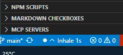
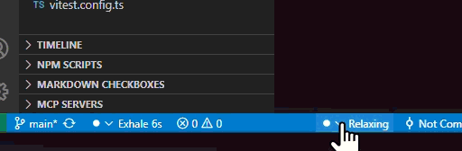
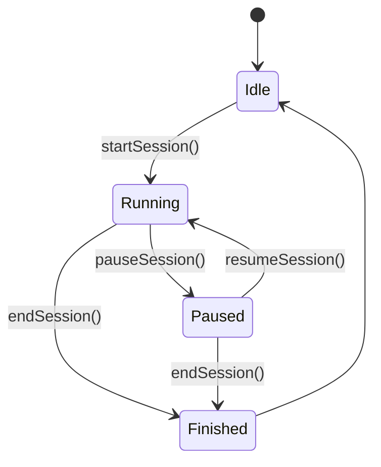

## �‍♀️ Breath Master - Mindful Coding with Ethical Gamification

[](./docs/DOCUMENTATION-OVERVIEW.md)

## 🎮 Mindful Coding Adventure🧘‍♀️ Breath Master - Mindful Coding with Ethical Gamification

## 🎮 Mindful Coding Adventure

Transform your coding sessions into a mindful journey! Breath Master turns meditation into a fun, gamified experience while respecting your privacy and wellbeing. 



**🏆 Challenge Yourself!** Track your progress, earn mindfulness achievements, and watch as you evolve from a Mindful Rookie to a Breath Master!



**🔥 Build Your Streak!** Stay consistent with your breathing practice and watch your daily streak grow - all while staying productive and centered during coding sessions.

Remember: this is mindfulness with a playful twist - not a competitive race. Your wellbeing journey happens at your own pace, on your own terms.


## ✨ Features

### **Core Breathing**
- **5 Preset Patterns**: Chill, Medium, Active, Boxing, Relaxing
- **Custom Patterns**: Create your own with simple format: `4-4-4-4` (inhale-hold-exhale-pause)
- **Visual Breathing Cues**: Subtle status bar animation guides your breath
- **Dual Indicators**: Left (breathing) and right (pattern controls) status bar items

###  **Ethical Gamification** (Opt-in)
- **Privacy-First**: All data stays on your machine, never uploaded
- **Meditation Tracking**: Track mindful moments with breathing cycles
- **Level Progression**: From Mindful Rookie to Breath Master
- **Daily Streaks**: Gentle encouragement without pressure
- **Session Timer**: See today's meditation progress

###  **Privacy & Control**
- **Local-Only Storage**: Data never leaves your computer
- **Full Export**: JSON export of your progress anytime
- **Complete Control**: Clear data, adjust privacy settings
- **No Accounts**: Works entirely offline

###  **Onboarding & Engagement**
- **Welcome Tour**: Gentle introduction to all features
- **Exponential Backoff**: Messages become less frequent over time
- **User-Controlled**: Set engagement to off/subtle/moderate/active
- **12 Principles Compliant**: Follows ethical design principles

## 🚀 Quick Start

1. **Install**: Search "Breath Master" in VS Code extensions
2. **Breathe**: Watch the gentle pulse in your status bar
3. **Cycle Patterns**: Click the right status bar item to try different rhythms
4. **Optional Tour**: Run "Breath Master: Show Welcome Tour" from command palette
5. **Optional Tracking**: Enable gamification in settings if desired

Check out the [complete User Guide](./docs/USER-GUIDE.md) for detailed instructions and visualizations.

### Status Bar Interface

```
┌────────────────────────────────────────────────────────────────────────────┐
│  (Left) Breathing Indicator:  ●▲ Inhale 3s                                 │
│                                                                            │
│  (Right cluster)  🍃 Calm Coder • 🔥 5d • 06m • ▶ Goal 10m                  │
│      Legend: Level • Streak • Today Time • Session State / Pledge          │
└────────────────────────────────────────────────────────────────────────────┘
```

## ⚙️ Settings

```json
{
  "breathMaster.pattern": "chill",           // Breathing pattern
  "breathMaster.customPattern": "4-4-4-4",   // Custom timing (seconds)
  "breathMaster.intensity": 0.6,             // Visual intensity
  "breathMaster.enableGamification": false,  // Opt-in tracking
  "breathMaster.dataPrivacy": "local-only"   // Privacy control
}
```

## 🎯 Commands

- `Breath Master: Toggle` - Start/stop breathing animation
- `Breath Master: Cycle Pattern` - Try different breathing patterns
- `Breath Master: Show Welcome Tour` - Replay the introduction
- `Breath Master: Toggle Meditation Session` - Start/stop tracking
- `Breath Master: Start Stretch Preset` - Begin a guided stretching routine
- `Breath Master: Cancel Stretch Preset` - Stop the current stretch preset
- `Breath Master: Export Your Data` - Save your progress
- `Breath Master: Clear All Data` - Fresh start

### Stretch Preset Flow

```
Start Preset ─┬─> Timer(5m) ─> Step 1 Notice
              ├─> Timer(10m) ─> Step 2 Notice
              ├─> Timer(15m) ─> Step 3 Notice
              └─> Timer(20m) ─> Step 4 Notice

Cancel Preset: clears all timers.
```

## 🧘‍♂️ Breathing Patterns

| Pattern | Timing | Purpose |
|---------|--------|---------|
| **Chill** | 6-0-8-0 | Relaxation and stress relief |
| **Medium** | 5-0-5-0 | Coherent breathing balance |
| **Active** | 4-2-4-1 | Energy and focus boost |
| **Boxing** | 4-4-4-4 | Tactical breathing for concentration |
| **Relaxing** | 4-7-8 | Deep relaxation technique |
| **Custom** | Your choice | Create your perfect rhythm |

## 🔄 Session Lifecycle



## 🏆 Level System (Optional)

Progress through mindful titles as you build a breathing practice:

🌱 **Mindful Rookie** → 🌿 **Breathing Novice** → 🍃 **Calm Coder** → 🌳 **Zen Developer** → ✨ **Mindful Master** → 🧘 **Breathing Sage** → ⭐ **Code Mystic** → 🌌 **Breath Master**

## 🔐 Privacy Promise

Breath Master follows the [12 Principles of Ethical Design](./12-PRINCIPLES-ANALYSIS.md):

- ✅ **Transparent**: You know exactly what data exists
- ✅ **User Control**: You decide what features to use
- ✅ **Local-First**: No cloud, no accounts, no tracking
- ✅ **Consensual**: Clear opt-in for any data collection
- ✅ **Respectful**: No manipulation or dark patterns

## 🛠️ For Developers

### Custom Patterns
Format: `"inhale-hold-exhale-pause"` in seconds
- Example: `"4-4-4-4"` = 4 seconds each phase
- Example: `"6-0-8-0"` = 6 second inhale, 8 second exhale
- Validation ensures safe breathing patterns

### Data Export Format
```json
{
  "exportDate": "2025-08-11T...",
  "breathMaster": {
    "meditation": {
      "totalXP": 150,
      "currentStreak": 5,
      "todaySessionTime": 600000
    },
    "onboarding": {
      "hasSeenTour": true,
      "gamificationOptIn": true
    }
  }
}
```

## Contributing

This extension demonstrates ethical technology design. Contributions should maintain:
- User agency and control
- Privacy-first approach
- Respectful engagement
- Transparent functionality

## License

MIT License - Build mindful technology freely

---

> *"Code with breath, build with intention, ship with mindfulness."*

**Made with 🫁 for developers who care about well-being and ethical tech.**

## 🌿 Guiding Principles

Breath Master is intentionally subtle. It augments—not hijacks—your focus.

1. Attention Respect – no flashing panels, no manipulative loops.
2. Voluntary Depth – gamification is gentle decoration, never obligation.
3. Body–Mind Balance – micro-regulation beats marathon sitting.
4. Narrative as Soft Guidance – Eon speaks seldom; silence is acceptable.
5. Local-First Privacy – nothing leaves your machine unless you export.
6. Low Cognitive Load – status bar centric; minimal surfaces.
7. No Shame, No FOMO – streaks encourage, never guilt.
8. Sustainable Pace – encouragement frequency capped & user-tunable.
9. Conservation Reciprocity – inspiration from forests → awareness of stewardship.
10. Honest Monetization (future) – enterprise analytics only with explicit opt‑in.

## 🌳 Conservation & Stewardship (Passive Awareness)

If you feel gratitude, you may independently support conservation (links are passive; no in‑app solicitation):
- Sequoia Parks Conservancy: https://sequoiaparksconservancy.org/support-a-program/
- APAMI / Costa Rica Reforestation: https://giving.classy.org/campaign/644782/donate

## 🗺️ Subtle Roadmap (Non-Pushy)

- Daily Challenges (Eon’s whispers): DONE
- Stretch Presets + Compact Mode: DONE
- Gentle Reminder Cadence (idle only): EXPERIMENTAL
- SVG Movement Icons (minimal set): CONSIDERING
- Opt‑In Team Leaderboards (privacy-first): DESIGN PHASE
- Enterprise Wellness Export Adapter: FUTURE
- Pair / Group Ritual Windows: RESEARCH
- Conservation Insight Badge (weekly consistency): MAYBE

All future additions remain optional and off by default if they risk distraction.

## 🧭 Philosophy Snapshot

Not about “meditating more”. It’s about small breathable seams between cognitive shifts. Ignoring 90% of features is valid use.

Read the narrative backdrop: [Origin Story – The Whispering Grove](./docs/design/narrative/ORIGIN-STORY.md)

## ⚖️ Enterprise / Organizational Preview

Potential direction (still conceptual): aggregated anonymous metrics (consistency bands, mindful minutes, challenge diversity) – no per-user surveillance dashboards. Paid adapter; core stays free.

## 🔗 Link / Placeholder Audit

Active external links intentionally documented (not surfaced automatically inside UI):
- Sequoia Parks Conservancy (program support)
- APAMI / Costa Rica (reforestation)

Placeholders / future docs:
- Enterprise integration guide (TBD)
- Leaderboard privacy whitepaper (TBD)
- SVG icon spec (TBD)

---
