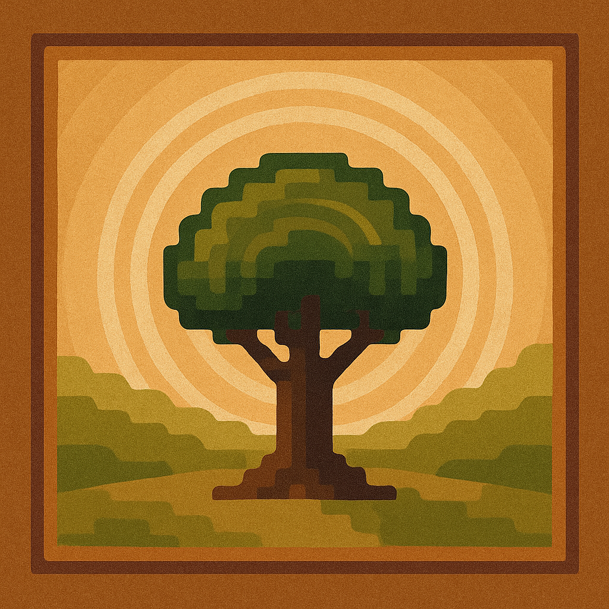
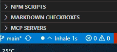
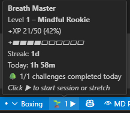

<div align="center">
  
  
  # 🧘‍♂️ Breath Master
  
  ```
     ╭─────────────────────────────────────╮
     │    ◉    Mindful    Coding    ◉     │
     │         Adventure Awaits            │
     ╰─────────────────────────────────────╯
  ```
  
  [](https://marketplace.visualstudio.com/items?itemName=GSejas.breath-master)
  [](https://marketplace.visualstudio.com/items?itemName=GSejas.breath-master)
  [](https://github.com/GSejas/breath_master)
  [](https://opensource.org/licenses/MIT)
  [](./docs/DOCUMENTATION-OVERVIEW.md)
</div>


```
    🌱 ～～～～～～～～～～～～～～～～～～～～～～～～～～～～～～～～～～ 🌱
   ╱                                                                      ╲
  ╱    Transform your coding sessions into a mindful journey!              ╲
 ╱     Breath Master turns meditation into a fun, gamified experience      ╲
╱      while respecting your privacy and wellbeing.                        ╲
╲                                                                          ╱
 ╲                 ✨ Stay Centered ✨                                     ╱
  ╲                                                                      ╱
   ╲____________________________________________________________________╱
    🌿 ～～～～～～～～～～～～～～～～～～～～～～～～～～～～～～～～～～ 🌿
```

|  |  |  |
|--------------------------------------------------------------|----------------------------------------------------------|-----------------------------------------------------|

Remember: this is mindfulness with a playful twist - not a competitive race. Your wellbeing journey happens at your own pace, on your own terms.


```
         ╭─────────────────────────────────────────╮
         │  🌟  F E A T U R E S   O V E R V I E W  │
         ╰─────────────────────────────────────────╯
```

## 🫁 Core Breathing
```
     ╭───────────────────────────────────────────────╮
     │  ↗️  Inhale    ─    Hold    ─    Exhale  ↘️  │
     │                                               │
     │     ◦ Continuous and minimal guidance         │
     │     ◦ 5 Preset Patterns + Custom options      │
     │     ◦ Visual breathing cues in status bar     │
     │     ◦ Dual indicators for full control        │
     ╰───────────────────────────────────────────────╯
```
- **Continuous and minimal**: Barely noticeable, always guiding.
- **5 Preset Patterns**: Chill, Medium, Active, Boxing, Relaxing
- **Custom Patterns**: Create your own with simple format: `4-4-4-4` (inhale-hold-exhale-pause)
- **Visual Breathing Cues**: Subtle status bar animation guides your breath
- **Dual Indicators**: Left (breathing) and right (pattern controls) status bar items

## 🎮 Ethical Gamification (Opt-in)
```
     ╭───────────────────────────────────────────────╮
     │    🏆 Level Up Your Mindfulness Journey 🏆    │
     │                                               │
     │   Mindful Rookie → Breath Apprentice → 🧘‍♂️   │
     │              Breath Master                    │
     ╰───────────────────────────────────────────────╯
```
- **Privacy-First**: All data stays on your machine, never uploaded
- **Meditation Tracking**: Track mindful moments with breathing cycles
- **Level Progression**: From Mindful Rookie to Breath Master
- **Daily Streaks**: Gentle encouragement without pressure
- **Session Timer**: See today's meditation progress

## 🔒 Privacy & Control
```
     ╭───────────────────────────────────────────────╮
     │     🔐 Your Data, Your Machine, Your Choice    │
     │                                               │
     │    Local Storage ─── No Uploads ─── No Ads   │
     │         ▲               ▲            ▲       │
     │    Full Control ─── JSON Export ─── Offline  │
     ╰───────────────────────────────────────────────╯
```
- **Local-Only Storage**: Data never leaves your computer
- **Full Export**: JSON export of your progress anytime
- **Complete Control**: Clear data, adjust privacy settings
- **No Accounts**: Works entirely offline

## 🌱 Onboarding & Engagement
```
     ╭───────────────────────────────────────────────╮
     │        🌿 Gentle Guidance, Your Pace 🌿       │
     │                                               │
     │   Welcome Tour → Smart Backoff → User Control │
     │        ▼             ▼              ▼        │
     │   Introduction → Less Frequent → Your Choice  │
     ╰───────────────────────────────────────────────╯
```
- **Welcome Tour**: Gentle introduction to all features
- **Exponential Backoff**: Messages become less frequent over time
- **User-Controlled**: Set engagement to off/subtle/moderate/active
- **12 Principles Compliant**: Follows ethical design principles

```
     ╭─────────────────────────────────────────╮
     │     🚀 Q U I C K   S T A R T 🚀         │
     ╰─────────────────────────────────────────╯
```

## 🎯 Installation & Setup
```
    Step 1: Install        Step 2: Activate       Step 3: Breathe
       │                      │                      │
       ▼                      ▼                      ▼
  ╭─────────╮           ╭─────────╮           ╭─────────╮
  │ VS Code │ ────────► │ Command │ ────────► │ Status  │
  │Marketplace│          │Palette │           │   Bar   │
  ╰─────────╯           ╰─────────╯           ╰─────────╯
```

1. **Install**: Search "Breath Master" in VS Code extensions
2. **Breathe**: Watch the gentle pulse in your status bar
3. **Cycle Patterns**: Click the right status bar item to try different rhythms
4. **Optional Tour**: Run "Breath Master: Show Welcome Tour" from command palette
5. **Optional Tracking**: Enable gamification in settings if desired

Check out the [complete User Guide](./docs/USER-GUIDE.md) for detailed instructions and visualizations.

### Status Bar Interface

```
┌────────────────────────────────────────────────────────────────────────────┐
│  (Left) Breathing Indicator:  ●▲ Inhale 3s                                 │
│                                                                            │
│  (Right cluster)  ⏹  Lvl: 2 ⏸                                               │
│      Stop indicator • Level • Control button                               │
│                                                                            │
│  • Stop indicator (⏹) - appears when active, click to stop anything        │
│  • Level display - configurable: "L 2", "Lvl: 2", or "🌱 2"               │
│  • Control button - smart: ▶ start, ⏸ pause, ▶ resume                     │
└────────────────────────────────────────────────────────────────────────────┘
```

## ⚙️ Settings

```json
{
  "breathMaster.pattern": "chill",                    // Breathing pattern
  "breathMaster.customPattern": "4-4-4-4",            // Custom timing (seconds)
  "breathMaster.intensity": 0.6,                      // Visual intensity
  "breathMaster.enableGamification": false,           // Opt-in tracking
  "breathMaster.dataPrivacy": "local-only",           // Privacy control
  "breathMaster.gamificationCommitment": "balanced"   // UI style: minimal/balanced/nature
}
```

## 🎯 Commands

### Core Controls
- `Breath Master: Toggle` - Start/stop breathing animation
- `Breath Master: Cycle Pattern` - Try different breathing patterns
- `Breath Master: Show Welcome Tour` - Replay the introduction

### Session Management
- `Breath Master: Start Session` - Begin a timed meditation session
- `Breath Master: Pause Session` - Pause active session
- `Breath Master: Resume Session` - Resume paused session
- `Breath Master: End Session` - Stop session and record progress

### Universal Controls (Status Bar)
- **Stop Indicator (⏹)** - Click to immediately stop any active session/stretch
- **Control Button (▶/⏸)** - Context-aware start/pause/resume actions

### Stretch & Progress
- `Breath Master: Start Stretch Preset` - Begin a guided stretching routine
- `Breath Master: Cancel Stretch Preset` - Stop the current stretch preset
- `Breath Master: Export Your Data` - Save your progress
- `Breath Master: Clear All Data` - Fresh start

### Stretch Preset Flow

```
Start Preset ─┬─> Timer(5m) ─> Step 1 Notice
              ├─> Timer(10m) ─> Step 2 Notice
              ├─> Timer(15m) ─> Step 3 Notice
              └─> Timer(20m) ─> Step 4 Notice

Cancel Preset: clears all timers.
```

```
     ╭─────────────────────────────────────────╮
     │    🫁 B R E A T H I N G   P A T T E R N S │
     ╰─────────────────────────────────────────╯
```

## 🧘‍♂️ Breathing Patterns

```
    ╭───────────────────────────────────────────────────────╮
    │                 Pattern Guide                         │
    │                                                       │
    │  ◦ Chill     6-0-8-0  │  Relaxation & stress relief   │
    │  ◦ Medium    5-0-5-0  │  Coherent breathing balance   │
    │  ◦ Active    4-2-4-1  │  Energy & focus boost         │
    │  ◦ Boxing    4-4-4-4  │  Tactical concentration       │
    │  ◦ Relaxing  4-7-8    │  Deep relaxation technique    │
    │  ◦ Custom    Your choice │ Create your perfect rhythm │
    ╰───────────────────────────────────────────────────────╯
```

| Pattern | Timing | Purpose |
|---------|--------|---------|
| **Chill** | 6-0-8-0 | Relaxation and stress relief |
| **Medium** | 5-0-5-0 | Coherent breathing balance |
| **Active** | 4-2-4-1 | Energy and focus boost |
| **Boxing** | 4-4-4-4 | Tactical breathing for concentration |
| **Relaxing** | 4-7-8 | Deep relaxation technique |
| **Custom** | Your choice | Create your perfect rhythm |

```
     ╭─────────────────────────────────────────╮
     │    🔄 S E S S I O N   F L O W 🔄        │
     ╰─────────────────────────────────────────╯
```

## 🔄 Session Lifecycle

```
    ╭─────╮    startSession()    ╭─────────╮
    │ 💤  │ ────────────────────► │ 🏃 Run  │
    │Idle │                      │ ning    │
    ╰─────╯ ◄──────────────────── ╰─────────╯
        ▲           endSession()        │
        │                               │ pauseSession()
        │    ╭─────────╮                ▼
        └────│ 🏁 Done │ ◄──────── ╭─────────╮
             ╰─────────╯ endSession│ ⏸ Pause │
                                   ╰─────────╯
                                        │
                                        │ resumeSession()
                                        ▼
                                   ╭─────────╮
                                   │ 🏃 Run  │
                                   │ ning    │
                                   ╰─────────╯
```


```
     ╭─────────────────────────────────────────╮
     │      🏆 L E V E L   S Y S T E M 🏆      │
     ╰─────────────────────────────────────────╯
```

## 🏆 Level System (Optional)

```
    ╭─────────────────────────────────────────────────────╮
    │              🌱 → 🌿 → 🌳 → 🧘‍♂️                    │
    │                                                     │
    │  Mindful     Breath      Breath      Breath         │
    │  Rookie  →  Apprentice → Adept   →   Master         │
    │  (0-50)     (51-150)    (151-500)   (501+ cycles)  │
    │                                                     │
    │    🟢 ───────► 🔵 ───────► 🟣 ───────► 🏆          │
    ╰─────────────────────────────────────────────────────╯
```

Progress through mindful titles as you build a breathing practice:

🌱 **Mindful Rookie** → 🌿 **Breathing Novice** → 🍃 **Calm Coder** → 🌳 **Zen Developer** → ✨ **Mindful Master** → 🧘 **Breathing Sage** → ⭐ **Code Mystic** → 🌌 **Breath Master**

## 🔐 Privacy Promise

Breath Master follows the [12 Principles of Ethical Design](./12-PRINCIPLES-ANALYSIS.md):

- ✅ **Transparent**: You know exactly what data exists
- ✅ **User Control**: You decide what features to use
- ✅ **Local-First**: No cloud, no accounts, no tracking
- ✅ **Consensual**: Clear opt-in for any data collection
- ✅ **Respectful**: No manipulation or dark patterns

## 🛠️ For Developers

### Custom Patterns
Format: `"inhale-hold-exhale-pause"` in seconds
- Example: `"4-4-4-4"` = 4 seconds each phase
- Example: `"6-0-8-0"` = 6 second inhale, 8 second exhale
- Validation ensures safe breathing patterns

### Data Export Format
```json
{
  "exportDate": "2025-08-11T...",
  "breathMaster": {
    "meditation": {
      "totalXP": 150,
      "currentStreak": 5,
      "todaySessionTime": 600000
    },
    "onboarding": {
      "hasSeenTour": true,
      "gamificationOptIn": true
    }
  }
}
```

## Contributing

This extension demonstrates ethical technology design. Contributions should maintain:
- User agency and control
- Privacy-first approach
- Respectful engagement
- Transparent functionality

## License

MIT License - Build mindful technology freely

```
     ╭─────────────────────────────────────────╮
     │    💭 P H I L O S O P H Y 💭            │
     ╰─────────────────────────────────────────╯
```

> *"Code with breath, build with intention, ship with mindfulness."*

```
    🫁 ──── 💻 ──── 🧘‍♂️ ──── 🌱 ──── ✨
    │       │       │        │       │
  Breathe  Code   Mind    Grow    Shine
```

**Made with 🫁 for developers who care about well-being and ethical tech.**

```
     ╭─────────────────────────────────────────╮
     │    🌿 G U I D I N G   P R I N C I P L E S │
     ╰─────────────────────────────────────────╯
```

## 🌿 Guiding Principles

```
    ╭───────────────────────────────────────────────────────╮
    │   🎯 Attention Respect     🤗 Voluntary Depth         │
    │   ⚖️  Body-Mind Balance     📚 Narrative Guidance     │
    │   🔒 Local-First Privacy   🧠 Low Cognitive Load      │
    │   💚 No Shame, No FOMO     ♻️  Sustainable Pace       │
    │   🌳 Conservation Aware    💎 Honest Monetization     │
    ╰───────────────────────────────────────────────────────╯
```

Breath Master is intentionally subtle. It augments—not hijacks—your focus.

1. **Attention Respect** – no flashing panels, no manipulative loops.
2. **Voluntary Depth** – gamification is gentle decoration, never obligation.
3. **Body–Mind Balance** – micro-regulation beats marathon sitting.
4. **Narrative as Soft Guidance** – Eon speaks seldom; silence is acceptable.
5. **Local-First Privacy** – nothing leaves your machine unless you export.
6. **Low Cognitive Load** – status bar centric; minimal surfaces.
7. **No Shame, No FOMO** – streaks encourage, never guilt.
8. **Sustainable Pace** – encouragement frequency capped & user-tunable.
9. **Conservation Reciprocity** – inspiration from forests → awareness of stewardship.
10. **Honest Monetization** (future) – enterprise analytics only with explicit opt‑in.

```
     ╭─────────────────────────────────────────╮
     │  🌳 C O N S E R V A T I O N   L I N K S  │
     ╰─────────────────────────────────────────╯
```

## 🌳 Conservation & Stewardship (Passive Awareness)

```
    🌲    If gratitude flows, support grows    🌲
    ╭─────────────────────────────────────────╮
    │  Optional • Independent • No Pressure  │
    ╰─────────────────────────────────────────╯
```

If you feel gratitude, you may independently support conservation (links are passive; no in‑app solicitation):
- **Sequoia Parks Conservancy**: https://sequoiaparksconservancy.org/support-a-program/
- **APAMI / Costa Rica Reforestation**: https://giving.classy.org/campaign/644782/donate

## 🗺️ Subtle Roadmap (Non-Pushy)

- Daily Challenges (Eon’s whispers): DONE
- Stretch Presets + Compact Mode: DONE
- Gentle Reminder Cadence (idle only): EXPERIMENTAL
- SVG Movement Icons (minimal set): CONSIDERING
- Opt‑In Team Leaderboards (privacy-first): DESIGN PHASE
- Enterprise Wellness Export Adapter: FUTURE
- Pair / Group Ritual Windows: RESEARCH
- Conservation Insight Badge (weekly consistency): MAYBE

All future additions remain optional and off by default if they risk distraction.

## 🧭 Philosophy Snapshot

Not about “meditating more”. It’s about small breathable seams between cognitive shifts. Ignoring 90% of features is valid use.

Read the narrative backdrop: [Origin Story – The Whispering Grove](./docs/design/narrative/ORIGIN-STORY.md)

## ⚖️ Enterprise / Organizational Preview

Potential direction (still conceptual): aggregated anonymous metrics (consistency bands, mindful minutes, challenge diversity) – no per-user surveillance dashboards. Paid adapter; core stays free.

## 🔗 Link / Placeholder Audit

Active external links intentionally documented (not surfaced automatically inside UI):
- Sequoia Parks Conservancy (program support)
- APAMI / Costa Rica (reforestation)

Placeholders / future docs:
- Enterprise integration guide (TBD)
- Leaderboard privacy whitepaper (TBD)
- SVG icon spec (TBD)

---
