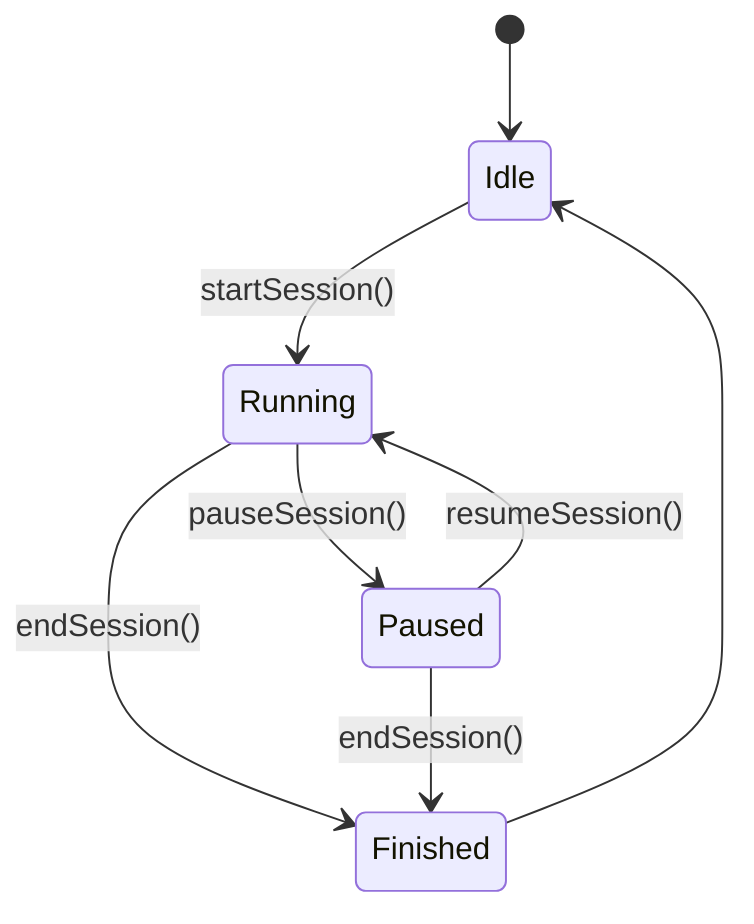
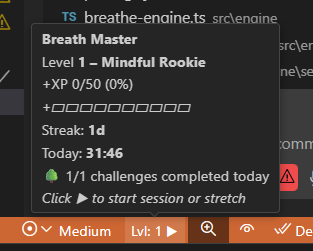
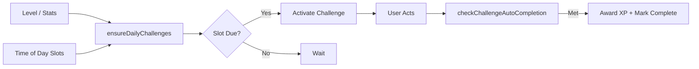

# 🧘‍♀️ Breath Master User Guide

Welcome to the comprehensive user guide for Breath Master, your companion for mindful coding with ethical gamification. This guide will help you navigate through all the features and get the most out of your mindful coding experience.

## Table of Contents

1. [Getting Started](#getting-started)
2. [Status Bar Interface](#status-bar-interface)
3. [Breathing Patterns](#breathing-patterns)
4. [Session Management](#session-management)
5. [Stretch Presets](#stretch-presets)
6. [Gamification Features](#gamification-features)
7. [Challenges](#challenges)
8. [Settings & Customization](#settings--customization)
9. [Data Management](#data-management)
10. [Keyboard Shortcuts](#keyboard-shortcuts)
11. [Troubleshooting](#troubleshooting)

## Getting Started

### Installation

1. Open VS Code
2. Navigate to the Extensions view (Ctrl+Shift+X)
3. Search for "Breath Master"
4. Click Install
5. Restart VS Code if prompted

### First Steps

After installation, you'll notice two status bar items:
- Left side: Breathing indicator
- Right side: Session controls and gamification stats


```
┌────────────────────────────────────────────────────────────────────────────┐
│  (Left) Breathing Indicator:  ●▲ Inhale 3s                                 │
│                                                                            │
│  (Right cluster)  🍃 Calm Coder • 🔥 5d • 06m • ▶ Goal 10m                  │
│      Legend: Level • Streak • Today Time • Session State / Pledge          │
└────────────────────────────────────────────────────────────────────────────┘
```

Click on the left status bar item to change breathing patterns.
Click on the right status bar item to start/stop sessions and access other features.

## Status Bar Interface

The status bar provides at-a-glance information about your breathing and session status:

### Left Status Bar Item (Breathing Indicator)

```
●▲ Inhale 3s      ●► Hold 2s      ●▼ Exhale 4s      ●■ Rest 2s
```

The symbol indicates the current phase:
- ▲ Inhale
- ► Hold
- ▼ Exhale
- ■ Rest

### Right Status Bar Item (Session Controls)

```
🍃 Calm Coder • 🔥 5d • 06m • ▶ Goal 10m
```

Components:
- Current level (🍃 Calm Coder)
- Streak days (🔥 5d)
- Today's meditation time (06m)
- Current session status or goal (▶ Goal 10m)

## Breathing Patterns


### Preset Patterns

Breath Master comes with 5 preset breathing patterns:

1. **Chill**: 6-0-8-0 (Inhale 6s, Exhale 8s) - Gentle and relaxing
2. **Medium**: 5-0-5-0 (Balanced breathing)  
3. **Active**: 4-2-4-1 (Energizing with brief holds)
4. **Boxing**: 4-4-4-4 (Equal timing for focus)
5. **Relaxing**: 4-7-8-0 (Extended exhale for calm)

### Custom Patterns

Create your own breathing pattern using the format:
```
inhale-hold-exhale-rest
```

Example: `5-2-7-0` means:
- Inhale for 5 seconds
- Hold for 2 seconds
- Exhale for 7 seconds
- No rest (0 seconds)

## Session Management

Sessions in Breath Master follow a simple lifecycle:





### Starting a Session

1. Click the right status bar item
2. Select "Start Session"
3. Choose a goal duration
4. Start breathing!

### During a Session

- The status bar shows your progress
- Breathing indicator guides your breath
- You can pause or end the session at any time

### Ending a Session

1. Click the right status bar item
2. Select "End Session"
3. Your progress and XP will be saved

## Stretch Presets

Stretch presets help remind you to stretch during coding sessions:

```
Start Preset ─┬─> Timer(5m) ─> Step 1 Notice
              ├─> Timer(10m) ─> Step 2 Notice
              ├─> Timer(15m) ─> Step 3 Notice
              └─> Timer(20m) ─> Step 4 Notice

Cancel Preset: clears all timers.
```

### Using Stretch Presets

1. Open the command palette (Ctrl+Shift+P)
2. Type "Breath Master: Start Stretch Preset"
3. Select a preset
4. You'll receive notifications at set intervals

### Cancelling Stretch Presets

1. Open the command palette
2. Type "Breath Master: Cancel Stretch Preset"
3. All scheduled stretch reminders will be cleared

## Gamification Features

Breath Master includes ethical gamification features:

### Levels

Progress through levels as you earn XP:
- Mindful Rookie
- Calm Coder
- Breath Master
- (And many more!)

### Streaks

Build daily streaks by completing at least one session each day.

### Pledges/Commits

Make a pledge to maintain focus for a specific duration:

```
Minimal Interface Flow
User clicks gamification bar
   ↓
If session active -> Quick Controls (Pause / Resume / End / Pledge)
Else -> Goal Select / Pledge Start
   ↓
Session Running -> cycles tracked -> XP + Challenges auto progress
   ↓
End Session -> XP calc (+pledge bonus if honored)
```

## Challenges

Daily challenges provide fun goals to achieve:



### Accessing Challenges

1. Open the command palette
2. Type "Breath Master: View Daily Challenges"
3. Complete challenges to earn bonus XP

## Settings & Customization

Customize Breath Master through VS Code settings:

### General Settings

- `breathMaster.engagement`: Control notification frequency
- `breathMaster.showLevelInStatusBar`: Toggle level display
- `breathMaster.defaultPattern`: Set default breathing pattern

### Stretch Settings

- `stretch.compactMode`: Use compact notifications for stretches
- `stretch.showEonQuotes`: Show quotes during stretch reminders
- `stretch.iconStyle`: Choose icon style for notifications

## Data Management

Breath Master respects your privacy with local-only data storage:

```
+-----------------------+    +---------------------------+
|  Local Only Data      |    | Optional Export (User)    |
|  - Streak count       |    |  JSON snapshot            |
|  - Total XP           |    |  (No auto upload)         |
|  - Session history    |    +---------------------------+
|  - Challenge states   |
+-----------------------+
```

### Exporting Your Data

1. Open the command palette
2. Type "Breath Master: Export Data"
3. Choose a location to save your JSON data file

### Clearing Your Data

1. Open the command palette
2. Type "Breath Master: Clear Data"
3. Confirm the action

## Keyboard Shortcuts

For maximum efficiency, Breath Master supports keyboard shortcuts:

- Start Session: No default (can be customized)
- End Session: No default (can be customized)
- Toggle Pause/Resume: No default (can be customized)

To customize shortcuts:
1. Open VS Code settings
2. Search for "keyboard shortcuts"
3. Find Breath Master commands
4. Assign your preferred key combinations

## Troubleshooting

### Status Bar Items Not Showing

1. Check if VS Code status bar is visible (View > Appearance > Status Bar)
2. Try reloading VS Code (Ctrl+R)

### Breathing Animation Issues

1. Try switching to a different breathing pattern
2. Reload VS Code

### Progress Not Saving

1. Check if VS Code has permission to write to disk
2. Try exporting your data and then reloading

---

## Additional Resources

For more information, check out:
- [README.md](../README.md) - General overview
- [Diagrams](./design/DIAGRAMS.md) - Detailed architecture diagrams
- [Progression & Goals](./design/gamification/PROGRESSION_TIME_GOALS.md) - Learn about progression

---

*Remember: Breath Master is about mindfulness, not competition. Progress at your own pace!*
