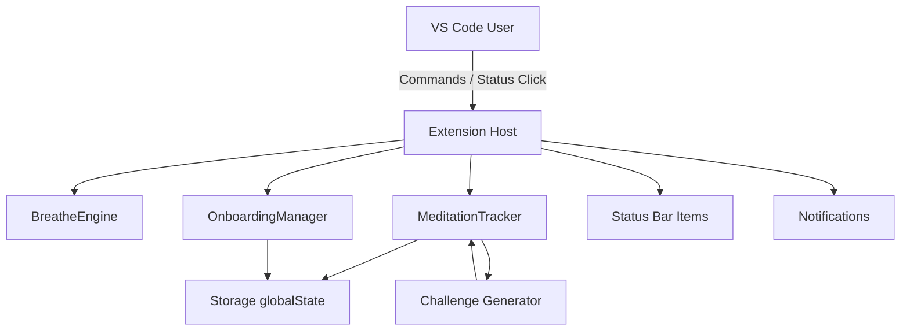
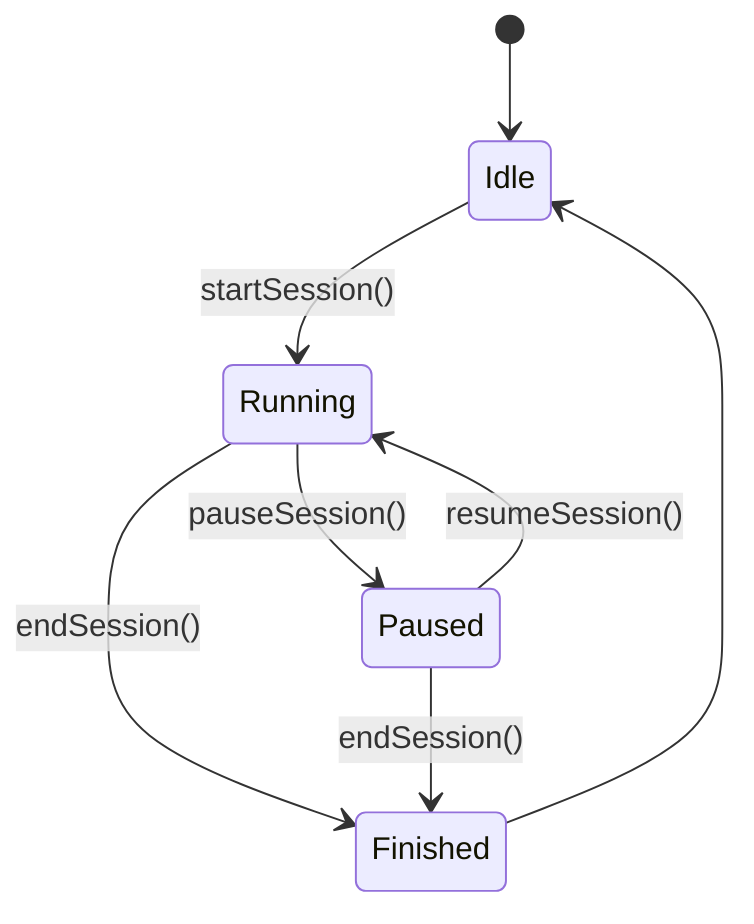
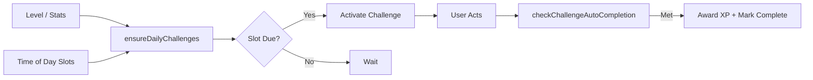
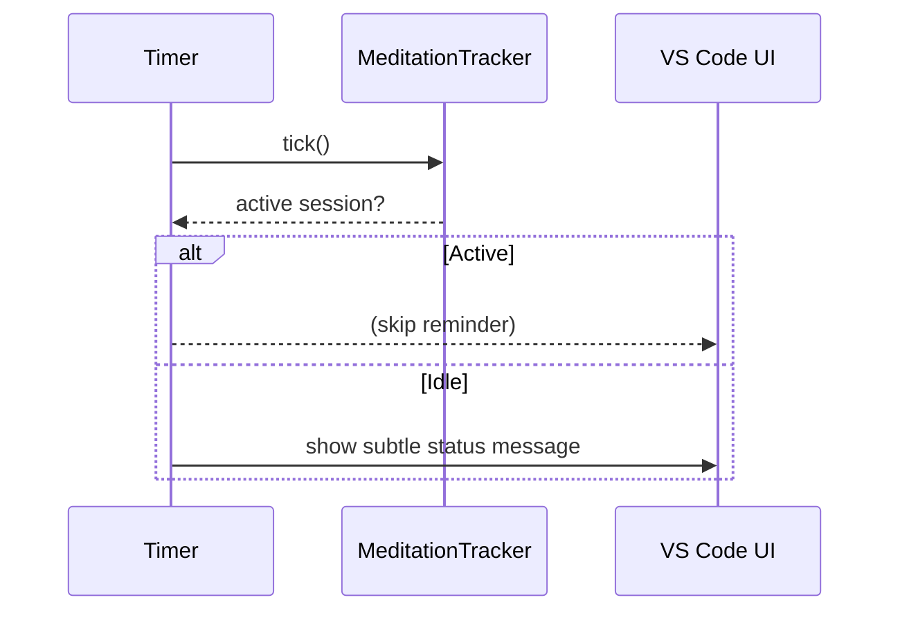

# Breath Master – Architecture & Interaction Diagrams

Lightweight visuals: small, focused, and readable. (Avoiding giant unreadable all‑in‑one maps.)

---
## 1. High-Level Runtime Components


---
## 2. Status Bar Surfaces (ASCII)
```
┌────────────────────────────────────────────────────────────────────────────┐
│  (Left) Breathing Indicator:  ●▲ Inhale 3s                                 │
│                                                                          │
│  (Right cluster)  🍃 Calm Coder • 🔥 5d • 06m • ▶ Goal 10m                 │
│      Legend: Level • Streak • Today Time • Session State / Pledge         │
└────────────────────────────────────────────────────────────────────────────┘
```

---
## 3. Session Lifecycle (Simplified)


---
## 4. Challenge Generation Flow


---
## 5. Stretch Preset Scheduling (ASCII)
```
Start Preset ─┬─> Timer(5m) ─> Step 1 Notice
              ├─> Timer(10m) ─> Step 2 Notice
              ├─> Timer(15m) ─> Step 3 Notice
              └─> Timer(20m) ─> Step 4 Notice

Cancel Preset: clears all timers.
```

---
## 6. Gentle Reminder Cadence (Idle Only)


---
## 7. Data Boundaries
```
+-----------------------+    +---------------------------+
|  Local Only Data      |    | Optional Export (User)    |
|  - Streak count       |    |  JSON snapshot            |
|  - Total XP           |    |  (No auto upload)         |
|  - Session history    |    +---------------------------+
|  - Challenge states   |
+-----------------------+
```

---
## 8. Future (Enterprise) – Opt-In Aggregation (Concept)
```mermaid
graph LR
  subgraph Local Developer
    LT[Tracker] --> LA[Aggregate Daily]
  end
  LA -- anonymized metrics --> S[(Team Collector)]
  S -- summarized trends --> Dash[Wellness Dashboard]
  note right of Dash: No raw breath events
```

---
## 9. Minimal Interface Flow (ASCII)
```
User clicks gamification bar
   ↓
If session active -> Quick Controls (Pause / Resume / End / Pledge)
Else -> Goal Select / Pledge Start
   ↓
Session Running -> cycles tracked -> XP + Challenges auto progress
   ↓
End Session -> XP calc (+pledge bonus if honored)
```

---
## 10. Extension Command Surface (Snapshot)
```
Palette:
  Breath Master: Start Session
  Breath Master: End Session
  Breath Master: Make Pledge
  Breath Master: Cancel Pledge
  Breath Master: View Daily Challenges
  Breath Master: Complete Challenge
  Breath Master: Start Stretch Preset
  Breath Master: Cancel Stretch Preset
  Breath Master: Show Leaderboard (preview)
  Breath Master: Export Data
  Breath Master: Clear Data
```

---
## Notes
- Diagrams intentionally compact.
- No network surface today beyond possible future opt-in enterprise adapter.
- Eon narrative remains textual–diagram avoids anthropomorphizing further.
- Update diagrams as scope evolves rather than expanding single diagrams endlessly.
