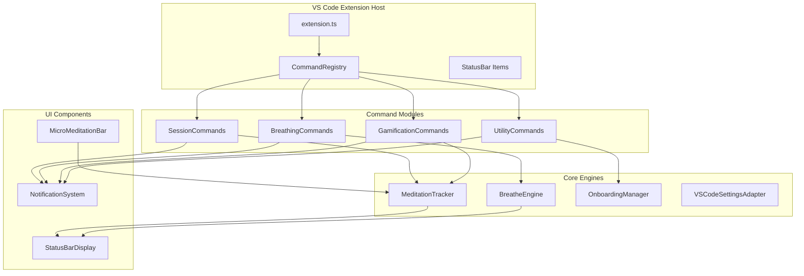
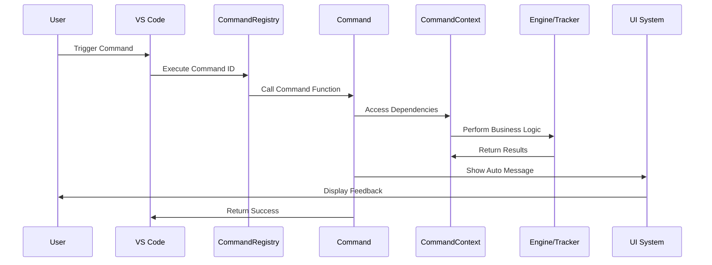
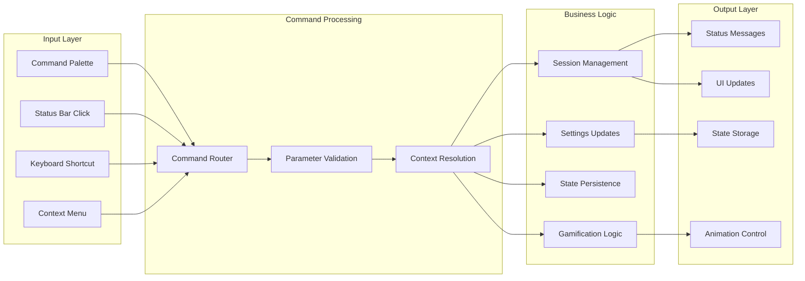
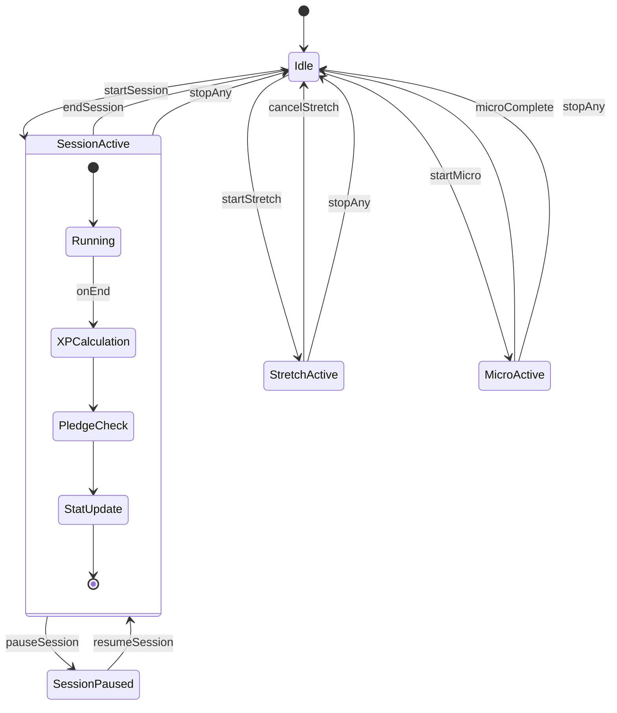
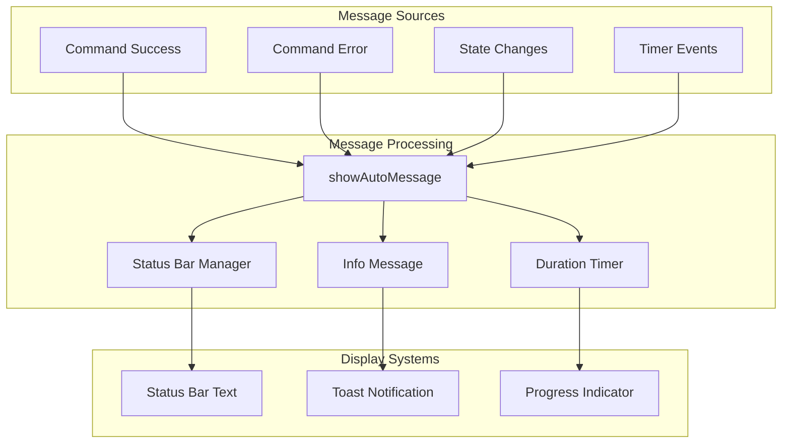
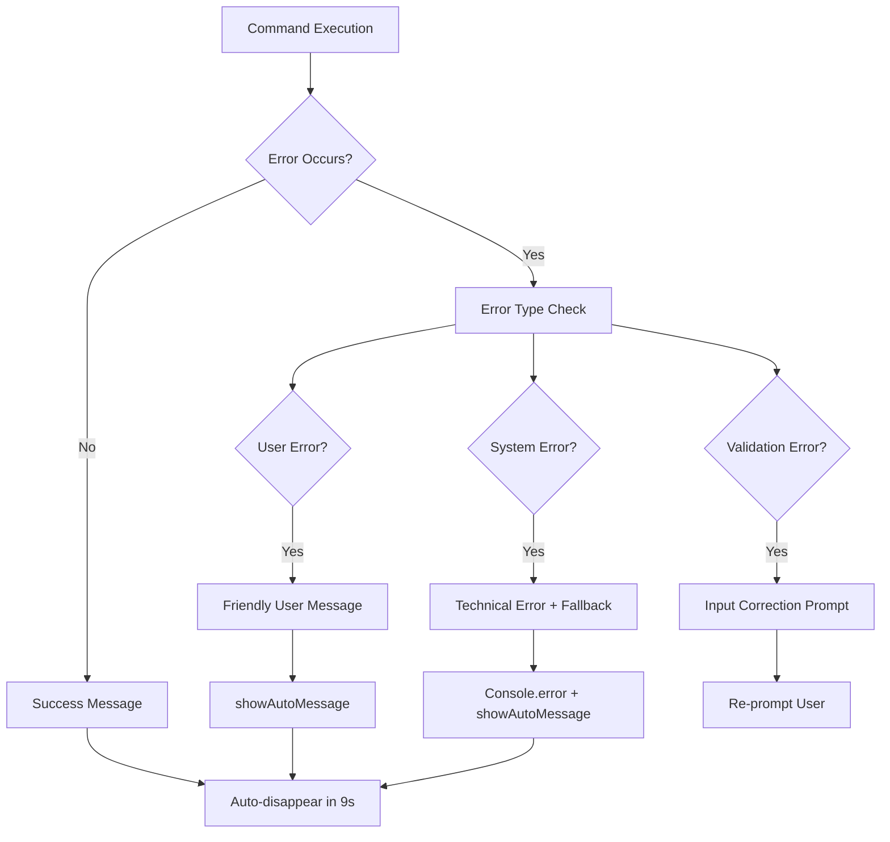
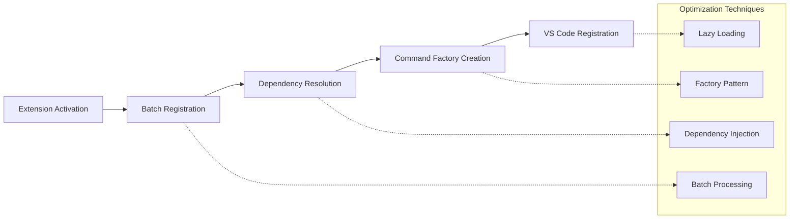
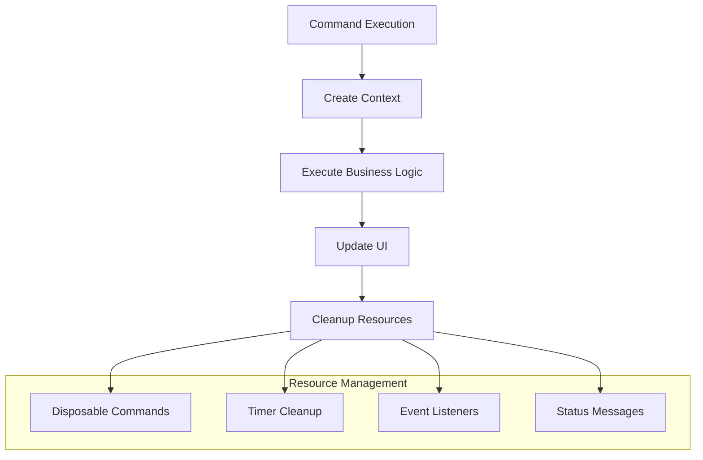
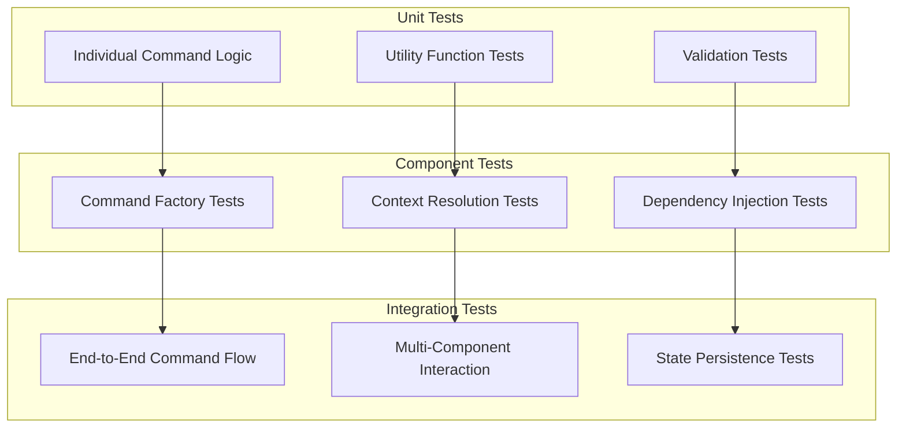
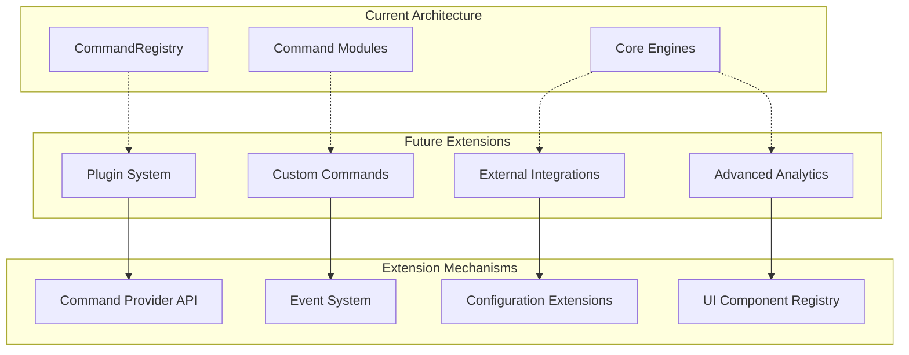

![Integration Architecture Banner](data:image/svg+xml;base64,PHN2ZyB3aWR0aD0iODAwIiBoZWlnaHQ9IjEwMCIgeG1sbnM9Imh0dHA6Ly93d3cudzMub3JnLzIwMDAvc3ZnIj4KICA8ZGVmcz4KICAgIAogICAgPHBhdHRlcm4gaWQ9InBhdHRlcm4iIHg9IjAiIHk9IjAiIHdpZHRoPSIyMCIgaGVpZ2h0PSIyMCIgcGF0dGVyblVuaXRzPSJ1c2VyU3BhY2VPblVzZSI+CiAgICAgIDxyZWN0IHdpZHRoPSIyMCIgaGVpZ2h0PSIyMCIgZmlsbD0iIzFmMjkzNyIvPgogICAgICA8Y2lyY2xlIGN4PSIxMCIgY3k9IjEwIiByPSIyIiBmaWxsPSIjMTBiOTgxIiBvcGFjaXR5PSIwLjMiLz4KICAgIDwvcGF0dGVybj4KICA8L2RlZnM+CiAgPHJlY3Qgd2lkdGg9IjgwMCIgaGVpZ2h0PSIxMDAiIGZpbGw9InVybCgjcGF0dGVybikiLz4KICA8dGV4dCB4PSI0MDAiIHk9IjM1IiBmb250LWZhbWlseT0iQXJpYWwgQmxhY2siIGZvbnQtc2l6ZT0iMjQiIGZpbGw9IndoaXRlIiB0ZXh0LWFuY2hvcj0ibWlkZGxlIj5JbnRlZ3JhdGlvbiBBcmNoaXRlY3R1cmU8L3RleHQ+CiAgPHRleHQgeD0iNDAwIiB5PSI1NSIgZm9udC1mYW1pbHk9IkFyaWFsIiBmb250LXNpemU9IjE0IiBmaWxsPSIjMTBiOTgxIiB0ZXh0LWFuY2hvcj0ibWlkZGxlIj5EYXRhIEZsb3cgJiBTeXN0ZW0gUGF0dGVybnM8L3RleHQ+CiAgPHRleHQgeD0iNDAwIiB5PSI3NSIgZm9udC1mYW1pbHk9IkFyaWFsIiBmb250LXNpemU9IjEyIiBmaWxsPSJyZ2JhKDI1NSwyNTUsMjU1LDAuNykiIHRleHQtYW5jaG9yPSJtaWRkbGUiPvCfj5fvuI8gQ29tcG9uZW50IEludGVyYWN0aW9uIE1hcHM8L3RleHQ+Cjwvc3ZnPg==)

**Date:** August 29, 2025  
**Focus:** Data flow and integration patterns in the refactored command system

## System Integration Overview

## Command Execution Flow

## Data Flow Architecture

## Command Dependencies Matrix

| Command Category | MeditationTracker | OnboardingManager | Settings | BreatheEngine | StatusBar |
|------------------|-------------------|-------------------|----------|---------------|-----------|
| **Session**      | ✅ Primary        | ⚠️ Reminders     | ✅ Goals  | ❌            | ✅        |
| **Breathing**    | ❌                | ❌                | ✅ Patterns | ✅ Primary   | ✅        |
| **Gamification** | ✅ Primary        | ⚠️ Tour Status   | ⚠️ Privacy | ❌           | ✅        |
| **Data**         | ✅ Export/Clear   | ✅ Export/Clear   | ⚠️ Privacy | ❌           | ⚠️        |
| **Internal**     | ✅ Stop Logic     | ❌                | ❌        | ⚠️ Stop      | ✅        |

**Legend:**
- ✅ Primary dependency (command cannot function without)
- ⚠️ Conditional dependency (used in specific scenarios)
- ❌ No dependency

## State Management Flow

## Message Flow Architecture

## Error Handling Flow

## Performance Optimization Points

### Command Registration Optimization

### Memory Management Flow

## Integration Testing Strategy

### Test Pyramid for Commands

## Extension Points for Future Development

This integration flow documentation provides a comprehensive view of how the refactored command system integrates with the broader Breath Master architecture, ensuring maintainability and extensibility while preserving the extension's core mindful user experience philosophy.