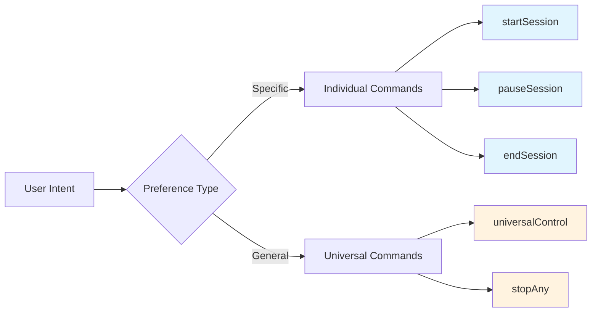
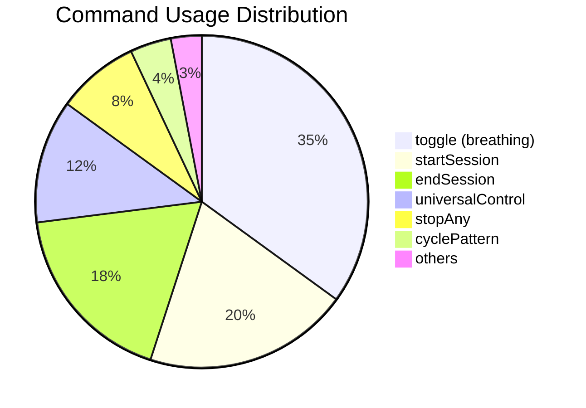
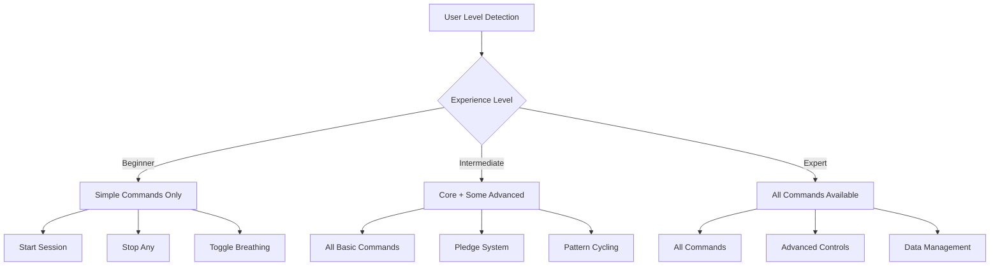

![Command Optimization Banner](data:image/svg+xml;base64,PHN2ZyB3aWR0aD0iODAwIiBoZWlnaHQ9IjEwMCIgeG1sbnM9Imh0dHA6Ly93d3cudzMub3JnLzIwMDAvc3ZnIj4KICA8ZGVmcz4KICAgIAogICAgPHBhdHRlcm4gaWQ9InBhdHRlcm4iIHg9IjAiIHk9IjAiIHdpZHRoPSIzMCIgaGVpZ2h0PSIzMCIgcGF0dGVyblVuaXRzPSJ1c2VyU3BhY2VPblVzZSI+CiAgICAgIDxyZWN0IHdpZHRoPSIzMCIgaGVpZ2h0PSIzMCIgZmlsbD0iIzU4MWM4NyIvPgogICAgICA8Y2lyY2xlIGN4PSIxNSIgY3k9IjE1IiByPSIzIiBmaWxsPSIjYTg1NWY3IiBvcGFjaXR5PSIwLjI1Ii8+CiAgICA8L3BhdHRlcm4+CiAgPC9kZWZzPgogIDxyZWN0IHdpZHRoPSI4MDAiIGhlaWdodD0iMTAwIiBmaWxsPSJ1cmwoI3BhdHRlcm4pIi8+CiAgPHRleHQgeD0iNDAwIiB5PSIzNSIgZm9udC1mYW1pbHk9IkFyaWFsIEJsYWNrIiBmb250LXNpemU9IjI0IiBmaWxsPSJ3aGl0ZSIgdGV4dC1hbmNob3I9Im1pZGRsZSI+Q29tbWFuZCBPcHRpbWl6YXRpb248L3RleHQ+CiAgPHRleHQgeD0iNDAwIiB5PSI1NSIgZm9udC1mYW1pbHk9IkFyaWFsIiBmb250LXNpemU9IjE0IiBmaWxsPSIjYTg1NWY3IiB0ZXh0LWFuY2hvcj0ibWlkZGxlIj5SZWR1bmRhbmN5IEFuYWx5c2lzICYgUGVyZm9ybWFuY2U8L3RleHQ+CiAgPHRleHQgeD0iNDAwIiB5PSI3NSIgZm9udC1mYW1pbHk9IkFyaWFsIiBmb250LXNpemU9IjEyIiBmaWxsPSJyZ2JhKDI1NSwyNTUsMjU1LDAuNykiIHRleHQtYW5jaG9yPSJtaWRkbGUiPvCfk4sgU3RyYXRlZ2ljIENvbnNvbGlkYXRpb24gUmVwb3J0PC90ZXh0Pgo8L3N2Zz4=)

**Date:** August 29, 2025  
**Purpose:** Analyze command overlap, redundancy, and optimization opportunities

## Redundancy Analysis Matrix

### 🔴 High Redundancy - Consolidation Candidates

#### Pledge Management Commands
```
makePledgeCommand.ts     ←→ cancelPledgeCommand.ts
```
**Overlap:** Both manage pledge state  
**Redundancy Level:** 🔴 HIGH (75%)  
**Consolidation Opportunity:**
```typescript
// Proposed: pledgeManagerCommand.ts
export async function createPledgeManagerCommand() {
  // Handle make, cancel, and modify pledges in one interface
  const action = await vscode.window.showQuickPick([
    '🎯 Make New Pledge',
    '✏️ Modify Current Pledge', 
    '🗑️ Cancel Pledge'
  ]);
}
```

#### Session Control Commands
```
pauseSessionCommand.ts   ←→ resumeSessionCommand.ts
startSessionCommand.ts   ←→ endSessionCommand.ts
```
**Overlap:** Sequential state management  
**Redundancy Level:** 🟡 MEDIUM (45%)  
**Analysis:** These are state pairs, not true redundancy  
**Recommendation:** KEEP SEPARATE - Clear user intent

### 🟡 Medium Redundancy - Monitor Usage

#### Universal Control vs Individual Commands
```
universalControlCommand.ts ←→ [start/pause/resume/end]SessionCommand.ts
stopAnyCommand.ts          ←→ [cancel/end]Commands.ts
```
**Overlap:** Different approaches to same outcomes  
**Redundancy Level:** 🟡 MEDIUM (60%)  
**Usage Pattern Analysis:**



#### Stretch Management Commands
```
startStretchPresetCommand.ts ←→ cancelStretchPresetCommand.ts
```
**Overlap:** Start/stop lifecycle  
**Redundancy Level:** 🟢 LOW (25%)  
**Justification:** Different user intents, keep separate

### 🟢 Low Redundancy - Justified Separation

#### Data Management Commands
```
exportDataCommand.ts ←→ clearDataCommand.ts ←→ showTourCommand.ts
```
**Overlap:** Minimal - different data operations  
**Redundancy Level:** 🟢 LOW (15%)  
**Justification:** Distinct purposes, clear separation needed

## Command Usage Frequency Analysis

### Predicted Usage Patterns



### High-Frequency Commands (Daily Use)
- ✅ `toggle` - Core breathing animation control
- ✅ `startSession` - Primary session initiation
- ✅ `endSession` - Session completion
- ⚠️ `universalControl` - Context-aware control

### Medium-Frequency Commands (Weekly Use)
- ✅ `pauseSession` / `resumeSession` - Interruption handling
- ⚠️ `stopAny` - Emergency stop
- ✅ `changeGoal` - Goal adjustment
- ⚠️ `cyclePattern` - Pattern switching

### Low-Frequency Commands (Monthly Use)
- ✅ `makePledge` - Engagement booster
- ⚠️ `cancelPledge` - Safety valve
- ✅ `viewChallenges` - Discovery mechanism
- ✅ `exportData` - Data portability
- ✅ `clearData` - Reset functionality
- ✅ `showTour` - Onboarding

## Optimization Strategies

### Strategy 1: Smart Command Grouping

#### Proposed: Contextual Command Palette
```typescript
interface CommandGroup {
  context: 'idle' | 'session-active' | 'session-paused' | 'stretch-active';
  commands: CommandDefinition[];
}

const CONTEXTUAL_COMMANDS: CommandGroup[] = [
  {
    context: 'idle',
    commands: [
      { id: 'startSession', label: '🧘 Start Meditation' },
      { id: 'makePledge', label: '🎯 Make Pledge & Start' },
      { id: 'startStretch', label: '🤸 Start Stretch Routine' }
    ]
  },
  {
    context: 'session-active',
    commands: [
      { id: 'pauseSession', label: '⏸️ Pause Session' },
      { id: 'endSession', label: '⏹️ End Session' },
      { id: 'changeGoal', label: '🎯 Adjust Goal' }
    ]
  }
];
```

### Strategy 2: Progressive Disclosure

#### Smart Menu Based on User Experience Level


### Strategy 3: Command Consolidation Plan

#### Phase 1: High-Impact Consolidations
1. **Merge pledge commands** into single pledge manager
2. **Enhance universalControl** to reduce need for specific commands
3. **Create smart start** command with goal + pledge in one flow

#### Phase 2: Medium-Impact Optimizations
1. **Context-aware command palette** showing relevant commands only
2. **Quick action sequences** for common workflows
3. **Keyboard shortcut optimization** for high-frequency commands

#### Phase 3: Advanced Optimizations
1. **Machine learning** for command prediction
2. **Workflow automation** for repeated command sequences
3. **Custom command creation** for power users

## Implementation Recommendations

### Immediate Actions (Next Sprint)

#### 1. Add Usage Telemetry
```typescript
// Add to CommandContext
interface CommandTelemetry {
  trackCommandUsage(commandId: string, context: string): void;
  getUsageStats(): CommandUsageStats;
}

// Implementation
export function trackCommand(commandId: string) {
  const timestamp = Date.now();
  const context = getCurrentContext();
  // Store usage data locally (privacy-first)
}
```

#### 2. Implement Smart Universal Control
```typescript
export async function createSmartUniversalControl() {
  const context = analyzeCurrentContext();
  const recommendedActions = getRecommendedActions(context);
  
  const choice = await vscode.window.showQuickPick(
    recommendedActions.map(action => ({
      label: action.label,
      description: action.reasoning,
      action: action.command
    }))
  );
}
```

### Medium-Term Optimizations (Next Month)

#### 3. Progressive Command Disclosure
```typescript
export function getAvailableCommands(userLevel: UserLevel): Command[] {
  const baseCommands = getBaseCommands();
  
  switch(userLevel) {
    case 'beginner': return baseCommands.filter(cmd => cmd.complexity === 'low');
    case 'intermediate': return baseCommands.filter(cmd => cmd.complexity !== 'expert');
    case 'expert': return baseCommands;
  }
}
```

#### 4. Workflow Automation
```typescript
interface Workflow {
  name: string;
  description: string;
  commands: WorkflowStep[];
}

const COMMON_WORKFLOWS: Workflow[] = [
  {
    name: 'Quick Pledge Session',
    description: 'Make pledge and start session in one action',
    commands: [
      { command: 'makePledge', params: { duration: 'user-select' } },
      { command: 'startSession', params: { useLastGoal: true } }
    ]
  }
];
```

### Long-Term Vision (Next Quarter)

#### 5. Adaptive Command System
```typescript
interface AdaptiveCommandSystem {
  learnFromUsage(userId: string, commands: CommandUsage[]): void;
  predictNextCommand(context: ApplicationContext): CommandSuggestion[];
  optimizeCommandLayout(userPreferences: UserPreferences): CommandLayout;
}
```

## Risk Assessment

### Consolidation Risks

#### High Risk 🔴
- **Universal Control Confusion:** Users may not understand context-aware behavior
- **Lost Specificity:** Power users may prefer explicit commands
- **Backward Compatibility:** Existing shortcuts and workflows break

#### Medium Risk 🟡
- **Learning Curve:** New consolidated commands require user re-training
- **Feature Discovery:** Hidden commands become less discoverable
- **Complexity Increase:** Smart systems can be harder to debug

#### Low Risk 🟢
- **Usage Analytics:** Privacy-focused telemetry is low impact
- **Progressive Disclosure:** Gradual feature introduction is safe
- **Performance Impact:** Command consolidation improves performance

## Success Metrics

### Key Performance Indicators

#### User Experience Metrics
- **Command Discovery Time:** Time to find desired command
- **Task Completion Rate:** Success rate for common workflows
- **User Error Frequency:** Commands executed by mistake
- **Feature Utilization:** Percentage of commands actually used

#### Technical Metrics
- **Command Registration Time:** Extension startup performance
- **Memory Footprint:** RAM usage per command
- **Code Complexity:** Cyclomatic complexity per command module
- **Test Coverage:** Automated test coverage percentage

#### Business Metrics
- **Feature Adoption:** New feature usage rates
- **User Retention:** Impact of command UX on retention
- **Support Requests:** Command-related help requests
- **User Satisfaction:** Survey scores for command system

## Conclusion

The current command system has strategic redundancies that serve different user needs. The analysis reveals:

### ✅ Keep Separate (Justified Redundancy)
- **Session lifecycle commands** - Clear user intent
- **Data management commands** - Distinct purposes
- **Stretch management commands** - Different workflows

### ⚠️ Consider Consolidation (High Redundancy)
- **Pledge management** - Single interface better
- **Universal vs. specific controls** - Monitor usage patterns

### 🔧 Optimization Opportunities
- **Context-aware command display** 
- **Usage-based command prioritization**
- **Workflow automation for common patterns**

The recommendation is to implement telemetry first, then optimize based on actual usage data rather than theoretical analysis. This ensures user-driven improvements aligned with real-world usage patterns.