![Test Automation Guide Banner](data:image/svg+xml;base64,PHN2ZyB3aWR0aD0iODAwIiBoZWlnaHQ9IjEwMCIgeG1sbnM9Imh0dHA6Ly93d3cudzMub3JnLzIwMDAvc3ZnIj4KICA8ZGVmcz4KICAgIAogICAgPHBhdHRlcm4gaWQ9InBhdHRlcm4iIHg9IjAiIHk9IjAiIHdpZHRoPSI0MCIgaGVpZ2h0PSI0MCIgcGF0dGVyblVuaXRzPSJ1c2VyU3BhY2VPblVzZSI+CiAgICAgIDxyZWN0IHdpZHRoPSI0MCIgaGVpZ2h0PSI0MCIgZmlsbD0iIzBmMTcyYSIvPgogICAgICA8cGF0aCBkPSJNIDQwIDAgTCAwIDAgMCA0MCIgZmlsbD0ibm9uZSIgc3Ryb2tlPSIjM2I4MmY2IiBzdHJva2Utd2lkdGg9IjEiIG9wYWNpdHk9IjAuMiIvPgogICAgPC9wYXR0ZXJuPgogIDwvZGVmcz4KICA8cmVjdCB3aWR0aD0iODAwIiBoZWlnaHQ9IjEwMCIgZmlsbD0idXJsKCNwYXR0ZXJuKSIvPgogIDx0ZXh0IHg9IjQwMCIgeT0iMzUiIGZvbnQtZmFtaWx5PSJBcmlhbCBCbGFjayIgZm9udC1zaXplPSIyNCIgZmlsbD0id2hpdGUiIHRleHQtYW5jaG9yPSJtaWRkbGUiPlRlc3QgQXV0b21hdGlvbiBHdWlkZTwvdGV4dD4KICA8dGV4dCB4PSI0MDAiIHk9IjU1IiBmb250LWZhbWlseT0iQXJpYWwiIGZvbnQtc2l6ZT0iMTQiIGZpbGw9IiMzYjgyZjYiIHRleHQtYW5jaG9yPSJtaWRkbGUiPlVuaXQgJiBJbnRlZ3JhdGlvbiBUZXN0aW5nPC90ZXh0PgogIDx0ZXh0IHg9IjQwMCIgeT0iNzUiIGZvbnQtZmFtaWx5PSJBcmlhbCIgZm9udC1zaXplPSIxMiIgZmlsbD0icmdiYSgyNTUsMjU1LDI1NSwwLjcpIiB0ZXh0LWFuY2hvcj0ibWlkZGxlIj7wn6eqIFF1YWxpdHkgQXNzdXJhbmNlIEZyYW1ld29yazwvdGV4dD4KPC9zdmc+)

**Version:** 0.3.4  
**Date:** August 29, 2025  
**Target Audience:** Developers, QA Engineers, DevOps

## Table of Contents

1. [Overview](#overview)
2. [Test Architecture](#test-architecture) 
3. [Setting Up Test Environment](#setting-up-test-environment)
4. [Unit Testing Guide](#unit-testing-guide)
5. [Integration Testing Guide](#integration-testing-guide)
6. [Command Testing Patterns](#command-testing-patterns)
7. [Automated Test Execution](#automated-test-execution)
8. [Coverage & Metrics](#coverage--metrics)
9. [CI/CD Integration](#cicd-integration)
10. [Troubleshooting](#troubleshooting)

## Overview

The Breath Master extension uses a comprehensive test automation strategy with two distinct testing layers:

### Test Pyramid Structure
```
                    ┌─────────────────┐
                    │                 │
                    │  Integration    │ ← VS Code Extension API Tests
                    │  Tests (11)     │   Real VS Code Environment
                    │                 │   End-to-End Workflows
                    └─────────────────┘
                            │
                ┌───────────────────────────┐
                │                           │
                │      Unit Tests           │ ← Pure Logic Testing
                │      (151 tests)          │   Fast Execution
                │                           │   Framework: Vitest
                └───────────────────────────┘
```

### Testing Frameworks

- **Unit Tests:** [Vitest](https://vitest.dev/) - Fast, modern test runner
- **Integration Tests:** [Mocha](https://mochajs.org/) - VS Code extension testing
- **Coverage:** Built-in coverage reporting via Vitest
- **Mocking:** Vitest built-in mocking + custom VS Code API mocks

## Test Architecture

### Directory Structure
```
test/
├── unit/                              # Unit tests (Vitest)
│   ├── breathe-engine.test.ts         # Core breathing engine logic
│   ├── gamification.test.ts           # XP, levels, challenges
│   ├── onboarding.test.ts            # User journey flow
│   ├── tutorial-service.test.ts       # Tutorial system
│   ├── challenges.test.ts            # Daily challenges
│   ├── session-pledge.test.ts        # Pledge system
│   ├── progress-tooltip.test.ts       # UI tooltip logic
│   ├── animation-figures.test.ts      # Animation calculations
│   └── settings/                     # Settings system tests
│       ├── ModernSettingsManager.test.ts
│       ├── BreathingModule.test.ts
│       └── validators.test.ts
├── integration/                      # Integration tests (Mocha)
│   └── suite/
│       ├── index.ts                 # Test suite setup
│       └── extension.test.ts        # VS Code API integration
└── fixtures/                        # Test data and helpers
    ├── mockVSCode.ts               # VS Code API mocking
    └── testData.json               # Sample test data
```

### Test Configuration Files
```
Configuration Files:
├── vitest.config.ts                 # Unit test configuration
├── .vscode-test.mjs                # Integration test setup  
├── src/test/runTest.ts             # Test runner entry point
└── package.json                    # Test scripts
```

## Setting Up Test Environment

### Prerequisites
```bash
# Node.js 18+ required
node --version  # Should be 18+

# Install dependencies
npm install

# Verify test frameworks are installed
npm list vitest @vscode/test-electron mocha
```

### Environment Setup
```bash
# 1. Clone repository
git clone <repository-url>
cd breath-master

# 2. Install dependencies
npm install

# 3. Compile TypeScript
npm run compile

# 4. Run initial test to verify setup
npm run test:unit -- --run
```

### VS Code Test Environment
The integration tests automatically download and configure VS Code:
```bash
# First run downloads VS Code test environment
npm run test:integration
# ✔ Validated version: 1.103.2
# ✔ Found existing install in .vscode-test/
```

## Unit Testing Guide

### Test File Structure
```typescript
/**
 * Example: test/unit/example.test.ts
 */
import { describe, it, expect, beforeEach, vi } from 'vitest';
import { ClassUnderTest } from '../../src/path/to/class';

describe('ClassUnderTest', () => {
  let instance: ClassUnderTest;

  beforeEach(() => {
    // Fresh instance for each test
    instance = new ClassUnderTest();
  });

  describe('methodName', () => {
    it('should handle normal case correctly', () => {
      // Arrange
      const input = 'test input';
      const expected = 'expected output';

      // Act  
      const result = instance.methodName(input);

      // Assert
      expect(result).toBe(expected);
    });

    it('should handle edge cases gracefully', () => {
      // Test edge cases, error conditions, etc.
      expect(() => instance.methodName(null)).toThrow();
    });
  });
});
```

### Key Testing Patterns

#### 1. Testing Engine Classes
```typescript
// Example: Breathing Engine Tests
describe('BreatheEngine', () => {
  it('should calculate correct amplitude for inhale phase', () => {
    const engine = new BreatheEngine('chill', '6-0-8-0');
    
    // Simulate time progression
    engine.tick(1000); // 1 second
    
    const amplitude = engine.getAmplitude();
    expect(amplitude).toBeGreaterThan(0);
    expect(amplitude).toBeLessThanOrEqual(1);
  });

  it('should transition between phases correctly', () => {
    const engine = new BreatheEngine('boxing', '4-4-4-4');
    const phases: string[] = [];
    
    // Collect phases over time
    for (let i = 0; i < 16; i++) {
      phases.push(engine.getCurrentPhase().phase);
      engine.tick(1000);
    }
    
    expect(phases).toContain('Inhale');
    expect(phases).toContain('Hold');
    expect(phases).toContain('Exhale');
  });
});
```

#### 2. Testing Gamification Logic
```typescript
// Example: Meditation Tracker Tests
describe('MeditationTracker', () => {
  let tracker: MeditationTracker;
  let mockStorage: any;

  beforeEach(() => {
    mockStorage = {
      get: vi.fn().mockReturnValue({}),
      update: vi.fn()
    };
    tracker = new MeditationTracker(mockStorage);
  });

  it('should calculate XP correctly for session completion', () => {
    const session = tracker.startSession(10); // 10 minute goal
    
    // Simulate session completion
    vi.advanceTimersByTime(10 * 60 * 1000); // 10 minutes
    const result = tracker.endSession();
    
    expect(result.xpGained).toBeGreaterThan(0);
    expect(tracker.getStats().totalXP).toBe(result.xpGained);
  });

  it('should handle pledge multipliers correctly', () => {
    const pledgeResult = tracker.makePledge(15, 1.5); // 15min, 1.5x multiplier
    expect(pledgeResult.ok).toBe(true);
    
    tracker.startSession(15);
    vi.advanceTimersByTime(15 * 60 * 1000);
    const result = tracker.endSession();
    
    // Should get bonus XP from pledge
    expect(result.pledgeBonusXP).toBeGreaterThan(0);
  });
});
```

#### 3. Testing Settings System
```typescript
// Example: Modern Settings Tests
describe('ModernSettingsManager', () => {
  let manager: ModernSettingsManager;
  let mockAdapter: any;

  beforeEach(() => {
    mockAdapter = {
      get: vi.fn(),
      update: vi.fn(),
      has: vi.fn()
    };
    manager = new ModernSettingsManager(mockAdapter);
  });

  it('should validate settings correctly', () => {
    const mockModule = {
      name: 'test',
      schema: { type: 'object', properties: { value: { type: 'string' } } },
      defaults: { value: 'default' }
    };

    manager.registerModule(mockModule);
    
    // Valid settings should pass
    const validSettings = { value: 'test' };
    expect(manager.validateSettings('test', validSettings)).toBe(true);
    
    // Invalid settings should fail
    const invalidSettings = { value: 123 };
    expect(manager.validateSettings('test', invalidSettings)).toBe(false);
  });
});
```

### Running Unit Tests

```bash
# Run all unit tests
npm run test:unit

# Run specific test file
npm run test:unit breathe-engine.test.ts

# Run tests in watch mode (auto-rerun on changes)
npm run test:unit:watch

# Run with coverage report
npm run test:cov

# Run specific test pattern
npx vitest run --grep "breathing pattern"
```

## Integration Testing Guide

### Integration Test Structure
```typescript
/**
 * Example: src/test/suite/extension.test.ts
 */
import * as vscode from 'vscode';
import * as assert from 'assert';

suite('Breath Master Extension Integration Tests', () => {
  let extension: vscode.Extension<any>;

  suiteSetup(async () => {
    // Get extension instance
    extension = vscode.extensions.getExtension('GSejas.breath-master')!;
    assert.ok(extension, 'Extension should be found');
    
    // Activate extension if not already active
    if (!extension.isActive) {
      await extension.activate();
    }
  });

  test('Extension should be activated', () => {
    assert.ok(extension.isActive, 'Extension should be active');
  });

  test('Commands should be registered', async () => {
    const commands = await vscode.commands.getCommands(true);
    
    // Verify key commands are registered
    assert.ok(commands.includes('breathMaster.toggle'));
    assert.ok(commands.includes('breathMaster.startSession'));
    assert.ok(commands.includes('breathMaster.endSession'));
  });

  test('Toggle command should execute without error', async () => {
    // Execute command and verify no errors
    await vscode.commands.executeCommand('breathMaster.toggle');
    // If we reach here, command executed successfully
    assert.ok(true);
  });
});
```

### Advanced Integration Testing

#### Testing Command Execution
```typescript
test('Session commands should execute without hanging', async function() {
  this.timeout(5000); // 5 second timeout
  
  // Test session lifecycle
  await vscode.commands.executeCommand('breathMaster.startSession');
  await new Promise(resolve => setTimeout(resolve, 100)); // Brief pause
  
  await vscode.commands.executeCommand('breathMaster.pauseSession');
  await new Promise(resolve => setTimeout(resolve, 100));
  
  await vscode.commands.executeCommand('breathMaster.resumeSession');
  await new Promise(resolve => setTimeout(resolve, 100));
  
  await vscode.commands.executeCommand('breathMaster.endSession');
  
  // If we reach here, all commands executed successfully
  assert.ok(true);
});
```

#### Testing Extension Settings
```typescript
test('Extension should respect configuration changes', async () => {
  const config = vscode.workspace.getConfiguration('breathMaster');
  
  // Change a setting
  await config.update('breathingEnabled', false, vscode.ConfigurationTarget.Global);
  
  // Verify the change took effect (may require waiting for config change event)
  await new Promise(resolve => setTimeout(resolve, 500));
  
  const newValue = config.get('breathingEnabled');
  assert.strictEqual(newValue, false);
  
  // Reset to default
  await config.update('breathingEnabled', undefined, vscode.ConfigurationTarget.Global);
});
```

### Running Integration Tests

```bash
# Run integration tests
npm run test:integration

# Debug integration tests (with VS Code debugger)
npm run test:integration -- --inspect-brk

# Run with specific VS Code version
VSCODE_VERSION=1.103.2 npm run test:integration
```

## Command Testing Patterns

### Testing Refactored Commands

Since the extension was refactored with modular commands, here's how to test them:

#### 1. Testing Command Factory Functions
```typescript
// Example: Testing command creation
describe('Command Factory', () => {
  let mockContext: CommandContext;
  let mockVscode: any;

  beforeEach(() => {
    mockVscode = {
      commands: {
        registerCommand: vi.fn().mockReturnValue({ dispose: vi.fn() })
      },
      window: {
        showInformationMessage: vi.fn(),
        setStatusBarMessage: vi.fn().mockReturnValue({ dispose: vi.fn() })
      }
    };
    
    // Mock the context
    mockContext = {
      meditationTracker: createMockTracker(),
      onboardingManager: createMockOnboarding(),
      settings: createMockSettings(),
      journeyCoverage: createMockJourney(),
      updateGamificationDisplay: vi.fn(),
      extensionContext: createMockExtensionContext()
    };
  });

  it('should create start session command correctly', async () => {
    const disposable = await createStartSessionCommand(mockContext);
    
    expect(mockVscode.commands.registerCommand).toHaveBeenCalledWith(
      'breathMaster.startSession',
      expect.any(Function)
    );
    
    expect(disposable).toBeDefined();
    expect(typeof disposable.dispose).toBe('function');
  });
});
```

#### 2. Testing Command Logic
```typescript
// Example: Testing command execution logic
describe('Start Session Command Logic', () => {
  it('should start session with proper goal setting', async () => {
    const mockTracker = createMockTracker();
    const mockContext = { ...createMockContext(), meditationTracker: mockTracker };
    
    // Create command
    const disposable = await createStartSessionCommand(mockContext);
    
    // Get the registered command function
    const commandFn = mockVscode.commands.registerCommand.mock.calls[0][1];
    
    // Mock user selecting 10 minute goal
    mockVscode.window.showQuickPick.mockResolvedValue({ value: 10 });
    mockTracker.startSession.mockReturnValue({ started: true });
    
    // Execute command
    await commandFn();
    
    // Verify tracker was called correctly
    expect(mockTracker.startSession).toHaveBeenCalledWith(10);
  });
});
```

#### 3. Testing Auto-Disappearing Messages
```typescript
describe('Auto-Disappearing Messages', () => {
  let mockVscode: any;
  
  beforeEach(() => {
    vi.useFakeTimers();
    mockVscode = {
      window: {
        setStatusBarMessage: vi.fn().mockReturnValue({ dispose: vi.fn() }),
        showInformationMessage: vi.fn()
      }
    };
  });

  afterEach(() => {
    vi.useRealTimers();
  });

  it('should auto-dispose messages after timeout', () => {
    const mockDispose = vi.fn();
    mockVscode.window.setStatusBarMessage.mockReturnValue({ dispose: mockDispose });
    
    showAutoMessage('Test message', 5000);
    
    // Verify immediate calls
    expect(mockVscode.window.setStatusBarMessage).toHaveBeenCalledWith('Test message', 5000);
    expect(mockVscode.window.showInformationMessage).toHaveBeenCalledWith('Test message');
    
    // Fast-forward time
    vi.advanceTimersByTime(5000);
    
    // Verify cleanup
    expect(mockDispose).toHaveBeenCalled();
  });
});
```

## Automated Test Execution

### NPM Scripts Overview
```json
{
  "scripts": {
    "test": "npm run test:unit && npm run test:integration",
    "test:unit": "vitest run",
    "test:unit:watch": "vitest",
    "test:integration": "node ./dist/test/runTest.js",
    "test:cov": "vitest run --coverage",
    "pretest": "npm run compile"
  }
}
```

### Test Execution Flow

```mermaid
graph TB
    A[npm run test] --> B[pretest: Compile TypeScript]
    B --> C[test:unit: Run Vitest]
    C --> D{Unit Tests Pass?}
    D -->|Yes| E[test:integration: Run VS Code Tests]
    D -->|No| F[❌ Fail - Fix Unit Tests]
    E --> G{Integration Tests Pass?}
    G -->|Yes| H[✅ All Tests Pass]
    G -->|No| I[❌ Fail - Fix Integration Tests]
```


### Parallel Test Execution
```bash
# Run unit and integration tests in parallel (faster)
npm run test:unit & npm run test:integration

# Wait for both to complete
wait

# Or use a tool like npm-run-all
npx npm-run-all --parallel test:unit test:integration
```

## Coverage & Metrics

### Current Coverage Targets
```yaml
Coverage Thresholds:
  statements: 55%
  branches: 45%
  lines: 55%
  functions: 50%
```

### Viewing Coverage Reports
```bash
# Generate coverage report
npm run test:cov

# Coverage report locations:
# - Terminal output (summary)
# - coverage/index.html (detailed HTML report)

# Open HTML report in browser
open coverage/index.html  # macOS
start coverage/index.html # Windows
xdg-open coverage/index.html # Linux
```

### Coverage Report Structure
```
coverage/
├── index.html              # Main coverage report
├── lcov.info              # LCOV format (CI/CD)
└── clover.xml             # Clover format (some tools)
```

### Interpreting Coverage Metrics
```typescript
// Example coverage report section:
// File: src/engine/breathe-engine.ts
// Statements: 45/50 (90%)     ← Lines of code executed
// Branches: 8/12 (66.67%)     ← Conditional paths tested  
// Functions: 5/6 (83.33%)     ← Functions called
// Lines: 42/48 (87.5%)        ← Physical lines executed
```

## CI/CD Integration

### GitHub Actions Example
```yaml
# .github/workflows/test.yml
name: Test Suite

on: [push, pull_request]

jobs:
  test:
    runs-on: ubuntu-latest
    
    steps:
    - uses: actions/checkout@v3
    
    - name: Setup Node.js
      uses: actions/setup-node@v3
      with:
        node-version: '18'
        cache: 'npm'
    
    - name: Install dependencies
      run: npm ci
    
    - name: Run unit tests
      run: npm run test:unit
    
    - name: Run integration tests  
      run: xvfb-run -a npm run test:integration
    
    - name: Generate coverage
      run: npm run test:cov
    
    - name: Upload coverage to Codecov
      uses: codecov/codecov-action@v3
      with:
        file: ./coverage/lcov.info
```

### Azure DevOps Pipeline
```yaml
# azure-pipelines.yml
trigger:
- main

pool:
  vmImage: 'ubuntu-latest'

steps:
- task: NodeTool@0
  inputs:
    versionSpec: '18.x'
  displayName: 'Install Node.js'

- script: npm ci
  displayName: 'Install dependencies'

- script: npm run compile
  displayName: 'Compile TypeScript'

- script: npm run test:unit
  displayName: 'Run unit tests'

- script: xvfb-run -a npm run test:integration
  displayName: 'Run integration tests'

- task: PublishTestResults@2
  inputs:
    testResultsFormat: 'JUnit'
    testResultsFiles: 'test-results.xml'
    mergeTestResults: true
  displayName: 'Publish test results'
```

### Pre-commit Hooks
```bash
# Install husky for git hooks
npm install --save-dev husky

# Set up pre-commit hook
npx husky add .husky/pre-commit "npm run test:unit"

# .husky/pre-commit
#!/usr/bin/env sh
. "$(dirname -- "$0")/_/husky.sh"

npm run test:unit
```

## Troubleshooting

### Common Issues & Solutions

#### 1. VS Code Extension Not Loading
```bash
# Error: Extension activation failed
# Solution: Check extension manifest
cat package.json | grep -A5 -B5 "activationEvents"

# Verify extension ID matches
grep "name\|publisher" package.json
```

#### 2. Unit Tests Failing with Module Imports
```typescript
// Error: Cannot find module './some-module'
// Solution: Check vitest.config.ts resolve settings

// vitest.config.ts
export default defineConfig({
  resolve: {
    alias: {
      '@': path.resolve(__dirname, 'src')
    }
  }
});
```

#### 3. Integration Tests Timeout
```javascript
// Error: Test timeout after 2000ms
// Solution: Increase timeout for slow tests

test('slow operation', async function() {
  this.timeout(10000); // 10 seconds
  // ... test code
});
```

#### 4. Coverage Thresholds Not Met
```bash
# Error: Coverage threshold not met
# Solution: Identify uncovered code
npm run test:cov -- --reporter=verbose

# Focus on specific files
npx vitest run src/engine/breathe-engine.ts --coverage
```

#### 5. Mock Issues in Unit Tests
```typescript
// Error: TypeError: Cannot read property 'showInformationMessage' of undefined
// Solution: Proper VS Code API mocking

// test/fixtures/mockVSCode.ts
export const mockVscode = {
  window: {
    showInformationMessage: vi.fn(),
    showQuickPick: vi.fn(),
    setStatusBarMessage: vi.fn().mockReturnValue({ dispose: vi.fn() })
  },
  commands: {
    registerCommand: vi.fn(),
    executeCommand: vi.fn()
  }
};

// In test file:
vi.mock('vscode', () => mockVscode);
```

### Debug Mode Testing

#### Unit Test Debugging
```bash
# Debug unit tests with VS Code
# 1. Add breakpoints in test file
# 2. Run debug configuration:
{
  "name": "Debug Unit Tests",
  "type": "node",
  "request": "launch",
  "program": "${workspaceFolder}/node_modules/vitest/vitest.mjs",
  "args": ["run", "--no-coverage", "${relativeFile}"],
  "console": "integratedTerminal"
}
```

#### Integration Test Debugging
```bash
# Debug integration tests
# Set environment variable:
DEBUG=1 npm run test:integration

# Or use VS Code launch configuration:
{
  "name": "Debug Integration Tests",
  "type": "extensionHost",
  "request": "launch",
  "args": ["--extensionDevelopmentPath=${workspaceFolder}"],
  "outFiles": ["${workspaceFolder}/dist/**/*.js"]
}
```

### Performance Monitoring

#### Test Execution Time
```bash
# Monitor test performance
npm run test:unit -- --reporter=verbose --run

# Sample output:
# ✓ breathe-engine.test.ts (20) 47ms
# ✓ gamification.test.ts (14) 52ms
# ✓ settings/ModernSettingsManager.test.ts (24) 108ms
```

#### Memory Usage Tracking
```bash
# Monitor memory during tests
NODE_OPTIONS="--max-old-space-size=4096" npm run test

# Profile memory usage
node --inspect-brk node_modules/.bin/vitest run
# Then connect Chrome DevTools for profiling
```

## Best Practices Summary

### ✅ Do's
- **Write tests first** for new features (TDD)
- **Mock external dependencies** (VS Code API, file system)
- **Use descriptive test names** that explain the scenario
- **Test edge cases** and error conditions
- **Keep tests isolated** and independent
- **Use proper setup/teardown** to avoid test interference
- **Maintain test coverage** above threshold levels

### ❌ Don'ts  
- **Don't test implementation details** - focus on behavior
- **Don't write slow tests** - use mocks for expensive operations
- **Don't ignore failing tests** - fix or remove them
- **Don't forget to test error paths** 
- **Don't hardcode values** - use fixtures and factories
- **Don't skip integration tests** - they catch real-world issues

### 📋 Test Checklist
- [ ] Unit tests cover core business logic
- [ ] Integration tests verify VS Code API integration  
- [ ] Commands are tested for registration and execution
- [ ] Error handling is tested
- [ ] Auto-message cleanup is verified
- [ ] Settings changes are tested
- [ ] Coverage meets minimum thresholds
- [ ] Tests run quickly (< 5 seconds for unit tests)
- [ ] CI/CD pipeline includes all test types
- [ ] Documentation is updated for new test patterns

This guide provides comprehensive coverage of test automation for the Breath Master extension, enabling developers to write effective tests, debug issues, and maintain high code quality through automated testing practices.