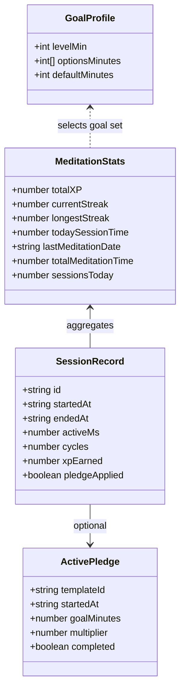

# Data Model Relationships


```mermaid
classDiagram
  class MeditationStats {
    +number totalXP
    +number currentStreak
    +number longestStreak
    +number todaySessionTime
    +string lastMeditationDate
    +number totalMeditationTime
    +number sessionsToday
  }
  class SessionRecord {
    +string id
    +string startedAt
    +string endedAt
    +number activeMs
    +number cycles
    +number xpEarned
    +boolean pledgeApplied
  }
  class ActivePledge {
    +string templateId
    +string startedAt
    +number goalMinutes
    +number multiplier
    +boolean completed
  }
  class GoalProfile {
    +int levelMin
    +int[] optionsMinutes
    +int defaultMinutes
  }
  MeditationStats <-- SessionRecord : aggregates
  SessionRecord --> ActivePledge : optional
  GoalProfile <.. MeditationStats : selects goal set
```

ASCII Abstract:
```
MeditationStats
  | (many)
  v
SessionRecord --(0..1)--> ActivePledge

Level gating: GoalProfile(levelMin) -> available goal options
```
