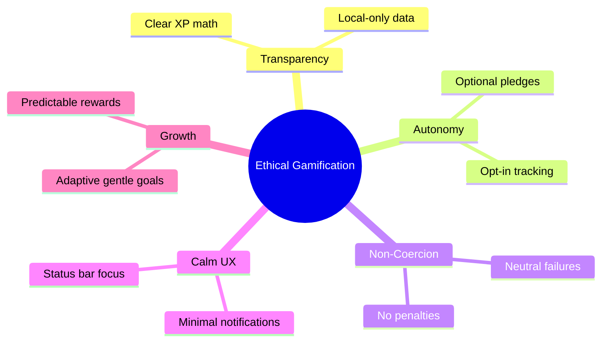

# Ethics Alignment Overview



ASCII Mindmap:
```
Ethical Gamification
 |- Transparency (XP math, local-only)
 |- Autonomy (opt-in, pledges)
 |- Non-Coercion (no penalties)
 |- Calm UX (minimal toasts)
 |- Growth (adaptive goals)
```
