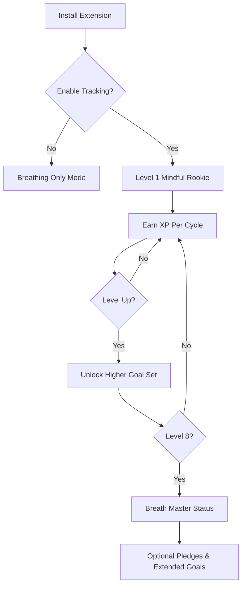

# Progression Flow

```mermaid
graph TD;
  A[Install Extension] --> B{Enable Tracking?};
  B -- No --> C[Breathing Only Mode];
  B -- Yes --> D[Level 1 Mindful Rookie];
  D --> E[Earn XP Per Cycle];
  E --> F{Level Up?};
  F -- Yes --> G[Unlock Higher Goal Set];
  F -- No --> E;
  G --> H{Level 8?};
  H -- No --> E;
  H -- Yes --> I[Breath Master Status];
  I --> J[Optional Pledges & Extended Goals];
```

Minimal explanation: A deterministic loop—XP from mindful cycles advances level bands which widen optional goal choices. No forced escalation.
