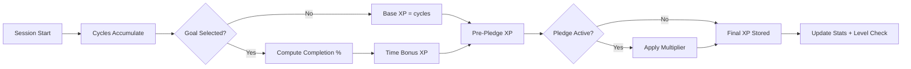

# Reward Pipeline

```mermaid
flowchart LR
  A[Session Start] --> B[Cycles Accumulate]
  B --> C{Goal Selected?}
  C -- No --> D[Base XP = cycles]
  C -- Yes --> E[Compute Completion %]
  E --> F[Time Bonus XP]
  D --> G[Pre-Pledge XP]
  F --> G[Pre-Pledge XP]
  G --> H{Pledge Active?}
  H -- No --> I[Final XP Stored]
  H -- Yes --> J[Apply Multiplier]
  J --> I
  I --> K[Update Stats + Level Check]
```

Explanation: Linear transparent stages; no randomization; optional layers (goal, pledge) compose predictably.
