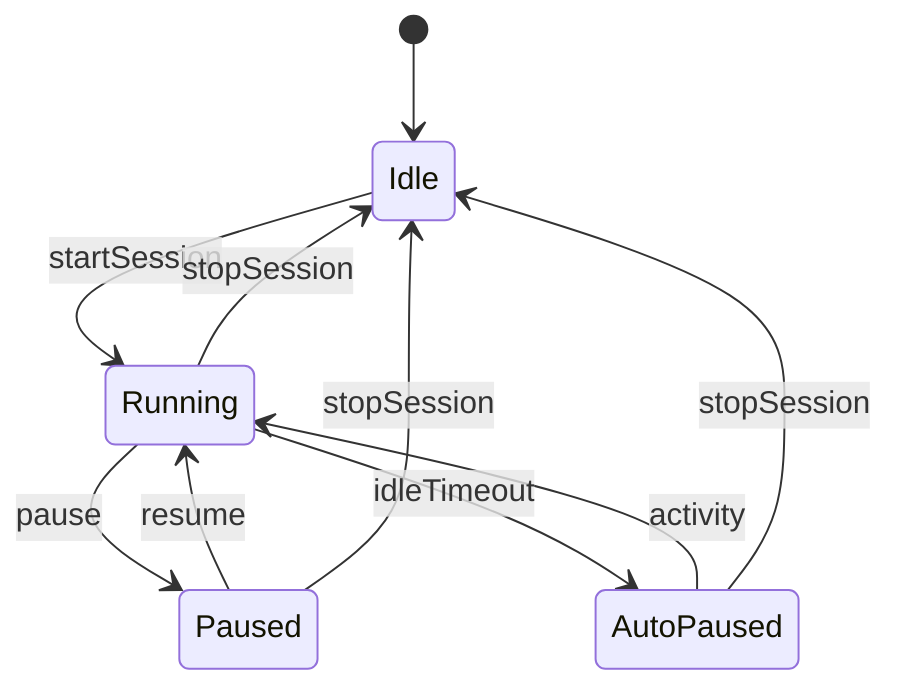

# Session State Machine



ASCII Abstract:
```
[*] -> Idle -> Running <-> Paused
              |            ^
              v            |
           AutoPaused ------
              |
             Idle
```

Each transition is user-driven except idleTimeout (optional feature). No punitive transitions.
