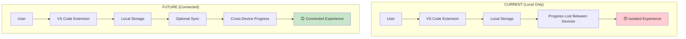
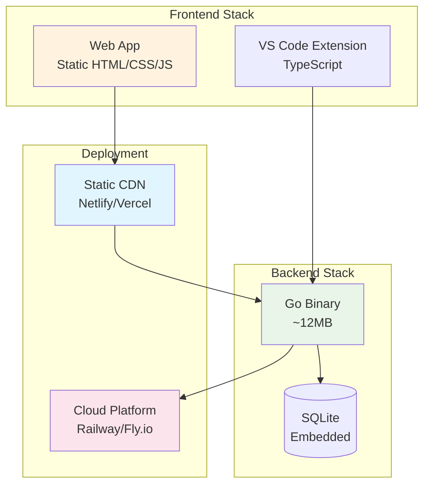
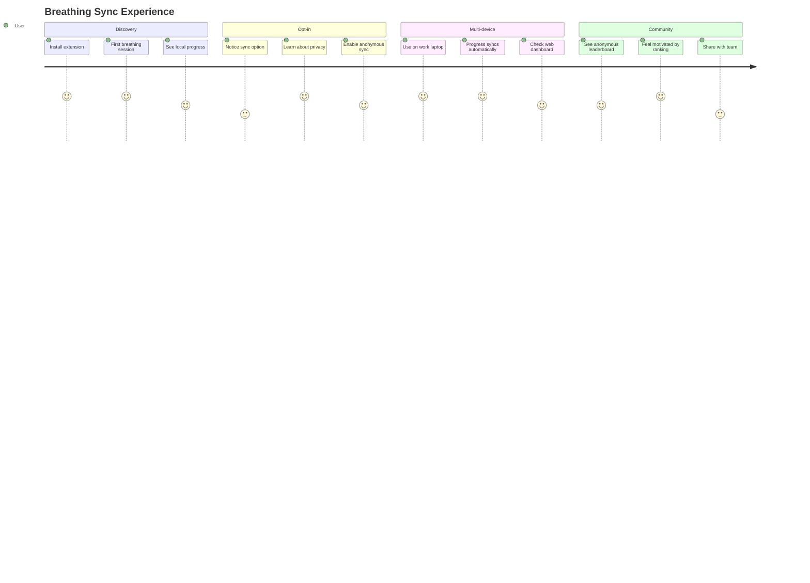

![Backend Sync Architecture Banner](data:image/svg+xml;base64,PHN2ZyB3aWR0aD0iODAwIiBoZWlnaHQ9IjEwMCIgeG1sbnM9Imh0dHA6Ly93d3cudzMub3JnLzIwMDAvc3ZnIj4KICA8ZGVmcz4KICAgIDxwYXR0ZXJuIGlkPSJwYXR0ZXJuIiB4PSIwIiB5PSIwIiB3aWR0aD0iNDAiIGhlaWdodD0iNDAiIHBhdHRlcm5Vbml0cz0idXNlclNwYWNlT25Vc2UiPgogICAgICA8cmVjdCB3aWR0aD0iNDAiIGhlaWdodD0iNDAiIGZpbGw9IiMxZjI5MzciLz4KICAgICAgPGNpcmNsZSBjeD0iMjAiIGN5PSIyMCIgcj0iMiIgZmlsbD0iIzEwYjk4MSIgb3BhY2l0eT0iMC40Ii8+CiAgICAgIDxyZWN0IHdpZHRoPSI4IiBoZWlnaHQ9IjgiIHg9IjE2IiB5PSIxNiIgZmlsbD0ibm9uZSIgc3Ryb2tlPSIjMTBiOTgxIiBzdHJva2Utd2lkdGg9IjAuNSIgb3BhY2l0eT0iMC4zIi8+CiAgICA8L3BhdHRlcm4+CiAgPC9kZWZzPgogIDxyZWN0IHdpZHRoPSI4MDAiIGhlaWdodD0iMTAwIiBmaWxsPSJ1cmwoI3BhdHRlcm4pIi8+CiAgPHRleHQgeD0iNDAwIiB5PSIzNSIgZm9udC1mYW1pbHk9IkFyaWFsIEJsYWNrIiBmb250LXNpemU9IjI0IiBmaWxsPSJ3aGl0ZSIgdGV4dC1hbmNob3I9Im1pZGRsZSI+QmFja2VuZCBTeW5jIEFyY2hpdGVjdHVyZTwvdGV4dD4KICA8dGV4dCB4PSI0MDAiIHk9IjU1IiBmb250LWZhbWlseT0iQXJpYWwiIGZvbnQtc2l6ZT0iMTQiIGZpbGw9IiMxMGI5ODEiIHRleHQtYW5jaG9yPSJtaWRkbGUiPlZpc3VhbCBkZXNpZ24gZm9yIHRoZSBicmVhdGhpbmcgZWNvc3lzdGVtPC90ZXh0PgogIDx0ZXh0IHg9IjQwMCIgeT0iNzUiIGZvbnQtZmFtaWx5PSJBcmlhbCIgZm9udC1zaXplPSIxMiIgZmlsbD0icmdiYSgyNTUsMjU1LDI1NSwwLjcpIiB0ZXh0LWFuY2hvcj0ibWlkZGxlIj7wn5Sy77iPIENyb3NzLVBsYXRmb3JtIERhdGEgU3luYzwvdGV4dD4KPC9zdmc+)

# Backend Sync Architecture 
*Visual design for the breathing ecosystem*

## The Big Picture

```ascii
    ┌─────────────────────────────────────────────┐
    │              BREATH MASTER                  │
    │                ECOSYSTEM                    │
    └─────────────────────────────────────────────┘
                           │
        ┌──────────────────┼──────────────────┐
        │                  │                  │
        ▼                  ▼                  ▼
┌──────────────┐  ┌──────────────┐  ┌──────────────┐
│  VS CODE     │  │   BACKEND    │  │   WEB APP    │
│ EXTENSION    │  │     API      │  │  COMPANION   │
│              │  │              │  │              │
│ 🫁 Breathe   │  │ 🔄 Sync      │  │ 📊 Dashboard │
│ 🎮 Game      │  │ 🏆 Scores    │  │ 🌐 Share     │
│ 💾 Local     │  │ 🗃️ Store     │  │ 📱 Mobile    │
└──────────────┘  └──────────────┘  └──────────────┘
```

## Current State vs Future State



## Architecture Layers

```ascii
╔═══════════════════════════════════════════════════════════╗
║                    PRESENTATION LAYER                     ║
╠═══════════════════════════════════════════════════════════╣
║                                                           ║
║  ┌─────────────────┐       ┌─────────────────────────────┐ ║
║  │   VS CODE UI    │       │       WEB COMPANION         │ ║
║  │                 │       │                             │ ║
║  │  Status Bar     │  ◀──▶ │   📊 Dashboard              │ ║
║  │  Commands       │       │   🏆 Leaderboard            │ ║
║  │  Notifications  │       │   🌊 Web Breathing          │ ║
║  └─────────────────┘       └─────────────────────────────┘ ║
╠═══════════════════════════════════════════════════════════╣
║                    BUSINESS LOGIC LAYER                   ║
╠═══════════════════════════════════════════════════════════╣
║                                                           ║
║  ┌─────────────────┐       ┌─────────────────────────────┐ ║
║  │  BREATHING      │       │         SYNC LOGIC          │ ║
║  │  ENGINE         │  ◀──▶ │                             │ ║
║  │                 │       │   Conflict Resolution       │ ║
║  │  Patterns       │       │   Queue Management          │ ║
║  │  Animation      │       │   Privacy Protection        │ ║
║  │  Gamification   │       │                             │ ║
║  └─────────────────┘       └─────────────────────────────┘ ║
╠═══════════════════════════════════════════════════════════╣
║                     DATA LAYER                            ║
╠═══════════════════════════════════════════════════════════╣
║                                                           ║
║  ┌─────────────────┐       ┌─────────────────────────────┐ ║
║  │  LOCAL STORAGE  │       │       BACKEND API           │ ║
║  │                 │  ◀──▶ │                             │ ║
║  │  VS Code State  │       │   Go + SQLite               │ ║
║  │  Settings       │       │   Anonymous Only            │ ║
║  │  Progress       │       │   REST Endpoints            │ ║
║  └─────────────────┘       └─────────────────────────────┘ ║
╚═══════════════════════════════════════════════════════════╝
```

## Data Flow Philosophy

```ascii
         LOCAL FIRST PRINCIPLE
    ═══════════════════════════════════════
    
    ┌─────┐    ┌──────────┐    ┌─────────┐
    │USER │───▶│  LOCAL   │───▶│ INSTANT │
    │     │    │ ACTION   │    │RESPONSE │
    └─────┘    └──────────┘    └─────────┘
                     │
                     ▼
    ┌─────────────────────────────────────┐
    │         EVENTUAL SYNC               │
    │     (When network available)        │
    │                                     │
    │  ┌─────┐    ┌─────┐    ┌─────┐     │
    │  │ Q U │───▶│ U E │───▶│ U E │     │
    │  │ E U │    │ U E │    │ U E │     │
    │  │ U E │    │ E U │    │ U E │     │
    │  │ E   │    │     │    │     │     │
    │  └─────┘    └─────┘    └─────┘     │
    └─────────────────────────────────────┘
```

## Three-Phase Rollout

### Phase 1: Anonymous Sync 🎯
```ascii
┌────────────────────────────┐
│        SYNC ONLY           │
├────────────────────────────┤
│                            │
│  💾 Local XP/Streaks  ──┐  │
│                         │  │
│  🔄 Cross-Device Sync  ◀┘  │
│                            │
│  🏆 Anonymous Rankings     │
│                            │
│  🔐 Zero Personal Data     │
└────────────────────────────┘
        2-3 weeks
```

### Phase 2: Web Companion 🌐
```ascii
┌────────────────────────────┐
│      WEB EXPERIENCE        │
├────────────────────────────┤
│                            │
│  📊 Progress Dashboard     │
│                            │
│  🌊 Web Breathing App      │
│                            │
│  📱 Mobile-Friendly        │
│                            │
│  🎨 Beautiful Visualizations│
└────────────────────────────┘
        +1 week
```

### Phase 3: Social Features 👥
```ascii
┌────────────────────────────┐
│    COMMUNITY FEATURES      │
├────────────────────────────┤
│                            │
│  👥 Team Challenges        │
│                            │
│  🏢 Company Leaderboards   │
│                            │
│  🎯 Shared Goals           │
│                            │
│  🎉 Achievement Sharing    │
└────────────────────────────┘
        Future
```

## Tech Stack Visualization



## Privacy & Data Flow

```ascii
╔══════════════════════════════════════════════════════════╗
║                    PRIVACY BOUNDARIES                    ║
╠══════════════════════════════════════════════════════════╣
║                                                          ║
║  ┌─────────────────────────────────────────────────────┐ ║
║  │              PERSONAL ZONE                          │ ║
║  │              (Never Leaves)                         │ ║
║  │                                                     │ ║
║  │  • Real name                                        │ ║
║  │  • Email address                                    │ ║
║  │  • Specific breathing times                         │ ║
║  │  • Detailed session logs                            │ ║
║  │  • VS Code workspace info                           │ ║
║  └─────────────────────────────────────────────────────┘ ║
║                            │                             ║
║                            ▼                             ║
║  ┌─────────────────────────────────────────────────────┐ ║
║  │              ANONYMOUS ZONE                         │ ║
║  │              (Can Be Synced)                        │ ║
║  │                                                     │ ║
║  │  • Total XP points         • UUID: abc-123-def     │ ║
║  │  • Current streak days     • Last activity stamp   │ ║
║  │  • Level achieved          • Generic usage stats   │ ║
║  └─────────────────────────────────────────────────────┘ ║
╚══════════════════════════════════════════════════════════╝
```

## User Experience Journey



## Development Priorities

```ascii
    EFFORT vs IMPACT MATRIX
    ═══════════════════════════
    
    HIGH IMPACT  │    
                 │  ┌─────────────┐
                 │  │    SYNC     │ ← Phase 1
                 │  │   ENGINE    │
                 │  └─────────────┘
                 │          │
                 │  ┌─────────────┐
                 │  │     WEB     │ ← Phase 2
                 │  │  COMPANION  │  
                 │  └─────────────┘
    LOW IMPACT   │                      
                 └──────────────────────
                 LOW         HIGH
                      EFFORT
```

## Success Metrics

```ascii
┌─────────────────────────────────────────────┐
│              MEASUREMENT                    │
├─────────────────────────────────────────────┤
│                                             │
│  📊 TECHNICAL HEALTH                        │
│  ┌─────────────────────────────────────────┐ │
│  │ Uptime:      99.9% ████████████████████ │ │
│  │ Speed:       <100ms ████████████████████│ │
│  │ Memory:      <50MB ███████████████████  │ │
│  └─────────────────────────────────────────┘ │
│                                             │
│  👥 USER ADOPTION                           │
│  ┌─────────────────────────────────────────┐ │
│  │ Sync Enable: 20% ████                   │ │
│  │ Daily Use:   15% ███                    │ │
│  │ Satisfaction: 4.5/5 ████████████████████│ │
│  └─────────────────────────────────────────┘ │
└─────────────────────────────────────────────┘
```

## Deployment Architecture

```ascii
                SINGLE BINARY DEPLOYMENT
         ═══════════════════════════════════════════
         
    ┌─────────────────────────────────────────────────┐
    │                 CLOUD PROVIDER                  │
    │                                                 │
    │  ┌─────────────────────────────────────────────┐ │
    │  │            APPLICATION                      │ │
    │  │                                             │ │
    │  │  ┌─────────────┐  ┌─────────────────────┐   │ │
    │  │  │     API     │  │      WEB ASSETS     │   │ │
    │  │  │             │  │                     │   │ │
    │  │  │ ┌─────────┐ │  │  HTML/CSS/JS        │   │ │
    │  │  │ │ SQLite  │ │  │  Images/Fonts       │   │ │
    │  │  │ │   DB    │ │  │  Static Files       │   │ │
    │  │  │ └─────────┘ │  │                     │   │ │
    │  │  │  Go Binary  │  │  CDN Optimized      │   │ │
    │  │  └─────────────┘  └─────────────────────┘   │ │
    │  │         │                    │               │ │
    │  │         └──────────┬─────────┘               │ │
    │  └─────────────────────────────────────────────┘ │
    │                       │                          │
    │  ┌─────────────────────────────────────────────┐ │
    │  │             LOAD BALANCER                   │ │
    │  └─────────────────────────────────────────────┘ │
    └─────────────────────────────────────────────────┘
                           │
                           ▼
                    ┌─────────────┐
                    │    USERS    │
                    │             │
                    │  VS Code    │
                    │  Web App    │
                    │  Mobile     │
                    └─────────────┘
```

---

**Bottom Line:** Simple, secure, extensible breathing sync that respects privacy while enabling connection. 

*Let users breathe better, together.* 🌱