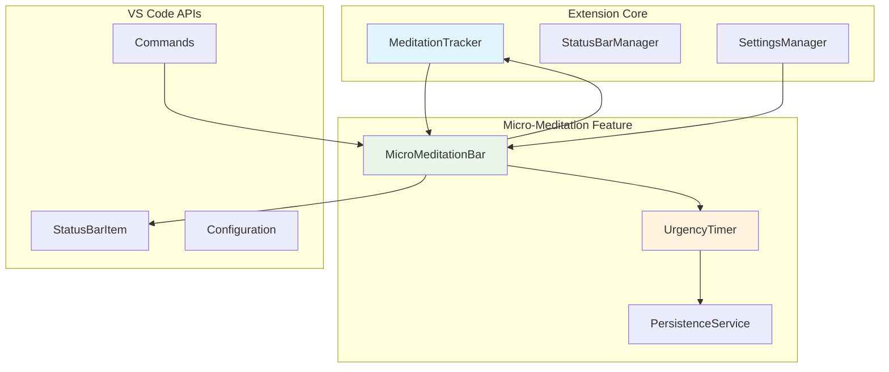
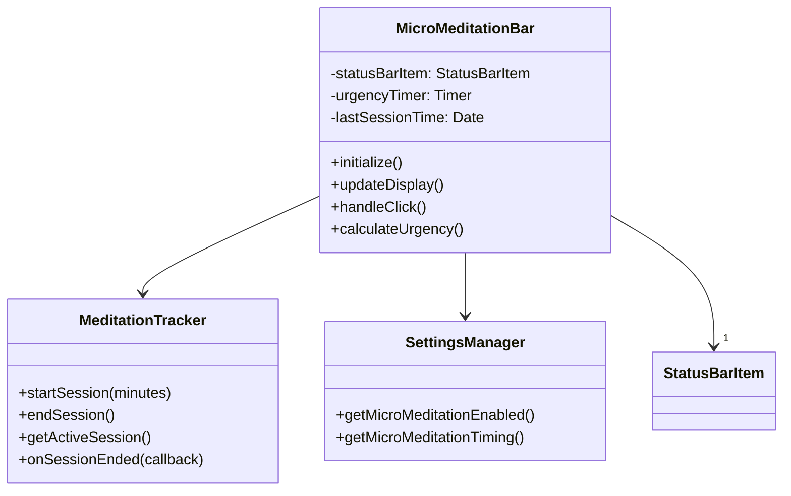

## 🧪 Overview

**Concept**: A dedicated status bar item for one-click micro-meditations with gentle visual urgency based on time since last session.

**Target**: Users who want accountability and frictionless session access.

**Core Value**: Transform "I should meditate" thoughts into immediate 1-click action.

---

## 🎯 Core Behavior

### **Status Bar Design**
```ascii
┌─────────────────────────────────┐
│ [🧘 3m] ← One-click meditation  │
└─────────────────────────────────┘
    ↑    ↑
  Icon Duration (fixed 3min)
```

### **Visual States** 
```typescript
enum UrgencyState {
  FRESH = 'fresh',     // 0-4 hours since last session
  REMINDER = 'remind', // 4-24 hours since last session  
  OVERDUE = 'overdue'  // 24+ hours since last session
}

interface StateVisuals {
  [UrgencyState.FRESH]: {
    backgroundColor: undefined,  // Default theme
    icon: '🧘',
    tooltip: 'Recent session • Click for another'
  };
  [UrgencyState.REMINDER]: {
    backgroundColor: 'statusBarItem.warningBackground',
    icon: '⏰',
    tooltip: 'Time for mindfulness • Quick session ready'
  };
  [UrgencyState.OVERDUE]: {
    backgroundColor: 'statusBarItem.errorBackground', 
    icon: '🎯',
    tooltip: 'Mindfulness break needed • Click to restart'
  };
}
```

### **Click Behavior**
```typescript
async handleClick(): Promise<void> {
  // Always start 3-minute session immediately
  const tracker = this.meditationTracker;
  const started = tracker.startSession(3);
  
  if (started.started) {
    vscode.window.showInformationMessage('🧘 3-minute micro-session started');
    
    // Auto-complete after 3 minutes
    setTimeout(() => {
      const session = tracker.getActiveSession();
      if (session && session.goalMinutes === 3) {
        tracker.endSession();
        this.resetUrgencyState(); // Back to FRESH
        vscode.window.showInformationMessage('✨ Micro-session complete!');
      }
    }, 180000); // 3 minutes
  }
}
```

---

## 🏗️ Architecture

### **System Integration**


### **Component Design**


---

## ⚙️ Configuration

### **Settings Integration**
```typescript
// Add to GamificationModule
interface GamificationSettings {
  // ... existing settings
  microMeditation: {
    enabled: boolean;
    timing: 'gentle' | 'standard' | 'assertive';
  };
}

const DEFAULTS = {
  microMeditation: {
    enabled: false,
    timing: 'standard'
  }
};

// Timing presets (hours to reach each state)
const TIMING_PRESETS = {
  gentle: { reminder: 12, overdue: 48 },
  standard: { reminder: 4, overdue: 24 }, 
  assertive: { reminder: 2, overdue: 12 }
};
```

### **Commands**
```typescript
const commands = [
  {
    command: 'breathMaster.microMeditation.start',
    title: 'Breath Master: Quick Micro-Meditation'
  },
  {
    command: 'breathMaster.microMeditation.toggle',  
    title: 'Breath Master: Toggle Micro-Meditation Bar'
  }
];
```

---

## 📂 Integration Points

### **File Dependencies**
```ascii
Current Codebase Integration:
├── src/engine/gamification.ts
│   └── Add session end hook: onSessionEnded()
├── src/engine/settings/modules/GamificationModule.ts  
│   └── Add microMeditation config section
├── src/vscode/extension.ts
│   └── Initialize MicroMeditationBar when gamification enabled
└── src/vscode/MicroMeditationBar.ts (NEW)
    └── Main implementation class
```

### **Existing Code Hooks**
```typescript
// In MeditationTracker (gamification.ts)
class MeditationTracker {
  private sessionEndCallbacks: (() => void)[] = [];
  
  onSessionEnded(callback: () => void): void {
    this.sessionEndCallbacks.push(callback);
  }
  
  endSession(): SessionRecord | null {
    const record = /* ... existing logic ... */;
    
    // Notify micro-meditation bar
    this.sessionEndCallbacks.forEach(cb => cb());
    
    return record;
  }
}

// In extension.ts
async function activate(context: vscode.ExtensionContext) {
  // ... existing code ...
  
  // Initialize micro-meditation bar if gamification enabled
  const gamificationEnabled = await settings.getGamificationEnabled();
  if (gamificationEnabled) {
    const microMeditationEnabled = await settings.getMicroMeditationEnabled();
    if (microMeditationEnabled) {
      const microBar = new MicroMeditationBar(meditationTracker, settings);
      await microBar.initialize();
      context.subscriptions.push(microBar);
    }
  }
}
```

### **New File Structure**
```typescript
// src/vscode/MicroMeditationBar.ts
export class MicroMeditationBar {
  private statusBarItem: vscode.StatusBarItem;
  private urgencyTimer: NodeJS.Timeout | undefined;
  private lastSessionTime: Date | null = null;
  
  constructor(
    private meditationTracker: MeditationTracker,
    private settings: VSCodeSettingsAdapter
  ) {
    this.statusBarItem = vscode.window.createStatusBarItem(
      vscode.StatusBarAlignment.Right, 
      975 // Between existing items
    );
    this.statusBarItem.command = 'breathMaster.microMeditation.start';
  }
  
  async initialize(): Promise<void> {
    // Load last session time from storage
    // Set up session end listener  
    // Start urgency timer
    // Show status bar item
  }
  
  dispose(): void {
    this.statusBarItem.dispose();
    if (this.urgencyTimer) {
      clearInterval(this.urgencyTimer);
    }
  }
}
```

---

## 🚦 Implementation Strategy

### **Phase 1: MVP** (1 week)
```typescript
// Minimal viable implementation
class SimpleMicroBar {
  // Fixed 3-minute duration
  // 3 visual states only
  // Basic urgency timing
  // Integration with existing MeditationTracker
}
```

### **Phase 2: Polish** (1 week)
```typescript
// Enhanced implementation  
class PolishedMicroBar {
  // Settings integration
  // Proper disposal and cleanup
  // Error handling
  // Persistence for last session time
}
```

### **Phase 3: Optimization** (Optional)
```typescript
// Advanced features
class OptimizedMicroBar {
  // Adaptive duration based on user level
  // Custom timing presets
  // Analytics integration
}
```

---

## 📊 Success Metrics

### **Simple KPIs**
- **Adoption**: 20% of gamification users enable feature
- **Engagement**: 2+ micro-sessions per day average  
- **Completion**: 80% of started sessions complete
- **Retention**: 60% still using after 2 weeks

### **User Feedback**
- Feature feels helpful vs. pushy
- One-click flow reduces friction
- 3-minute duration is appropriate
- Visual urgency is motivating

---

## 🎨 Visual Mockups

### **Status Bar Progression**
```ascii
FRESH (0-4h):
┌──────────────────┐
│ 🧘 3m │ default  │  ← Calm state
└──────────────────┘

REMINDER (4-24h):
┌──────────────────┐
│ ⏰ 3m │ warning  │  ← Yellow background  
└──────────────────┘

OVERDUE (24h+):
┌──────────────────┐
│ 🎯 3m │ error    │  ← Red background
└──────────────────┘
```

### **Settings UI**
```ascii
┌─────────────────────────────────────────┐
│ Gamification Settings                   │
├─────────────────────────────────────────┤
│ [✓] Enable Micro-Meditation Bar        │
│                                         │
│ Reminder Timing:                        │
│ ○ Gentle    (12h reminder, 48h urgent) │
│ ● Standard  (4h reminder, 24h urgent)  │
│ ○ Assertive (2h reminder, 12h urgent)  │
│                                         │
│ The micro-meditation bar shows a        │
│ gentle reminder to take 3-minute        │
│ breathing breaks throughout your day.   │
└─────────────────────────────────────────┘
```

---

## 💡 Key Architectural Decisions

**Why This Approach:**
1. **Leverage Existing Systems** - Uses current MeditationTracker and settings
2. **Minimal Complexity** - 3 states vs. original 5 states  
3. **Fixed Duration** - Eliminates complex duration logic
4. **Standard VS Code APIs** - Uses theme colors instead of custom
5. **Simple Integration** - Hooks into existing activation flow

**Removed Overengineering:**
- ❌ Complex guilt prevention system
- ❌ A/B testing framework  
- ❌ Health analytics with AI
- ❌ Multiple escape hatches
- ❌ Auto-intervention system
- ❌ 9-level configuration matrix

**Architecture Benefits:**
- ✅ Easy to implement and maintain
- ✅ Integrates cleanly with existing code
- ✅ Uses established patterns
- ✅ Minimal performance impact
- ✅ Clear success/failure criteria

This simplified design provides the core value (frictionless micro-meditations) without the complexity overhead that would make it difficult to build, maintain, or reason about.