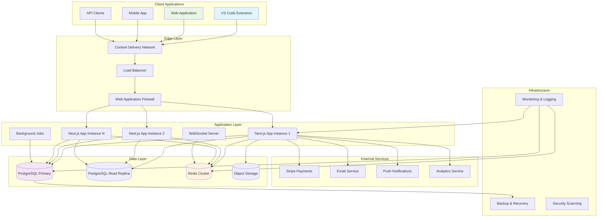

![Advanced Platform Banner](data:image/svg+xml;base64,PHN2ZyB3aWR0aD0iODAwIiBoZWlnaHQ9IjEwMCIgeG1sbnM9Imh0dHA6Ly93d3cudzMub3JnLzIwMDAvc3ZnIj4KICA8ZGVmcz4KICAgIDxwYXR0ZXJuIGlkPSJwYXR0ZXJuIiB4PSIwIiB5PSIwIiB3aWR0aD0iMjgiIGhlaWdodD0iMjQiIHBhdHRlcm5Vbml0cz0idXNlclNwYWNlT25Vc2UiPgogICAgICA8cmVjdCB3aWR0aD0iMjgiIGhlaWdodD0iMjQiIGZpbGw9IiMwNjVmNDYiLz4KICAgICAgPHBvbHlnb24gcG9pbnRzPSIxNCwyIDI0LDggMjQsMTYgMTQsMjIgNCwxNiA0LDgiIGZpbGw9Im5vbmUiIHN0cm9rZT0iIzM0ZDM5OSIgc3Ryb2tlLXdpZHRoPSIxIiBvcGFjaXR5PSIwLjIiLz4KICAgIDwvcGF0dGVybj4KICA8L2RlZnM+CiAgPHJlY3Qgd2lkdGg9IjgwMCIgaGVpZ2h0PSIxMDAiIGZpbGw9InVybCgjcGF0dGVybikiLz4KICA8dGV4dCB4PSI0MDAiIHk9IjM1IiBmb250LWZhbWlseT0iQXJpYWwgQmxhY2siIGZvbnQtc2l6ZT0iMjQiIGZpbGw9IndoaXRlIiB0ZXh0LWFuY2hvcj0ibWlkZGxlIj5BZHZhbmNlZCBQbGF0Zm9ybTwvdGV4dD4KICA8dGV4dCB4PSI0MDAiIHk9IjU1IiBmb250LWZhbWlseT0iQXJpYWwiIGZvbnQtc2l6ZT0iMTQiIGZpbGw9IiMzNGQzOTkiIHRleHQtYW5jaG9yPSJtaWRkbGUiPkZ1bGwtU3RhY2sgU29jaWFsIFBsYXRmb3JtPC90ZXh0PgogIDx0ZXh0IHg9IjQwMCIgeT0iNzUiIGZvbnQtZmFtaWx5PSJBcmlhbCIgZm9udC1zaXplPSIxMiIgZmlsbD0icmdiYSgyNTUsMjU1LDI1NSwwLjcpIiB0ZXh0LWFuY2hvcj0ibWlkZGxlIj7wn5+X77iPIENvbXBsZXggU3lzdGVtIEFyY2hpdGVjdHVyZTwvdGV4dD4KPC9zdmc+)

# 🏗️ Advanced: Full-Stack Social Platform

**Difficulty:** ⭐⭐⭐⭐⭐ (Advanced)  
**Time Estimate:** 2-3 months  
**Tech Stack:** Next.js + Prisma + PostgreSQL + Redis + tRPC  

## One-Shot Prompt

```
Build a production-ready, full-stack social platform for Breath Master that supports 
real-time collaboration, team challenges, premium subscriptions, and advanced analytics. 
Design for 100K+ concurrent users with enterprise-grade security and scalability.

SYSTEM REQUIREMENTS:

Backend Architecture:
- Next.js 14 with App Router
- tRPC for end-to-end type safety
- Prisma ORM with PostgreSQL
- Redis for caching and real-time features
- WebSocket connections for live updates
- Stripe for payments and subscriptions
- AWS/Vercel deployment with CDN
- Docker containerization
- Comprehensive monitoring and logging

Frontend Architecture:
- React 18 with Server Components
- TypeScript strict mode
- Tailwind CSS + Headless UI
- Framer Motion for animations
- Progressive Web App
- Real-time collaboration features
- Advanced data visualizations
- Multi-tenant architecture

CORE FEATURES:

1. AUTHENTICATION & AUTHORIZATION
   - JWT-based auth with refresh tokens
   - OAuth integration (Google, GitHub, Apple)
   - Role-based permissions (user, premium, admin, enterprise)
   - Multi-factor authentication
   - Session management across devices
   - Anonymous account to registered user migration

2. USER MANAGEMENT
   - Comprehensive user profiles
   - Privacy controls (granular permissions)
   - Account linking (multiple VS Code instances)
   - Data portability and GDPR compliance
   - Audit logs for security

3. REAL-TIME FEATURES
   - Live breathing sessions with multiple participants
   - Real-time leaderboard updates
   - Live challenge progress tracking
   - Instant notifications (in-app, email, push)
   - Collaborative breathing rooms
   - Live coaching sessions

4. SOCIAL PLATFORM
   - Friends system with discovery
   - Teams and organizations
   - Public and private challenges
   - Activity feeds and social interactions
   - Content moderation and reporting
   - Achievement sharing and celebrations

5. GAMIFICATION ENGINE
   - Advanced XP calculation algorithms
   - Dynamic challenge generation
   - Seasonal events and competitions
   - Badge and achievement systems
   - Leaderboard divisions and leagues
   - Progress tracking and analytics

6. PREMIUM FEATURES
   - Subscription management (Individual, Team, Enterprise)
   - Advanced analytics dashboards
   - Custom breathing program creation
   - Priority support and coaching
   - White-label solutions for enterprises
   - API access for integrations

7. ENTERPRISE FEATURES
   - Multi-tenant architecture
   - SSO integration (SAML, OIDC)
   - Admin dashboards and controls
   - Bulk user management
   - Custom branding and theming
   - Advanced reporting and insights
   - Compliance and audit features

TECHNICAL ARCHITECTURE:

Database Schema (Prisma):
```prisma
model User {
  id          String   @id @default(cuid())
  email       String?  @unique
  syncCodes   String[] // Multiple VS Code instances
  displayName String?
  avatar      String?
  
  // Gamification
  level       Int      @default(1)
  totalXP     Int      @default(0)
  currentStreak Int    @default(0)
  longestStreak Int    @default(0)
  
  // Membership
  role        Role     @default(USER)
  subscription Subscription?
  
  // Social
  friends     User[]   @relation("UserFriends")
  teams       TeamMember[]
  challenges  ChallengeParticipant[]
  sessions    Session[]
  
  // Timestamps
  createdAt   DateTime @default(now())
  updatedAt   DateTime @updatedAt
  lastActiveAt DateTime @default(now())
  
  @@map("users")
}

model Team {
  id          String       @id @default(cuid())
  name        String
  description String?
  avatar      String?
  slug        String       @unique
  
  // Configuration
  isPublic    Boolean      @default(false)
  maxMembers  Int          @default(100)
  settings    Json         @default("{}")
  
  // Relationships
  members     TeamMember[]
  challenges  Challenge[]
  
  createdAt   DateTime     @default(now())
  updatedAt   DateTime     @updatedAt
  
  @@map("teams")
}

model Challenge {
  id          String    @id @default(cuid())
  title       String
  description String
  type        ChallengeType
  target      Json      // Flexible target structure
  reward      Json      // XP, badges, premium time
  
  // Timing
  startDate   DateTime
  endDate     DateTime
  timezone    String    @default("UTC")
  
  // Scope
  visibility  Visibility @default(PUBLIC)
  teamId      String?
  team        Team?     @relation(fields: [teamId], references: [id])
  
  // Participation
  participants ChallengeParticipant[]
  maxParticipants Int?
  
  createdAt   DateTime  @default(now())
  updatedAt   DateTime  @updatedAt
  
  @@map("challenges")
}

model Session {
  id          String    @id @default(cuid())
  userId      String
  user        User      @relation(fields: [userId], references: [id])
  
  // Session data
  pattern     String    // breathing pattern used
  durationMs  Int
  xpEarned    Int
  quality     Float?    // session quality score
  
  // Context
  challenges  String[]  // challenge IDs this session counts toward
  teamId      String?   // if part of team session
  metadata    Json      @default("{}")
  
  completedAt DateTime  @default(now())
  
  @@map("sessions")
}

model Subscription {
  id          String          @id @default(cuid())
  userId      String          @unique
  user        User            @relation(fields: [userId], references: [id])
  
  // Stripe integration
  stripeId    String          @unique
  status      SubscriptionStatus
  plan        SubscriptionPlan
  
  // Billing
  currentPeriodStart DateTime
  currentPeriodEnd   DateTime
  cancelAtPeriodEnd  Boolean   @default(false)
  
  createdAt   DateTime        @default(now())
  updatedAt   DateTime        @updatedAt
  
  @@map("subscriptions")
}

enum Role {
  USER
  PREMIUM
  ADMIN
  ENTERPRISE
}

enum ChallengeType {
  STREAK
  SESSIONS
  MINUTES
  TEAM_GOAL
  CUSTOM
}

enum Visibility {
  PUBLIC
  FRIENDS
  TEAM
  PRIVATE
}

enum SubscriptionStatus {
  ACTIVE
  CANCELED
  PAST_DUE
  UNPAID
}

enum SubscriptionPlan {
  PREMIUM_MONTHLY
  PREMIUM_YEARLY
  TEAM_MONTHLY
  ENTERPRISE
}
```

API Design (tRPC):
```typescript
// app/server/api/routers/user.ts
export const userRouter = router({
  getProfile: publicProcedure
    .input(z.object({ syncCode: z.string() }))
    .query(async ({ input, ctx }) => {
      return await ctx.db.user.findUnique({
        where: { syncCodes: { has: input.syncCode } },
        include: { subscription: true, sessions: true }
      });
    }),
    
  updatePreferences: protectedProcedure
    .input(UserPreferencesSchema)
    .mutation(async ({ input, ctx }) => {
      return await ctx.db.user.update({
        where: { id: ctx.session.user.id },
        data: input
      });
    }),
    
  getLeaderboard: publicProcedure
    .input(LeaderboardFiltersSchema)
    .query(async ({ input, ctx }) => {
      // Complex leaderboard query with ranking
      const users = await ctx.db.user.findMany({
        select: { id: true, displayName: true, totalXP: true },
        orderBy: { totalXP: 'desc' },
        take: input.limit,
        skip: input.offset
      });
      
      return users.map((user, index) => ({
        ...user,
        rank: input.offset + index + 1
      }));
    })
});

// Real-time subscriptions
export const realtimeRouter = router({
  challengeUpdates: protectedProcedure
    .input(z.object({ challengeId: z.string() }))
    .subscription(async ({ input, ctx }) => {
      return observable<ChallengeUpdate>((emit) => {
        const interval = setInterval(() => {
          // Fetch and emit challenge updates
          emit.next(/* challenge update data */);
        }, 5000);
        
        return () => clearInterval(interval);
      });
    }),
    
  liveSession: protectedProcedure
    .input(z.object({ sessionId: z.string() }))
    .subscription(async ({ input, ctx }) => {
      // WebSocket-based live breathing session
      return observable<SessionEvent>((emit) => {
        // Handle real-time session events
      });
    })
});
```

Deployment Architecture:
- Next.js app deployed to Vercel/AWS
- PostgreSQL on AWS RDS or Supabase
- Redis on Upstash or AWS ElastiCache
- File storage on AWS S3 or Cloudflare R2
- CDN for global content delivery
- Monitoring with Sentry and DataDog
- CI/CD with GitHub Actions

Performance Optimizations:
- Server-side rendering for SEO
- Static generation for marketing pages
- Edge functions for regional performance
- Database query optimization with indexes
- Redis caching for frequently accessed data
- Image optimization and WebP conversion
- Code splitting and lazy loading
- Service worker for offline functionality

Security Measures:
- Rate limiting and DDoS protection
- SQL injection prevention (Prisma)
- XSS protection with Content Security Policy
- CSRF tokens for form submissions
- Secure cookie configuration
- Input validation and sanitization
- Audit logging for sensitive operations
- Encryption for sensitive data at rest

Monitoring and Analytics:
- Application performance monitoring
- Error tracking and alerting
- User behavior analytics
- Business metrics dashboards
- A/B testing infrastructure
- Real-time system health monitoring
- Automated backup and disaster recovery

DEVELOPMENT WORKFLOW:
1. Local development with Docker Compose
2. Feature branches with automated testing
3. Staging environment for integration testing
4. Production deployment with blue-green strategy
5. Database migrations with rollback capability
6. Feature flags for gradual rollouts

## System Architecture Diagram



## Enterprise Features Architecture

```ascii
ENTERPRISE ARCHITECTURE
═══════════════════════

┌─────────────────────────────────────────────────────────────────┐
│                    ENTERPRISE TENANT                           │
├─────────────────────────────────────────────────────────────────┤
│                                                                 │
│  ┌─────────────────┐  ┌─────────────────┐  ┌─────────────────┐ │
│  │   ADMIN PORTAL  │  │  EMPLOYEE APP   │  │   VS CODE EXT   │ │
│  │                 │  │                 │  │                 │ │
│  │ • User Mgmt     │  │ • Team Breathing│  │ • Auto-sync     │ │
│  │ • Analytics     │  │ • Challenges    │  │ • Org Challenges│ │
│  │ • Compliance    │  │ • Leaderboards  │  │ • Team Stats    │ │
│  │ • Billing       │  │ • Wellbeing     │  │ • Privacy       │ │
│  └─────────────────┘  └─────────────────┘  └─────────────────┘ │
│                                                                 │
│  ┌─────────────────────────────────────────────────────────────┐ │
│  │                  ENTERPRISE FEATURES                        │ │
│  │                                                             │ │
│  │  🏢 Multi-tenant isolation       🔐 SSO integration        │ │
│  │  📊 Advanced analytics           📋 Compliance reports     │ │
│  │  🎨 Custom branding              👥 Bulk user management  │ │
│  │  🔗 API access                   ⚡ Priority support      │ │
│  │  📈 ROI tracking                 🛡️ Enhanced security     │ │
│  └─────────────────────────────────────────────────────────────┘ │
│                                                                 │
│  ┌─────────────────────────────────────────────────────────────┐ │
│  │                    DATA FLOW                                │ │
│  │                                                             │ │
│  │  Employee ──────▶ Session Data ──────▶ Anonymized Analytics │ │
│  │  Activity         (Encrypted)          (GDPR Compliant)    │ │
│  │      │                                        │             │ │
│  │      ▼                                        ▼             │ │
│  │  Team Challenges ◀─────────────────────▶ Wellbeing Insights │ │
│  │  & Leaderboards                        & ROI Metrics       │ │
│  └─────────────────────────────────────────────────────────────┘ │
└─────────────────────────────────────────────────────────────────┘

COMPLIANCE & PRIVACY
═══════════════════

Data Processing:          Privacy Controls:
┌─────────────────┐       ┌─────────────────┐
│ • GDPR Ready    │       │ • Opt-out       │
│ • CCPA Support  │  ───  │ • Data Export   │
│ • SOC 2 Type II │       │ • Deletion      │
│ • HIPAA Option  │       │ • Anonymization │
└─────────────────┘       └─────────────────┘

Security Measures:         Audit Capabilities:
┌─────────────────┐       ┌─────────────────┐
│ • Zero Trust    │       │ • Full Logging  │
│ • Encryption    │  ───  │ • User Actions  │
│ • Access Control│       │ • Data Changes  │
│ • Pen Testing   │       │ • Admin Reports │
└─────────────────┘       └─────────────────┘
```

## Real-Time Collaboration Features

```ascii
LIVE BREATHING ROOM
═══════════════════

Room: "TechCorp Dev Team Morning Zen"
Connected: 23 participants

┌─────────────────────────────────────────────────────────────────┐
│  🫁 SYNCHRONIZED BREATHING SESSION                              │
├─────────────────────────────────────────────────────────────────┤
│                                                                 │
│     Pattern: Team Chill (6-2-8-2)    Duration: 10 minutes      │
│                                                                 │
│              ●○○○○○○○  ← Everyone breathes together             │
│            ○           ○                                        │
│          ○               ○     Inhale Phase                     │
│        ○                   ○   6 seconds                        │
│      ○                       ○                                  │
│    ○                           ○                                │
│                                                                 │
│  Participants:                                                  │
│  🟢 Sarah M.  🟢 Alex Dev   🟢 Mike C.   🟡 Jenny L. (joining) │
│  🟢 David T.  🟢 Lisa K.    🟢 Tom R.    🔴 Anna S. (away)     │
│  🟢 + 15 more...                                               │
│                                                                 │
│  Session Progress: ▰▰▰▰▰▱▱▱▱▱ 5/10 minutes                     │
│  Team XP Bonus: +15% (20+ participants)                        │
│                                                                 │
│  🎵 Ambient: Forest Sounds  👥 Chat: Enabled  📊 Stats: Live   │
│                                                                 │
│  ┌──────────┐ ┌──────────┐ ┌──────────┐ ┌──────────┐          │
│  │   Mute   │ │   Chat   │ │  Leave   │ │  Extend  │          │
│  └──────────┘ └──────────┘ └──────────┘ └──────────┘          │
└─────────────────────────────────────────────────────────────────┘

LIVE CHAT FEED:
┌─────────────────────────────────────────────────────────────────┐
│ Sarah M.: Feeling so much better already! 😌                    │
│ Alex Dev: This is exactly what our sprint planning needed       │
│ Mike C.: Can we make this a daily thing?                       │
│ System: 🎉 Team just hit 100 cycles! Bonus XP activated        │
│ David T.: Love seeing everyone's progress sync up               │
│ System: ⚡ Challenge "Team Zen Week" 67% complete (158/235)     │
└─────────────────────────────────────────────────────────────────┘
```

## Advanced Analytics Dashboard

```ascii
ENTERPRISE ANALYTICS DASHBOARD
══════════════════════════════

┌─────────────────────────────────────────────────────────────────┐
│  📊 COMPANY WELLBEING INSIGHTS - TECHCORP                      │
├─────────────────────────────────────────────────────────────────┤
│                                                                 │
│  ┌─────────────┐ ┌─────────────┐ ┌─────────────┐ ┌───────────┐ │
│  │ ADOPTION    │ │ ENGAGEMENT  │ │ WELLNESS    │ │    ROI    │ │
│  │             │ │             │ │  IMPACT     │ │           │ │
│  │    847      │ │    68%      │ │    +23%     │ │  $847K    │ │
│  │ employees   │ │ daily use   │ │ stress ↓    │ │ savings   │ │
│  │ enrolled    │ │ this month  │ │ focus ↑     │ │ estimated │ │
│  └─────────────┘ └─────────────┘ └─────────────┘ └───────────┘ │
│                                                                 │
│  ┌─────────────────────────────────────────────────────────────┐ │
│  │                   USAGE TRENDS                              │ │
│  │   Daily Sessions                                            │ │
│  │   2,400 │                        ██                        │ │
│  │   2,000 │                    ██  ██  ██                    │ │
│  │   1,600 │                ██  ██  ██  ██                    │ │
│  │   1,200 │            ██  ██  ██  ██  ██  ██                │ │
│  │     800 │        ██  ██  ██  ██  ██  ██  ██  ██            │ │
│  │     400 │    ██  ██  ██  ██  ██  ██  ██  ██  ██  ██        │ │
│  │       0 └────┴───┴───┴───┴───┴───┴───┴───┴───┴───┴────      │ │
│  │          Jan Feb Mar Apr May Jun Jul Aug Sep Oct Nov Dec   │ │
│  └─────────────────────────────────────────────────────────────┘ │
│                                                                 │
│  ┌─────────────────────┐ ┌─────────────────────────────────────┐ │
│  │   TOP DEPARTMENTS   │ │          CHALLENGE IMPACT           │ │
│  │                     │ │                                     │ │
│  │ 1. Engineering 94%  │ │ "Mindful March" completed by 78%    │ │
│  │ 2. Design      87%  │ │ Result: 31% reduction in reported   │ │
│  │ 3. Marketing   82%  │ │         afternoon fatigue           │ │
│  │ 4. Sales       76%  │ │                                     │ │
│  │ 5. HR          71%  │ │ "Focus Friday" ongoing challenge:   │ │
│  │ 6. Operations  68%  │ │ - 423 participants                  │ │
│  │                     │ │ - 15.7 avg minutes per session     │ │
│  │ Participation Rate  │ │ - 89% completion rate so far       │ │
│  └─────────────────────┘ └─────────────────────────────────────┘ │
│                                                                 │
│  🎯 Recommendations:                                            │
│  • Operations team showing low engagement - suggest lunch sessions│
│  • Engineering team highly engaged - consider advanced features  │
│  • Cross-department challenges driving 23% higher retention     │
└─────────────────────────────────────────────────────────────────┘
```

## Technology Decisions Rationale

**Next.js 14 + App Router:** Server-side rendering for SEO, React Server Components for performance, built-in API routes, excellent DX.

**tRPC:** End-to-end type safety, excellent dev experience, automatic API documentation, seamless client-server communication.

**Prisma + PostgreSQL:** Type-safe database queries, excellent migration system, PostgreSQL for complex queries and JSON support.

**Redis:** Caching, session storage, real-time features, pub/sub for WebSocket scaling.

**Stripe:** Industry-standard payments, comprehensive subscription management, excellent documentation.

**Docker + Kubernetes:** Containerization for consistent deployments, horizontal scaling, service mesh capabilities.

## Success Metrics

🎯 **Performance:** <2s initial load, <100ms API responses  
📊 **Scale:** Support 100K+ concurrent users  
🔒 **Security:** Zero data breaches, SOC 2 compliance  
💰 **Revenue:** $2M+ ARR within 18 months  
👥 **Adoption:** 75%+ enterprise client retention  
📈 **Growth:** 40% month-over-month user growth  
⚡ **Uptime:** 99.95% availability SLA  
🧪 **Quality:** <1% bug rate, >90% customer satisfaction