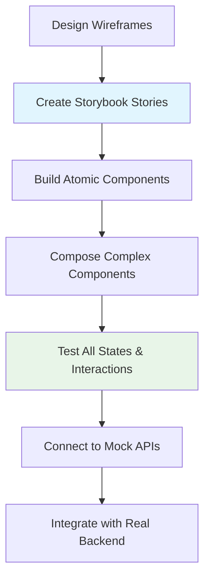
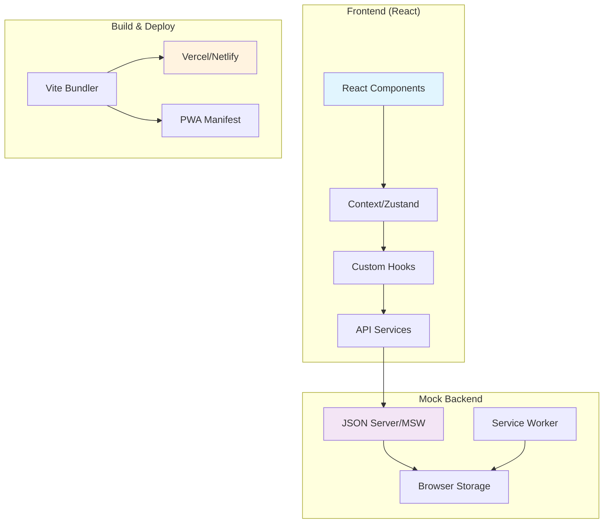

![Intermediate Dashboard Banner](data:image/svg+xml;base64,PHN2ZyB3aWR0aD0iODAwIiBoZWlnaHQ9IjEwMCIgeG1sbnM9Imh0dHA6Ly93d3cudzMub3JnLzIwMDAvc3ZnIj4KICA8ZGVmcz4KICAgIDxwYXR0ZXJuIGlkPSJwYXR0ZXJuIiB4PSIwIiB5PSIwIiB3aWR0aD0iMjgiIGhlaWdodD0iMjQiIHBhdHRlcm5Vbml0cz0idXNlclNwYWNlT25Vc2UiPgogICAgICA8cmVjdCB3aWR0aD0iMjgiIGhlaWdodD0iMjQiIGZpbGw9IiMwNjVmNDYiLz4KICAgICAgPHBvbHlnb24gcG9pbnRzPSIxNCwyIDI0LDggMjQsMTYgMTQsMjIgNCwxNiA0LDgiIGZpbGw9Im5vbmUiIHN0cm9rZT0iIzM0ZDM5OSIgc3Ryb2tlLXdpZHRoPSIxIiBvcGFjaXR5PSIwLjIiLz4KICAgIDwvcGF0dGVybj4KICA8L2RlZnM+CiAgPHJlY3Qgd2lkdGg9IjgwMCIgaGVpZ2h0PSIxMDAiIGZpbGw9InVybCgjcGF0dGVybikiLz4KICA8dGV4dCB4PSI0MDAiIHk9IjM1IiBmb250LWZhbWlseT0iQXJpYWwgQmxhY2siIGZvbnQtc2l6ZT0iMjQiIGZpbGw9IndoaXRlIiB0ZXh0LWFuY2hvcj0ibWlkZGxlIj5JbnRlcm1lZGlhdGUgRGFzaGJvYXJkPC90ZXh0PgogIDx0ZXh0IHg9IjQwMCIgeT0iNTUiIGZvbnQtZmFtaWx5PSJBcmlhbCIgZm9udC1zaXplPSIxNCIgZmlsbD0iIzM0ZDM5OSIgdGV4dC1hbmNob3I9Im1pZGRsZSI+UmVhY3QgRGFzaGJvYXJkPC90ZXh0PgogIDx0ZXh0IHg9IjQwMCIgeT0iNzUiIGZvbnQtZmFtaWx5PSJBcmlhbCIgZm9udC1zaXplPSIxMiIgZmlsbD0icmdiYSgyNTUsMjU1LDI1NSwwLjcpIiB0ZXh0LWFuY2hvcj0ibWlkZGxlIj7wn5+X77iPIEludGVyYWN0aXZlIFdlYiBBcHA8L3RleHQ+Cjwvc3ZnPg==)

# 🚀 Intermediate: React Dashboard

**Difficulty:** ⭐⭐⭐☆☆ (Intermediate)  
**Time Estimate:** 2-3 weeks  
**Tech Stack:** React + TypeScript + Tailwind + Vite + Storybook  

---

## 🎨 UI/UX Wireframes & Mockups

### **Main Dashboard Layout**
```ascii
┌─────────────────────────────────────────────────────────────────────────────────┐
│                           BREATH MASTER DASHBOARD                               │
├─────────────────────────────────────────────────────────────────────────────────┤
│ 🧘 Breath Master    [Dashboard] [Stats] [Social] [Settings]     👤 User    🔄  │
├─────────────────────────────────────────────────────────────────────────────────┤
│                                                                                 │
│  ┌─────────────────────────────┐  ┌─────────────────────────────────────────┐   │
│  │     QUICK ACTIONS           │  │           PROGRESS OVERVIEW             │   │
│  │                             │  │                                         │   │
│  │  🧘 [Start Session]         │  │   Level 4: Mindful Developer          │   │
│  │  ⏸️ [Pause Current]          │  │   ████████████████░░░░░░ 1,247/1,500XP│   │
│  │  📊 [View Progress]         │  │                                         │   │
│  │  🎯 [Daily Challenge]       │  │   Current Streak: 🔥 12 days          │   │
│  │                             │  │   Weekly Goal:    ████████░░ 6/7 days │   │
│  └─────────────────────────────┘  └─────────────────────────────────────────┘   │
│                                                                                 │
│  ┌─────────────────────────────────────────────────────────────────────────────┐ │
│  │                          TODAY'S ACTIVITY                                  │ │
│  │                                                                             │ │
│  │   🌅 Morning        🌞 Afternoon       🌙 Evening       📊 Analytics       │ │
│  │                                                                             │ │
│  │ ┌─────────────┐   ┌─────────────┐   ┌─────────────┐   ┌─────────────┐     │ │
│  │ │ ✅ 10min    │   │ ⏰ Pending  │   │ 🎯 Planned  │   │ 📈 Chart    │     │ │
│  │ │ Completed   │   │ 15min       │   │ 5min        │   │ View        │     │ │
│  │ │ 8:30 AM     │   │ 2:00 PM     │   │ 8:00 PM     │   │ Progress    │     │ │
│  │ └─────────────┘   └─────────────┘   └─────────────┘   └─────────────┘     │ │
│  └─────────────────────────────────────────────────────────────────────────────┘ │
│                                                                                 │
│  ┌─────────────────────────────────────────────────────────────────────────────┐ │
│  │                           SOCIAL FEED                                      │ │
│  │                                                                             │ │
│  │  👤 Alex just completed a 20-minute session! 🎉             2 min ago      │ │
│  │  🏆 You're now #3 on the weekly leaderboard!               5 min ago      │ │
│  │  🎯 Daily Challenge: Complete 3 sessions (2/3)             Today          │ │
│  │  💪 Team "Code Breathers" reached 100 sessions!            1 hour ago     │ │
│  │                                                                             │ │
│  │  [View All Activity]                      [Join Team Challenge] 🚀         │ │
│  └─────────────────────────────────────────────────────────────────────────────┘ │
│                                                                                 │
└─────────────────────────────────────────────────────────────────────────────────┘
```

### **Session Interface (Active State)**
```ascii
┌─────────────────────────────────────────────────────────────────────────────────┐
│                        🧘 ACTIVE BREATHING SESSION                             │
├─────────────────────────────────────────────────────────────────────────────────┤
│                                                                                 │
│                               BREATHE IN                                        │
│                                                                                 │
│                    ╭─────────────────────────────────╮                         │
│                   ╱                                   ╲                        │
│                  ╱                                     ╲                       │
│                 ╱                 🫁                    ╲                      │
│                ╱              EXPANDING                  ╲                     │
│               ╱                                           ╲                    │
│              ╱                   4 sec                     ╲                   │
│             ╱                                               ╲                  │
│            ╱                                                 ╲                 │
│           ╱___________________________________________________╲                │
│                                                                                 │
│            Pattern: 4-4-4-4 Boxing    │    Time: 8:32    │    Goal: 15:00     │
│            Progress: ████████░░░░░░░░░░ 57%                                     │
│                                                                                 │
│    [⏸️ Pause]           [⏹️ Stop]           [⚙️ Settings]           [📊 Stats] │
│                                                                                 │
│                          Current Streak: 🔥 12 days                           │
│                        Next Level: 253 XP remaining                            │
│                                                                                 │
└─────────────────────────────────────────────────────────────────────────────────┘
```

### **Statistics Page**
```ascii
┌─────────────────────────────────────────────────────────────────────────────────┐
│                              📊 STATISTICS                                     │
├─────────────────────────────────────────────────────────────────────────────────┤
│                                                                                 │
│  ┌─────────────────────┐  ┌─────────────────────┐  ┌─────────────────────┐     │
│  │   THIS WEEK         │  │   THIS MONTH        │  │    ALL TIME         │     │
│  │                     │  │                     │  │                     │     │
│  │  🧘 Sessions: 12    │  │  🧘 Sessions: 45    │  │  🧘 Sessions: 342   │     │
│  │  ⏱️ Time: 3h 45m    │  │  ⏱️ Time: 15h 20m   │  │  ⏱️ Time: 127h 30m  │     │
│  │  🔥 Streak: 12      │  │  🏆 Best: 18        │  │  🏆 Best: 45        │     │
│  │  📈 XP: +450        │  │  📈 XP: +1,847      │  │  📈 XP: 12,750      │     │
│  └─────────────────────┘  └─────────────────────┘  └─────────────────────┘     │
│                                                                                 │
│  ┌─────────────────────────────────────────────────────────────────────────────┐ │
│  │                        📈 PROGRESS CHART                                   │ │
│  │                                                                             │ │
│  │  Sessions  ▲                                                               │ │
│  │  per Day   │     ●                                                         │ │
│  │         4  │   ●   ●                                                       │ │
│  │         3  │ ●       ●                                                     │ │
│  │         2  │           ●     ●                                             │ │
│  │         1  │             ●     ●   ●                                       │ │
│  │         0  └─────────────────────────────────────────────────► Time       │ │
│  │            Mon Tue Wed Thu Fri Sat Sun                                     │ │
│  └─────────────────────────────────────────────────────────────────────────────┘ │
│                                                                                 │
│  ┌─────────────────────────────────────────────────────────────────────────────┐ │
│  │                      🎯 ACHIEVEMENT PROGRESS                               │ │
│  │                                                                             │ │
│  │  🏅 Early Bird       ████████████░░░░░░░░░░  12/20  Complete 20 morning   │ │
│  │  💪 Consistency King ████████░░░░░░░░░░░░░░░░  8/30  30-day streak        │ │
│  │  🧘 Zen Master       ████░░░░░░░░░░░░░░░░░░░░  4/50  50 sessions > 20min  │ │
│  │  🔥 Streak Legend    ██░░░░░░░░░░░░░░░░░░░░░░  2/100 100-day streak       │ │
│  │                                                                             │ │
│  └─────────────────────────────────────────────────────────────────────────────┘ │
│                                                                                 │
└─────────────────────────────────────────────────────────────────────────────────┘
```

### **Social/Leaderboard Page**
```ascii
┌─────────────────────────────────────────────────────────────────────────────────┐
│                           👥 COMMUNITY & LEADERBOARDS                          │
├─────────────────────────────────────────────────────────────────────────────────┤
│                                                                                 │
│  [🌍 Global] [👥 Teams] [🏢 Company] [⚡ Live]                                 │
│                                                                                 │
│  ┌─────────────────────────────────────────────────────────────────────────────┐ │
│  │                      🏆 WEEKLY LEADERBOARD                                 │ │
│  │                                                                             │ │
│  │  #1  🥇 ZenMaster42    ████████████████████░  2,847 XP    🔥 28 days      │ │
│  │  #2  🥈 CodeBreather   ████████████████░░░░░  2,341 XP    🔥 15 days      │ │
│  │  #3  🥉 You           ████████████████░░░░░  2,247 XP    🔥 12 days      │ │
│  │  #4     DevYogi        ███████████████░░░░░░  2,156 XP    🔥 8 days       │ │
│  │  #5     MindfulDev     ███████████████░░░░░░  2,089 XP    🔥 22 days      │ │
│  │  #6     TechZen        ██████████████░░░░░░░  1,967 XP    🔥 5 days       │ │
│  │  ...                                                                        │ │
│  │  #42    YourFriend     ███████░░░░░░░░░░░░░░░  1,156 XP    🔥 3 days       │ │
│  │                                                                             │ │
│  └─────────────────────────────────────────────────────────────────────────────┘ │
│                                                                                 │
│  ┌─────────────────────────────────────────────────────────────────────────────┐ │
│  │                        🎯 TEAM CHALLENGES                                  │ │
│  │                                                                             │ │
│  │  "Code Breathers" Team Challenge           [Join Team] [Create Team]       │ │
│  │  Goal: 500 total sessions this month                                       │ │
│  │  Progress: ████████████░░░░░░░░░░░ 342/500 sessions                        │ │
│  │  Time Left: 12 days                                                        │ │
│  │  Reward: Exclusive "Team Player" badge 🏅                                  │ │
│  │                                                                             │ │
│  │  Members (8): You, ZenMaster42, CodeBreather, DevYogi...                   │ │
│  │                                                                             │ │
│  │  Recent Activity:                                                           │ │
│  │  • CodeBreather completed 25min session  (+50 XP)      2 min ago          │ │
│  │  • You completed daily challenge         (+25 XP)      5 min ago          │ │
│  │  • DevYogi started morning routine       (+10 XP)      8 min ago          │ │
│  │                                                                             │ │
│  └─────────────────────────────────────────────────────────────────────────────┘ │
│                                                                                 │
└─────────────────────────────────────────────────────────────────────────────────┘
```

---

## 🎭 Storybook Component Library

### **Storybook Setup & Architecture**

```typescript
// .storybook/main.ts
export default {
  stories: ['../src/**/*.stories.@(js|jsx|ts|tsx)'],
  addons: [
    '@storybook/addon-essentials',
    '@storybook/addon-interactions',
    '@storybook/addon-a11y',
    '@storybook/addon-design-tokens',
    '@storybook/addon-docs'
  ],
  framework: {
    name: '@storybook/react-vite',
    options: {}
  }
};

// Component Structure for Storybook
src/
├── components/
│   ├── atoms/           # Basic building blocks
│   │   ├── Button/
│   │   │   ├── Button.tsx
│   │   │   ├── Button.stories.tsx
│   │   │   └── Button.test.tsx
│   │   ├── Icon/
│   │   ├── Badge/
│   │   └── ProgressBar/
│   ├── molecules/       # Simple component combinations
│   │   ├── SessionCard/
│   │   ├── UserProfile/
│   │   ├── StatsWidget/
│   │   └── NavigationItem/
│   ├── organisms/       # Complex UI sections
│   │   ├── Dashboard/
│   │   ├── SessionInterface/
│   │   ├── Leaderboard/
│   │   └── SettingsPanel/
│   └── templates/       # Page layouts
│       ├── DashboardLayout/
│       ├── SessionLayout/
│       └── StatsLayout/
```

### **Key Storybook Stories**

#### **Button Component Stories**
```ascii
┌─────────────────────────────────────────────────────────────────────────────────┐
│                          STORYBOOK: BUTTON COMPONENT                           │
├─────────────────────────────────────────────────────────────────────────────────┤
│                                                                                 │
│  [Primary] [Secondary] [Danger] [Ghost] [Icon] [Loading] [Disabled]           │
│                                                                                 │
│  Primary Button:     [🧘 Start Session]                                        │
│  Secondary Button:   [📊 View Stats]                                           │
│  Danger Button:      [🗑️ Delete Data]                                          │
│  Ghost Button:       [Cancel]                                                  │
│  Icon Button:        [⚙️]                                                       │
│  Loading Button:     [⏳ Starting...]                                          │
│  Disabled Button:    [Unavailable]                                             │
│                                                                                 │
│  Properties:                                                                    │
│  • variant: 'primary' | 'secondary' | 'danger' | 'ghost'                      │
│  • size: 'small' | 'medium' | 'large'                                         │
│  • loading: boolean                                                            │
│  • disabled: boolean                                                           │
│  • icon: ReactNode                                                             │
│  • fullWidth: boolean                                                          │
│                                                                                 │
└─────────────────────────────────────────────────────────────────────────────────┘
```

#### **Session Interface Component Stories**
```ascii
┌─────────────────────────────────────────────────────────────────────────────────┐
│                     STORYBOOK: SESSION INTERFACE COMPONENT                     │
├─────────────────────────────────────────────────────────────────────────────────┤
│                                                                                 │
│  [Idle] [Active] [Paused] [Completed] [Error]                                 │
│                                                                                 │
│  States Showcase:                                                               │
│                                                                                 │
│  Idle State:        [Start Your Session] [Choose Pattern ▼]                   │
│                     Ready to begin your mindfulness journey                     │
│                                                                                 │
│  Active State:      🫁 BREATHE IN... (4 sec)                                   │
│                     ████████░░ 35% complete                                    │
│                     [⏸️ Pause] [⏹️ Stop]                                        │
│                                                                                 │
│  Paused State:      ⏸️ Session Paused                                          │
│                     Take your time, resume when ready                          │
│                     [▶️ Resume] [⏹️ End Session]                                │
│                                                                                 │
│  Completed State:   ✅ Session Complete! (+50 XP)                              │
│                     Great job! 15 minutes of mindfulness                       │
│                     [🔄 Start Another] [📊 View Stats]                         │
│                                                                                 │
│  Error State:       ⚠️ Connection Lost                                         │
│                     Unable to sync progress                                     │
│                     [🔄 Retry] [💾 Save Locally]                               │
│                                                                                 │
└─────────────────────────────────────────────────────────────────────────────────┘
```

---

## 🗺️ Complete User Journeys

### **Journey 1: New User First Experience**

#### **Step 1: Landing & Discovery**
```ascii
┌─────────────────────────────────────────────────────────────────────────────────┐
│                            🌟 WELCOME TO BREATH MASTER                         │
├─────────────────────────────────────────────────────────────────────────────────┤
│                                                                                 │
│                         Your mindfulness companion for VS Code                  │
│                                                                                 │
│                    ┌─────────────────────────────────────────┐                 │
│                    │           🧘‍♀️ Getting Started          │                 │
│                    │                                         │                 │
│                    │  Connect your VS Code extension to     │                 │
│                    │  unlock cross-device progress tracking │                 │
│                    │  and join the mindful developer        │                 │
│                    │  community!                             │                 │
│                    │                                         │                 │
│                    │         [🔗 Connect VS Code]           │                 │
│                    │         [👀 Browse as Guest]           │                 │
│                    └─────────────────────────────────────────┘                 │
│                                                                                 │
│   Why connect?                                                                  │
│   ✅ Sync progress across devices    ✅ Join leaderboards                      │
│   ✅ Unlock achievements            ✅ Team challenges                         │
│   ✅ Advanced analytics             ✅ Community features                      │
│                                                                                 │
└─────────────────────────────────────────────────────────────────────────────────┘
```

#### **Step 2: Profile Setup**
```ascii
┌─────────────────────────────────────────────────────────────────────────────────┐
│                              👤 CREATE YOUR PROFILE                            │
├─────────────────────────────────────────────────────────────────────────────────┤
│                                                                                 │
│  Choose your mindful developer identity:                                        │
│                                                                                 │
│  Display Name: [CodeZen_________] (Visible to other users)                      │
│  Avatar:       [🧘] [🧘‍♀️] [🧘‍♂️] [🌱] [🔮] [🌊] [⭐] [🎯]                      │
│                                                                                 │
│  Privacy Settings:                                                              │
│  ☑️ Show me on leaderboards                                                     │
│  ☑️ Allow team invitations                                                      │
│  ☐ Share detailed session data                                                 │
│                                                                                 │
│  Mindfulness Goals:                                                             │
│  Daily Target:    [○ 5min] [●15min] [○30min] [○60min]                          │
│  Focus Areas:     ☑️ Stress Relief  ☑️ Focus  ☐ Sleep  ☐ Energy               │
│                                                                                 │
│                           [Skip for Now] [Create Profile]                      │
│                                                                                 │
└─────────────────────────────────────────────────────────────────────────────────┘
```

#### **Step 3: First Session Guidance**
```ascii
┌─────────────────────────────────────────────────────────────────────────────────┐
│                           🎯 YOUR FIRST MINDFUL MOMENT                         │
├─────────────────────────────────────────────────────────────────────────────────┤
│                                                                                 │
│  Let's start with a simple 5-minute breathing session:                         │
│                                                                                 │
│  ┌─────────────────────────────────────────────────────────────────────────────┐ │
│  │                           🫁 BREATHING GUIDE                               │ │
│  │                                                                             │ │
│  │         Inhale for 4 seconds → Hold for 4 seconds                          │ │
│  │         Exhale for 4 seconds → Hold for 4 seconds                          │ │
│  │                                                                             │ │
│  │                    This is called "Box Breathing"                          │ │
│  │                  Perfect for beginners and stress relief                   │ │
│  │                                                                             │ │
│  │                        ┌─────┐                                             │ │
│  │                        │  4  │ Inhale                                      │ │
│  │                ┌───────┴─────┴───────┐                                     │ │
│  │            Hold│                     │Hold                                 │ │
│  │               4│                     │4                                    │ │
│  │                │        4            │                                     │ │
│  │                └─────────────────────┘                                     │ │
│  │                         Exhale                                             │ │
│  └─────────────────────────────────────────────────────────────────────────────┘ │
│                                                                                 │
│                              [🚀 Start Session]                               │
│                              [🎵 Try Different Pattern]                       │
│                                                                                 │
└─────────────────────────────────────────────────────────────────────────────────┘
```

### **Journey 2: Regular User Daily Flow**

#### **Morning Check-in**
```ascii
┌─────────────────────────────────────────────────────────────────────────────────┐
│                              🌅 GOOD MORNING, CODEZEN!                         │
├─────────────────────────────────────────────────────────────────────────────────┤
│                                                                                 │
│  🔥 Streak: 12 days    🎯 Today's Goal: 0/15 min    📊 Level: Mindful Dev     │
│                                                                                 │
│  ┌─────────────────────────────────────────────────────────────────────────────┐ │
│  │                        ☀️ MORNING RITUAL                                   │ │
│  │                                                                             │ │
│  │  Start your day mindfully with our morning routine:                        │ │
│  │                                                                             │ │
│  │  🧘 [Quick 5-min Energizer]     Boost focus for the day                   │ │
│  │  🌱 [Mindful 10-min Start]      Deep breathing & intention                │ │
│  │  ⚡ [Power 3-min Booster]       Quick stress relief                       │ │
│  │                                                                             │ │
│  │  💡 Tip: Morning sessions increase daily productivity by 23%               │ │
│  │                                                                             │ │
│  └─────────────────────────────────────────────────────────────────────────────┘ │
│                                                                                 │
│  📅 Today's Challenge: Complete 3 sessions (+50 XP bonus)                      │
│  👥 Your team "Code Breathers" needs 12 more sessions to win!                  │
│                                                                                 │
│                              [Start Morning Ritual]                            │
│                                                                                 │
└─────────────────────────────────────────────────────────────────────────────────┘
```

#### **Mid-day Stress Relief**
```ascii
┌─────────────────────────────────────────────────────────────────────────────────┐
│                           ⚠️ STRESS LEVEL DETECTED                             │
├─────────────────────────────────────────────────────────────────────────────────┤
│                                                                                 │
│  It's 2:47 PM - time for a mindful break?                                      │
│                                                                                 │
│  Your VS Code extension noticed:                                                │
│  • 3 hours without break                                                       │
│  • High typing intensity                                                       │
│  • Multiple error compilations                                                 │
│                                                                                 │
│  ┌─────────────────────────────────────────────────────────────────────────────┐ │
│  │                       🔋 RECHARGE OPTIONS                                  │ │
│  │                                                                             │ │
│  │  ⚡ [2-min Power Reset]     Quick stress relief                           │ │
│  │  🌊 [5-min Deep Calm]      Reset and refocus                             │ │
│  │  🎯 [8-min Focus Boost]    Prepare for deep work                         │ │
│  │                                                                             │ │
│  │  🏃‍♂️ [Skip - I'm in flow]   Remind me in 30 min                          │ │
│  │                                                                             │ │
│  └─────────────────────────────────────────────────────────────────────────────┘ │
│                                                                                 │
│  📊 Quick fact: 5-minute breaks improve problem-solving by 35%                 │
│                                                                                 │
└─────────────────────────────────────────────────────────────────────────────────┘
```

### **Journey 3: Advanced User Social Features**

#### **Team Challenge Participation**
```ascii
┌─────────────────────────────────────────────────────────────────────────────────┐
│                           🏆 TEAM CHALLENGE: "MINDFUL MAY"                     │
├─────────────────────────────────────────────────────────────────────────────────┤
│                                                                                 │
│  Team: "Code Breathers" (8 members)    Rank: 🥈 2nd Place    Days Left: 5     │
│                                                                                 │
│  ┌─────────────────────────────────────────────────────────────────────────────┐ │
│  │                         📊 TEAM PROGRESS                                   │ │
│  │                                                                             │ │
│  │  Goal: 1,000 total minutes this month                                      │ │
│  │  Progress: ████████████████░░░░░ 847/1,000 minutes (84%)                   │ │
│  │                                                                             │ │
│  │  🎯 To win: Need 153 more minutes (30 min/day average)                     │ │
│  │  🏆 Prize: Exclusive "Team Mindfulness" badge + 500 XP each                │ │
│  │                                                                             │ │
│  │  Top Contributors:                                                          │ │
│  │  🥇 ZenMaster42    142 min    🔥 28 days                                    │ │
│  │  🥈 You           138 min    🔥 12 days                                    │ │
│  │  🥉 DevYogi       127 min    🔥 8 days                                     │ │
│  │                                                                             │ │
│  │  💬 Team Chat:                                                              │ │
│  │  ZenMaster42: "Let's push for 200 min today! 💪"      2 min ago            │ │
│  │  DevYogi: "Just finished 15min session, feeling great!" 5 min ago          │ │
│  │  You: "On it! Starting my session now 🧘"             8 min ago            │ │
│  │                                                                             │ │
│  └─────────────────────────────────────────────────────────────────────────────┘ │
│                                                                                 │
│                    [🚀 Start Session for Team] [💬 Open Team Chat]             │
│                                                                                 │
└─────────────────────────────────────────────────────────────────────────────────┘
```

#### **Achievement Unlocked Flow**
```ascii
┌─────────────────────────────────────────────────────────────────────────────────┐
│                             🎉 ACHIEVEMENT UNLOCKED!                           │
├─────────────────────────────────────────────────────────────────────────────────┤
│                                                                                 │
│                               ┌─────────────┐                                  │
│                               │      🏅     │                                  │
│                               │  ZEN MASTER │                                  │
│                               │             │                                  │
│                               │ 50 Sessions │                                  │
│                               │  Completed  │                                  │
│                               └─────────────┘                                  │
│                                                                                 │
│                    Congratulations! You've reached a major milestone           │
│                                                                                 │
│  Rewards Earned:                                                                │
│  🏆 +500 XP Bonus                                                              │
│  🎨 Unlocked "Golden Breath" animation theme                                   │
│  👑 "Zen Master" title (visible on leaderboards)                              │
│  🔓 Access to advanced breathing patterns                                      │
│                                                                                 │
│  ┌─────────────────────────────────────────────────────────────────────────────┐ │
│  │                         📈 YOUR JOURNEY SO FAR                            │ │
│  │                                                                             │ │
│  │  Started: 45 days ago        Current Level: 6 → 7 🎉                      │ │
│  │  Total Sessions: 50          Longest Streak: 18 days                       │ │
│  │  Total Time: 15h 30m         Favorite Pattern: Box Breathing              │ │
│  │  XP Earned: 3,247           Achievements: 8/25                            │ │
│  │                                                                             │ │
│  │  Next Milestone: "Consistency Champion" (100 sessions)                     │ │
│  │  Progress: ████████████░░░░░░░░░░ 50/100 sessions                          │ │
│  │                                                                             │ │
│  └─────────────────────────────────────────────────────────────────────────────┘ │
│                                                                                 │
│                    [🎨 Customize Theme] [📊 View All Stats] [🔄 Continue]       │
│                                                                                 │
└─────────────────────────────────────────────────────────────────────────────────┘
```

---

## 🧩 Comprehensive Storybook Development Strategy

### **Component-First Development Approach**

Start building dashboard components in isolation using Storybook before connecting to any backend:



### **Complete Storybook Setup**

#### **Project Structure**
```
src/
├── components/
│   ├── atoms/                 # Basic building blocks
│   │   ├── Button/
│   │   │   ├── Button.tsx
│   │   │   ├── Button.stories.tsx
│   │   │   ├── Button.test.tsx
│   │   │   └── index.ts
│   │   ├── Badge/
│   │   ├── ProgressBar/
│   │   ├── Avatar/
│   │   └── Icon/
│   ├── molecules/             # Component combinations
│   │   ├── SessionCard/
│   │   ├── UserProfile/
│   │   ├── StatsWidget/
│   │   ├── ActivityFeed/
│   │   └── QuickActions/
│   ├── organisms/            # Complex UI sections
│   │   ├── Dashboard/
│   │   ├── SessionInterface/
│   │   ├── Leaderboard/
│   │   ├── TeamChallenge/
│   │   └── SettingsPanel/
│   └── templates/            # Page layouts
│       ├── DashboardLayout/
│       └── SessionLayout/
├── stories/                  # Global stories
│   ├── mockData/            # Mock data for stories
│   ├── decorators/          # Story decorators
│   └── Introduction.stories.mdx
└── .storybook/
    ├── main.ts
    ├── preview.ts
    └── theme.js
```

#### **Storybook Configuration**
```typescript
// .storybook/main.ts
import type { StorybookConfig } from '@storybook/react-vite';

const config: StorybookConfig = {
  stories: ['../src/**/*.stories.@(js|jsx|ts|tsx|mdx)'],
  addons: [
    '@storybook/addon-essentials',
    '@storybook/addon-interactions',
    '@storybook/addon-a11y',
    '@storybook/addon-design-tokens',
    '@storybook/addon-docs',
    '@storybook/addon-controls',
    '@storybook/addon-viewport',
    '@storybook/addon-backgrounds'
  ],
  framework: {
    name: '@storybook/react-vite',
    options: {}
  },
  typescript: {
    reactDocgen: 'react-docgen-typescript'
  }
};

export default config;
```

```typescript
// .storybook/preview.ts
import type { Preview } from '@storybook/react';
import '../src/index.css'; // Import Tailwind CSS

const preview: Preview = {
  parameters: {
    actions: { argTypesRegex: '^on[A-Z].*' },
    controls: {
      matchers: {
        color: /(background|color)$/i,
        date: /Date$/,
      },
    },
    backgrounds: {
      default: 'light',
      values: [
        { name: 'light', value: '#ffffff' },
        { name: 'dark', value: '#1a1a1a' },
        { name: 'zen', value: '#f0f9ff' }
      ]
    },
    viewport: {
      viewports: {
        mobile: { name: 'Mobile', styles: { width: '375px', height: '667px' }},
        tablet: { name: 'Tablet', styles: { width: '768px', height: '1024px' }},
        desktop: { name: 'Desktop', styles: { width: '1440px', height: '900px' }}
      }
    }
  },
  decorators: [
    (Story) => (
      <div style={{ margin: '3em', fontFamily: 'Inter, sans-serif' }}>
        <Story />
      </div>
    ),
  ],
};

export default preview;
```

### **Detailed Component Stories**

#### **1. Atoms: Button Component**
```typescript
// src/components/atoms/Button/Button.stories.tsx
import type { Meta, StoryObj } from '@storybook/react';
import { Button } from './Button';

const meta: Meta<typeof Button> = {
  title: 'Atoms/Button',
  component: Button,
  parameters: {
    docs: {
      description: {
        component: 'Primary button component with multiple variants for different actions.'
      }
    }
  },
  argTypes: {
    variant: {
      control: 'select',
      options: ['primary', 'secondary', 'danger', 'ghost'],
      description: 'Button visual style'
    },
    size: {
      control: 'select', 
      options: ['small', 'medium', 'large'],
      description: 'Button size'
    },
    loading: { control: 'boolean', description: 'Show loading state' },
    disabled: { control: 'boolean', description: 'Disable button' }
  }
};

export default meta;
type Story = StoryObj<typeof Button>;

export const Primary: Story = {
  args: {
    variant: 'primary',
    children: '🧘 Start Session',
    size: 'medium'
  }
};

export const Secondary: Story = {
  args: {
    variant: 'secondary',
    children: '📊 View Stats',
    size: 'medium'
  }
};

export const Danger: Story = {
  args: {
    variant: 'danger',
    children: '🗑️ Delete Data',
    size: 'medium'
  }
};

export const Loading: Story = {
  args: {
    variant: 'primary',
    children: 'Starting Session...',
    loading: true,
    size: 'medium'
  }
};

export const AllSizes: Story = {
  render: () => (
    <div className="flex gap-4 items-center">
      <Button size="small">Small</Button>
      <Button size="medium">Medium</Button>
      <Button size="large">Large</Button>
    </div>
  )
};
```

#### **2. Molecules: Session Card Component**
```typescript
// src/components/molecules/SessionCard/SessionCard.stories.tsx
import type { Meta, StoryObj } from '@storybook/react';
import { SessionCard } from './SessionCard';

const meta: Meta<typeof SessionCard> = {
  title: 'Molecules/Session Card',
  component: SessionCard,
  parameters: {
    docs: {
      description: {
        component: 'Card component displaying session information and controls.'
      }
    }
  }
};

export default meta;
type Story = StoryObj<typeof SessionCard>;

export const Completed: Story = {
  args: {
    session: {
      id: '1',
      duration: 10,
      pattern: 'Box Breathing',
      completedAt: new Date('2024-01-15T08:30:00'),
      xpEarned: 50,
      status: 'completed'
    }
  }
};

export const Pending: Story = {
  args: {
    session: {
      id: '2',
      duration: 15,
      pattern: 'Deep Calm',
      scheduledAt: new Date('2024-01-15T14:00:00'),
      status: 'pending'
    }
  }
};

export const Active: Story = {
  args: {
    session: {
      id: '3',
      duration: 20,
      pattern: '4-7-8 Relaxing',
      startedAt: new Date(),
      progress: 35,
      status: 'active'
    }
  }
};
```

#### **3. Organisms: Complete Dashboard**
```typescript
// src/components/organisms/Dashboard/Dashboard.stories.tsx
import type { Meta, StoryObj } from '@storybook/react';
import { Dashboard } from './Dashboard';
import { mockUserData } from '../../../stories/mockData';

const meta: Meta<typeof Dashboard> = {
  title: 'Organisms/Dashboard',
  component: Dashboard,
  parameters: {
    layout: 'fullscreen',
    docs: {
      description: {
        component: 'Complete dashboard with user stats, session cards, and social feed.'
      }
    }
  }
};

export default meta;
type Story = StoryObj<typeof Dashboard>;

export const NewUser: Story = {
  args: {
    user: {
      ...mockUserData.newUser,
      name: 'CodeZen',
      level: 1,
      xp: 25,
      streak: 1,
      sessionsToday: 0,
      weeklyGoal: { current: 0, target: 7 }
    }
  }
};

export const RegularUser: Story = {
  args: {
    user: {
      ...mockUserData.regularUser,
      name: 'MindfulDev',
      level: 4,
      xp: 1247,
      totalXp: 1500,
      streak: 12,
      sessionsToday: 2,
      weeklyGoal: { current: 6, target: 7 }
    }
  }
};

export const PowerUser: Story = {
  args: {
    user: {
      ...mockUserData.powerUser,
      name: 'ZenMaster42',
      level: 7,
      xp: 3247,
      totalXp: 5000,
      streak: 28,
      sessionsToday: 4,
      weeklyGoal: { current: 7, target: 7 },
      achievements: ['Early Bird', 'Consistency King', 'Zen Master'],
      teamChallenges: ['Code Breathers Team Challenge']
    }
  }
};

export const Loading: Story = {
  args: {
    loading: true
  }
};

export const Error: Story = {
  args: {
    error: 'Failed to load user data. Please try again.'
  }
};
```

#### **4. Interactive Session Interface**
```typescript
// src/components/organisms/SessionInterface/SessionInterface.stories.tsx
import type { Meta, StoryObj } from '@storybook/react';
import { SessionInterface } from './SessionInterface';

const meta: Meta<typeof SessionInterface> = {
  title: 'Organisms/Session Interface',
  component: SessionInterface,
  parameters: {
    layout: 'fullscreen',
    docs: {
      description: {
        component: 'Interactive breathing session interface with animation and controls.'
      }
    }
  }
};

export default meta;
type Story = StoryObj<typeof SessionInterface>;

export const Idle: Story = {
  args: {
    status: 'idle',
    availablePatterns: ['Box Breathing', '4-7-8 Relaxing', 'Deep Calm', 'Focus Boost']
  }
};

export const Active: Story = {
  args: {
    status: 'active',
    currentSession: {
      pattern: 'Box Breathing',
      phase: 'inhale',
      phaseTime: 4,
      totalTime: 512, // 8:32
      goalTime: 900,  // 15:00
      progress: 57
    }
  }
};

export const Paused: Story = {
  args: {
    status: 'paused',
    currentSession: {
      pattern: 'Deep Calm',
      totalTime: 360, // 6:00
      goalTime: 600,  // 10:00
      progress: 60
    }
  }
};

export const Completed: Story = {
  args: {
    status: 'completed',
    completedSession: {
      pattern: 'Box Breathing',
      duration: 15,
      xpEarned: 75,
      streak: 13
    }
  }
};
```

### **Mock Data Management**

#### **Centralized Mock Data**
```typescript
// src/stories/mockData/index.ts
export const mockUserData = {
  newUser: {
    id: 'new-user-1',
    name: 'CodeZen',
    avatar: '🧘',
    level: 1,
    xp: 25,
    totalXp: 100,
    streak: 1,
    longestStreak: 1,
    totalSessions: 2,
    totalTime: 10 * 60 * 1000, // 10 minutes
    weeklyGoal: { current: 0, target: 7 },
    achievements: [],
    recentSessions: [],
    teamChallenges: []
  },

  regularUser: {
    id: 'regular-user-1', 
    name: 'MindfulDev',
    avatar: '🌱',
    level: 4,
    xp: 1247,
    totalXp: 1500,
    streak: 12,
    longestStreak: 18,
    totalSessions: 45,
    totalTime: 15.5 * 60 * 60 * 1000, // 15.5 hours
    weeklyGoal: { current: 6, target: 7 },
    achievements: ['Early Bird', 'Consistency King'],
    recentSessions: [
      { id: '1', duration: 10, pattern: 'Box Breathing', completedAt: new Date('2024-01-15T08:30:00'), xpEarned: 50 },
      { id: '2', duration: 15, pattern: 'Deep Calm', scheduledAt: new Date('2024-01-15T14:00:00'), status: 'pending' },
      { id: '3', duration: 5, pattern: 'Focus Boost', scheduledAt: new Date('2024-01-15T20:00:00'), status: 'planned' }
    ],
    socialFeed: [
      { id: '1', type: 'achievement', user: 'Alex', message: 'completed a 20-minute session!', time: '2 min ago' },
      { id: '2', type: 'ranking', message: "You're now #3 on the weekly leaderboard!", time: '5 min ago' },
      { id: '3', type: 'challenge', message: 'Daily Challenge: Complete 3 sessions (2/3)', time: 'Today' }
    ]
  },

  powerUser: {
    id: 'power-user-1',
    name: 'ZenMaster42',
    avatar: '🎯',
    level: 7,
    xp: 3247,
    totalXp: 5000,
    streak: 28,
    longestStreak: 45,
    totalSessions: 342,
    totalTime: 127.5 * 60 * 60 * 1000, // 127.5 hours
    weeklyGoal: { current: 7, target: 7 },
    achievements: ['Early Bird', 'Consistency King', 'Zen Master', 'Streak Legend'],
    teamChallenges: [
      {
        id: 'team-1',
        name: 'Code Breathers',
        progress: 847,
        goal: 1000,
        rank: 2,
        members: 8,
        daysLeft: 5
      }
    ]
  }
};

export const mockTeamData = {
  teamChallenge: {
    id: 'mindful-may',
    name: 'Mindful May',
    team: 'Code Breathers',
    members: 8,
    rank: 2,
    progress: 847,
    goal: 1000,
    daysLeft: 5,
    prize: 'Exclusive "Team Mindfulness" badge + 500 XP each',
    topContributors: [
      { name: 'ZenMaster42', minutes: 142, streak: 28 },
      { name: 'You', minutes: 138, streak: 12 },
      { name: 'DevYogi', minutes: 127, streak: 8 }
    ],
    recentActivity: [
      { user: 'ZenMaster42', action: '"Let\'s push for 200 min today! 💪"', time: '2 min ago' },
      { user: 'DevYogi', action: '"Just finished 15min session, feeling great!"', time: '5 min ago' },
      { user: 'You', action: '"On it! Starting my session now 🧘"', time: '8 min ago' }
    ]
  }
};
```

### **Story Decorators**
```typescript
// src/stories/decorators/index.tsx
import { ReactNode } from 'react';

export const DashboardDecorator = (Story: any) => (
  <div className="min-h-screen bg-gradient-to-br from-blue-50 to-indigo-100 p-4">
    <Story />
  </div>
);

export const SessionDecorator = (Story: any) => (
  <div className="min-h-screen bg-gradient-to-br from-green-50 to-emerald-100 flex items-center justify-center p-4">
    <Story />
  </div>
);

export const MobileDecorator = (Story: any) => (
  <div className="max-w-sm mx-auto bg-white rounded-lg shadow-lg overflow-hidden">
    <Story />
  </div>
);
```

### **Development Workflow**

#### **Step 1: Start with Storybook**
```bash
# Install dependencies
npm install --save-dev @storybook/react-vite @storybook/addon-essentials
npx storybook@latest init

# Run Storybook
npm run storybook
```

#### **Step 2: Build Components in Isolation**
```bash
# 1. Create atoms (buttons, badges, icons)
# 2. Build molecules (cards, widgets)  
# 3. Compose organisms (dashboard sections)
# 4. Test all states and interactions
```

#### **Step 3: Connect to Mock APIs**
```typescript
// Mock API service for Storybook
export const mockApiService = {
  getUserData: (userId: string) => Promise.resolve(mockUserData.regularUser),
  getSessionData: () => Promise.resolve(mockSessionData),
  getTeamChallenges: () => Promise.resolve([mockTeamData.teamChallenge])
};
```

This approach lets you:
1. **Build UI components first** without needing any backend
2. **Test all states and interactions** in isolation
3. **Validate designs** with stakeholders before building APIs
4. **Document components** for team collaboration
5. **Catch UI bugs early** before integration

Perfect for your workflow of testing dashboard components in Storybook first!

## One-Shot Prompt

```
Build a modern React dashboard for Breath Master sync that includes interactive breathing, 
real-time leaderboards, and social features. Use TypeScript for type safety and Tailwind 
for rapid styling.

REQUIREMENTS:
- React 18 with TypeScript and strict mode
- Vite for fast development and building
- Tailwind CSS for styling
- Component-driven architecture
- Mock API with JSON Server or MSW
- Progressive Web App capabilities
- Real-time data simulation
- Responsive design with dark/light mode

FEATURES TO IMPLEMENT:

1. AUTHENTICATION
   - Sync code input with validation
   - Session management (localStorage)
   - Anonymous user profiles

2. DASHBOARD PAGES
   - Overview dashboard with metrics
   - Interactive breathing simulator
   - Leaderboards (global, friends, company)
   - Challenge browser and participation
   - User profile and settings
   - Analytics and progress tracking

3. INTERACTIVE COMPONENTS
   - Breathing animation with Web Audio API
   - Real-time progress bars and counters
   - Interactive challenge creation
   - Social feed with activity updates
   - Notification system

4. TECHNICAL FEATURES
   - TypeScript interfaces for all data
   - Custom hooks for data fetching
   - Context for global state management
   - Error boundaries and loading states
   - Offline support with service workers
   - PWA manifest and caching strategy

ARCHITECTURE REQUIREMENTS:

/src
├── components/           # Reusable UI components
│   ├── breathing/       # Breathing-specific components
│   ├── charts/          # Data visualization
│   ├── layout/          # Layout components
│   └── ui/              # Generic UI components
├── pages/               # Route-level components
├── hooks/               # Custom React hooks
├── services/            # API and external services
├── types/               # TypeScript definitions
├── utils/               # Helper functions
└── stores/              # State management

COMPONENT EXAMPLES TO CREATE:

<BreathingSimulator />
- Animated breathing circle
- Pattern selection (chill, active, etc.)
- Session timer and controls
- Audio cues and background sounds

<LeaderboardTable />
- Sortable columns
- Pagination
- Filter by time period
- Anonymous user handling

<ChallengeCard />
- Progress visualization
- Join/leave functionality
- Participant count
- Reward display

<DashboardMetrics />
- XP progress rings
- Streak counter animations
- Today's stats
- Recent achievements

DATA MODELS:

interface User {
  id: string;
  syncCode: string;
  level: number;
  title: string;
  currentXP: number;
  nextLevelXP: number;
  currentStreak: number;
  totalSessions: number;
  createdAt: string;
  preferences: UserPreferences;
}

interface Session {
  id: string;
  userId: string;
  pattern: BreathingPattern;
  durationMs: number;
  xpEarned: number;
  completedAt: string;
  challengeIds?: string[];
}

interface Challenge {
  id: string;
  title: string;
  description: string;
  type: 'streak' | 'sessions' | 'minutes' | 'social';
  target: number;
  rewardXP: number;
  startDate: string;
  endDate: string;
  participants: string[];
}

API ENDPOINTS TO MOCK:

GET /api/user/:syncCode - Get user profile
PUT /api/user/:id - Update user preferences
GET /api/sessions/:userId - Get user sessions
POST /api/sessions - Create new session
GET /api/leaderboard - Get rankings
GET /api/challenges - Get active challenges
POST /api/challenges/:id/join - Join challenge
GET /api/activity/:userId - Get activity feed

DESIGN SYSTEM:
- Colors: Tailwind's emerald and slate palettes
- Typography: Inter font family
- Spacing: Consistent 4px grid
- Animations: Framer Motion for complex animations
- Icons: Heroicons or Lucide React
- Charts: Recharts for data visualization

DEPLOYMENT:
- Build optimized bundle with Vite
- Deploy to Vercel/Netlify with environment variables
- Configure API mocking for demo mode
- Set up automatic deployments from Git

TESTING:
- Vitest for unit tests
- React Testing Library for component tests
- Playwright for E2E tests
- Mock Service Worker for API testing
```

## System Architecture



## Component Hierarchy

```ascii
App
├── Router
│   ├── Layout
│   │   ├── Navigation
│   │   ├── Header
│   │   └── Footer
│   │
│   ├── Dashboard
│   │   ├── MetricsOverview
│   │   ├── QuickActions
│   │   ├── WeeklyProgress
│   │   ├── RecentActivity
│   │   └── CommunityPulse
│   │
│   ├── Breathing
│   │   ├── BreathingSimulator
│   │   │   ├── AnimatedCircle
│   │   │   ├── PatternSelector
│   │   │   ├── SessionTimer
│   │   │   └── AudioControls
│   │   └── SessionHistory
│   │
│   ├── Leaderboards
│   │   ├── RankingTabs
│   │   ├── LeaderboardTable
│   │   ├── UserRankCard
│   │   └── FilterControls
│   │
│   ├── Challenges
│   │   ├── ChallengeBrowser
│   │   ├── ChallengeCard
│   │   ├── ParticipationStats
│   │   └── CreateChallengeModal
│   │
│   └── Profile
│       ├── UserStats
│       ├── PreferencesForm
│       ├── PrivacySettings
│       └── DataExport
│
└── Providers
    ├── AuthProvider
    ├── ThemeProvider
    ├── NotificationProvider
    └── ErrorBoundary
```

## User Flow Diagram

```ascii
REACT DASHBOARD USER FLOW
═════════════════════════

┌─────────────┐     ┌─────────────┐     ┌─────────────┐
│   Landing   │────▶│ Sync Code   │────▶│  Dashboard  │
│    Page     │     │    Input    │     │   Loading   │
└─────────────┘     └─────────────┘     └─────────────┘
                           │                     │
                           ▼                     ▼
                    ┌─────────────┐     ┌─────────────┐
                    │Code Invalid │     │   Main UI   │
                    │Try Again    │     │  Rendered   │
                    └─────────────┘     └─────────────┘
                                               │
                    ┌─────────────────────────┼─────────────────────────┐
                    │                         │                         │
                    ▼                         ▼                         ▼
            ┌─────────────┐         ┌─────────────┐         ┌─────────────┐
            │  Breathing  │         │Leaderboards │         │ Challenges  │
            │  Simulator  │         │& Rankings   │         │ & Social    │
            └─────────────┘         └─────────────┘         └─────────────┘
                    │                         │                         │
                    ▼                         ▼                         ▼
            ┌─────────────┐         ┌─────────────┐         ┌─────────────┐
            │Start Session│         │View Friends │         │Join/Create  │
            │Track Progress│        │Compare Stats│         │Participate  │
            └─────────────┘         └─────────────┘         └─────────────┘
                    │                         │                         │
                    └─────────────────────────┼─────────────────────────┘
                                              ▼
                                    ┌─────────────┐
                                    │XP Gain &    │
                                    │Progress     │
                                    │Update       │
                                    └─────────────┘
```

## File Structure

```ascii
breath-master-dashboard/
├── public/
│   ├── manifest.json
│   ├── sw.js
│   └── icons/
├── src/
│   ├── components/
│   │   ├── breathing/
│   │   │   ├── BreathingSimulator.tsx
│   │   │   ├── AnimatedCircle.tsx
│   │   │   └── PatternSelector.tsx
│   │   ├── charts/
│   │   │   ├── ProgressRing.tsx
│   │   │   ├── WeeklyChart.tsx
│   │   │   └── LeaderboardChart.tsx
│   │   ├── layout/
│   │   │   ├── Navigation.tsx
│   │   │   ├── Header.tsx
│   │   │   └── Footer.tsx
│   │   └── ui/
│   │       ├── Button.tsx
│   │       ├── Card.tsx
│   │       ├── Input.tsx
│   │       └── Modal.tsx
│   ├── pages/
│   │   ├── Dashboard.tsx
│   │   ├── Breathing.tsx
│   │   ├── Leaderboards.tsx
│   │   ├── Challenges.tsx
│   │   └── Profile.tsx
│   ├── hooks/
│   │   ├── useAuth.ts
│   │   ├── useBreathing.ts
│   │   ├── useLeaderboard.ts
│   │   └── useChallenges.ts
│   ├── services/
│   │   ├── api.ts
│   │   ├── auth.ts
│   │   └── storage.ts
│   ├── types/
│   │   ├── user.ts
│   │   ├── session.ts
│   │   └── challenge.ts
│   ├── utils/
│   │   ├── formatters.ts
│   │   ├── validators.ts
│   │   └── animations.ts
│   └── stores/
│       ├── authStore.ts
│       ├── breathingStore.ts
│       └── notificationStore.ts
├── package.json
├── vite.config.ts
├── tailwind.config.js
└── tsconfig.json
```

## Key Features Demo

```ascii
INTERACTIVE BREATHING SIMULATOR
═══════════════════════════════

┌─────────────────────────────────┐
│     🫁 BREATHING SESSION        │
├─────────────────────────────────┤
│                                 │
│      Pattern: Chill (6-0-8-0)   │
│      ┌─────────────────────┐    │
│      │    [Chill] [Active] │    │
│      │  [Boxing] [Custom]  │    │
│      └─────────────────────┘    │
│                                 │
│          ●○○○○○○○               │
│        ○           ○             │
│      ○               ○  Inhale   │
│    ○                   ○         │
│  ○                       ○       │
│○                           ○     │
│                                 │
│    Session: ▰▰▰▱▱ 3/10 mins     │
│    XP: +18 (3 cycles × 6 base)  │
│                                 │
│  ┌─────┐ ┌─────┐ ┌─────┐ ┌───┐ │
│  │Pause│ │Audio│ │Info │ │End│ │
│  └─────┘ └─────┘ └─────┘ └───┘ │
└─────────────────────────────────┘

LIVE LEADERBOARD UPDATES
═══════════════════════

┌─────────────────────────────────┐
│  🏆 LIVE RANKINGS               │
├─────────────────────────────────┤
│                                 │
│  Global │ Friends │ Company     │
│  ▔▔▔▔▔▔                        │
│                                 │
│  #247 → #246 ⬆️ You just moved up!│
│                                 │
│  1. ZenMaster2024    2,847 XP   │
│  2. MindfulDev       2,156 XP   │
│  3. BreathingBee     1,998 XP   │
│  ...                            │
│  246. CoderCalm        837 XP   │
│ ►247. YOU             834 XP    │
│  248. DevZen99         831 XP   │
│                                 │
│  🎯 Need 3 XP to reach #246     │
│                                 │
│  ⚡ Live updates every 30s      │
└─────────────────────────────────┘
```

## Success Metrics

- ⚡ Fast: Sub-3s initial load time
- 📱 Responsive: Works 320px to 4K displays  
- 🔄 Real-time: Live data updates every 30s
- 🛠️ Type-safe: 100% TypeScript coverage
- ♿ Accessible: WCAG 2.1 AA compliant
- 📦 Efficient: <500KB gzipped bundle
- 🔧 Maintainable: <5 complexity per function
- 🧪 Tested: >80% code coverage