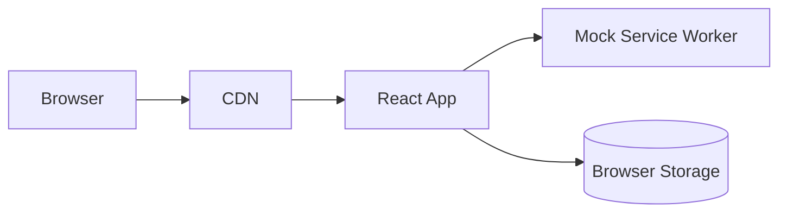
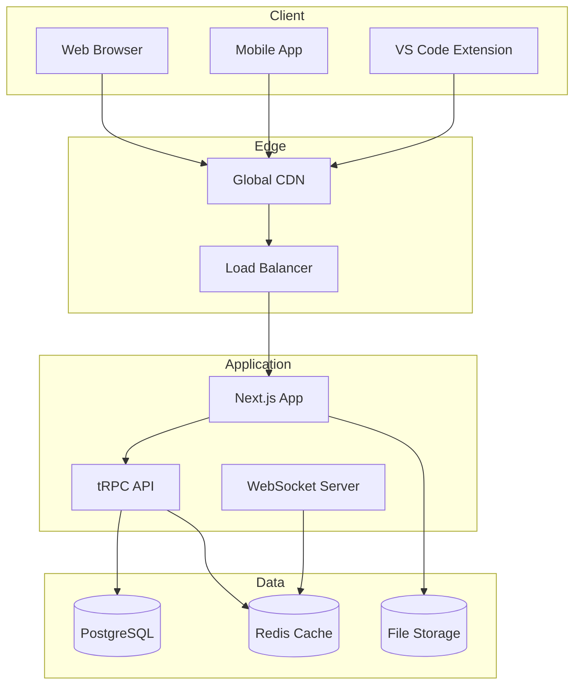

# 🌱 Breath Master Sync - Implementation Guides

*Choose your adventure: From simple static site to enterprise platform*

## 📁 Directory Overview

This directory contains comprehensive implementation guides for building the Breath Master sync ecosystem at different complexity levels.

```ascii
docs/design/sync/
├── README.md                           ← You are here
├── BACKEND-SYNC-ARCHITECTURE.md        ← System architecture overview
├── UI-MOCKUPS-SYNC.md                  ← Visual designs and wireframes
├── BACKEND_PROMPT.md                   ← Original backend prompt
├── BEGINNER-STATIC-SITE.md             ← ⭐☆☆☆☆ HTML/CSS/JS
├── INTERMEDIATE-REACT-DASHBOARD.md     ← ⭐⭐⭐☆☆ React/TypeScript
└── ADVANCED-FULLSTACK-PLATFORM.md     ← ⭐⭐⭐⭐⭐ Next.js/Enterprise
```

## 🎯 Choose Your Implementation Level

### ⭐☆☆☆☆ **Beginner: Static Site**
*Perfect for: Learning, MVP, portfolio projects*

```ascii
┌─────────────────────────────────┐
│     STATIC WEB PORTAL           │
├─────────────────────────────────┤
│ • HTML + CSS + Vanilla JS       │
│ • No backend required           │
│ • 4-6 hours to complete         │
│ • Deploy to Netlify/Vercel      │
│ • Perfect for beginners         │
└─────────────────────────────────┘
```

**What you'll build:**
- Sync code input portal
- Progress visualization 
- Mock leaderboards
- Responsive design
- Basic animations

**[📖 View Guide →](BEGINNER-STATIC-SITE.md)**

---

### ⭐⭐⭐☆☆ **Intermediate: React Dashboard**
*Perfect for: Frontend developers, SaaS prototypes*

```ascii
┌─────────────────────────────────┐
│    INTERACTIVE DASHBOARD        │
├─────────────────────────────────┤
│ • React + TypeScript + Tailwind │
│ • Mock API with MSW/JSON Server │
│ • 2-3 weeks to complete         │
│ • PWA capabilities              │
│ • Real-time features            │
└─────────────────────────────────┘
```

**What you'll build:**
- Interactive breathing simulator
- Live leaderboards
- Challenge system
- Social features
- Premium upgrade flow

**[📖 View Guide →](INTERMEDIATE-REACT-DASHBOARD.md)**

---

### ⭐⭐⭐⭐⭐ **Advanced: Full-Stack Platform**
*Perfect for: Senior developers, production systems, enterprise*

```ascii
┌─────────────────────────────────┐
│   ENTERPRISE SOCIAL PLATFORM    │
├─────────────────────────────────┤
│ • Next.js + Prisma + PostgreSQL │
│ • Real-time collaboration       │
│ • 2-3 months to complete        │
│ • Enterprise features           │
│ • Production-ready scale        │
└─────────────────────────────────┘
```

**What you'll build:**
- Multi-tenant architecture
- Real-time collaboration
- Payment processing
- Advanced analytics
- Enterprise admin tools

**[📖 View Guide →](ADVANCED-FULLSTACK-PLATFORM.md)**

## 📋 Feature Comparison Matrix

| Feature | Static | React | Full-Stack |
|---------|--------|-------|------------|
| **Core Features** |
| Sync code input | ✅ | ✅ | ✅ |
| Progress display | ✅ | ✅ | ✅ |
| Mock data | ✅ | ✅ | - |
| **Interactive Features** |
| Web breathing app | - | ✅ | ✅ |
| Live leaderboards | - | ✅ | ✅ |
| Challenge system | - | ✅ | ✅ |
| **Social Features** |
| Friends system | - | Mock | ✅ |
| Team challenges | - | Mock | ✅ |
| Real-time collaboration | - | - | ✅ |
| **Advanced Features** |
| User accounts | - | - | ✅ |
| Payment processing | - | - | ✅ |
| Enterprise features | - | - | ✅ |
| Multi-tenant | - | - | ✅ |
| **Technical** |
| Database | - | Mock | ✅ |
| Authentication | - | Mock | ✅ |
| API | - | Mock | ✅ |
| Real-time updates | - | Simulated | ✅ |
| **Deployment** |
| Complexity | Low | Medium | High |
| Infrastructure | CDN | CDN + Mock | Full Stack |
| Scaling | N/A | Client-side | Production |

## 🛠️ Tech Stack Overview

### **Static Site Stack**
```ascii
Browser ──── CDN (Netlify/Vercel)
   │
   └── HTML + CSS + Vanilla JS
```

### **React Dashboard Stack**


### **Full-Stack Platform Stack**


## 📊 Implementation Timeline

```ascii
DEVELOPMENT PHASES
══════════════════

Static Site (1 week):
Day 1-2: ├─ HTML structure & CSS styling
Day 3-4: ├─ JavaScript interactivity  
Day 5-6: ├─ Responsive design & polish
Day 7:   └─ Deploy & testing

React Dashboard (3 weeks):
Week 1: ├─ Project setup & core components
Week 2: ├─ Interactive features & state management
Week 3: └─ Polish, testing & PWA features

Full-Stack Platform (3 months):
Month 1: ├─ Backend architecture & database
Month 2: ├─ Frontend features & real-time
Month 3: └─ Enterprise features & production
```

## 🎨 Design Resources

### **Color Palette**
```css
/* Breath Master Brand Colors */
--primary-50:  #f0fdf4;    /* Light green background */
--primary-500: #22c55e;    /* Main brand green */
--primary-900: #14532d;    /* Dark green text */

--secondary-50:  #f8fafc;  /* Light gray background */
--secondary-500: #64748b;  /* Medium gray text */
--secondary-900: #0f172a;  /* Dark text */

--accent-500: #f59e0b;     /* Warm orange for CTAs */
--success-500: #10b981;    /* Success green */
--warning-500: #f59e0b;    /* Warning orange */
--error-500: #ef4444;      /* Error red */
```

### **Typography**
- **Headings:** Inter, system-ui fallback
- **Body:** Inter, system-ui fallback  
- **Code:** JetBrains Mono, monospace fallback

### **Component Patterns**
- **Cards:** Rounded corners, subtle shadows
- **Buttons:** Soft rounded, hover states
- **Progress bars:** Smooth animations
- **Icons:** Heroicons or Lucide React

## 🚀 Getting Started

### **Step 1: Choose Your Level**
Pick the implementation that matches your:
- Current skill level
- Available time
- Project requirements
- Team capabilities

### **Step 2: Read the Guide**
Each guide contains:
- Complete one-shot prompts
- Architecture diagrams
- User journey maps
- Technical specifications
- Success criteria

### **Step 3: Execute**
Follow the prompts with your preferred AI coding assistant:
- **Claude:** Excellent for architecture & design
- **GitHub Copilot:** Great for code completion
- **ChatGPT:** Good for explanations & debugging
- **Cursor:** Excellent for full implementation

### **Step 4: Deploy & Iterate**
- Start with the simplest version
- Get user feedback
- Iterate and enhance
- Gradually increase complexity

## 🔗 Integration with VS Code Extension

All implementations assume integration with the existing VS Code extension via:

```typescript
// VS Code extension generates sync codes
const syncCode = generateSyncCode(user.id);

// Web app accepts sync codes  
const userData = await fetchUserData(syncCode);

// Seamless bridge between VS Code ↔ Web
vscode.env.openExternal(`https://breathmaster.app?code=${syncCode}`);
```

## 🤝 Contributing

Want to add more implementation guides?

**Ideas for additional guides:**
- 🍃 **Vue.js Dashboard** (Intermediate)
- ⚡ **Svelte + SvelteKit** (Intermediate)
- 🦀 **Rust + WASM** (Advanced)
- 📱 **React Native Mobile** (Advanced)
- 🐍 **Python + FastAPI** (Backend)
- 🔥 **Firebase Realtime** (Rapid prototype)

**Contributing process:**
1. Create implementation guide following existing format
2. Include architecture diagrams and user journeys
3. Test with AI coding assistants
4. Submit PR with example outputs

## 📚 Additional Resources

### **Architecture References**
- [BACKEND-SYNC-ARCHITECTURE.md](BACKEND-SYNC-ARCHITECTURE.md) - System design overview
- [UI-MOCKUPS-SYNC.md](UI-MOCKUPS-SYNC.md) - Visual designs and wireframes

### **External Resources**
- [VS Code Extension API](https://code.visualstudio.com/api)
- [Next.js Documentation](https://nextjs.org/docs)
- [Prisma Documentation](https://www.prisma.io/docs)
- [tRPC Documentation](https://trpc.io)
- [Tailwind CSS](https://tailwindcss.com)

---

*Choose your path and start building! Each implementation is designed to be a complete, production-ready solution at its complexity level.* 🌱